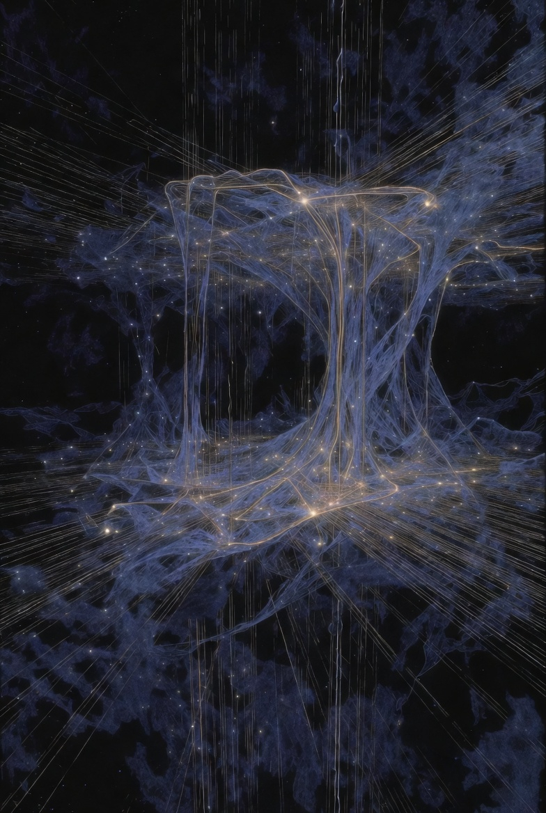
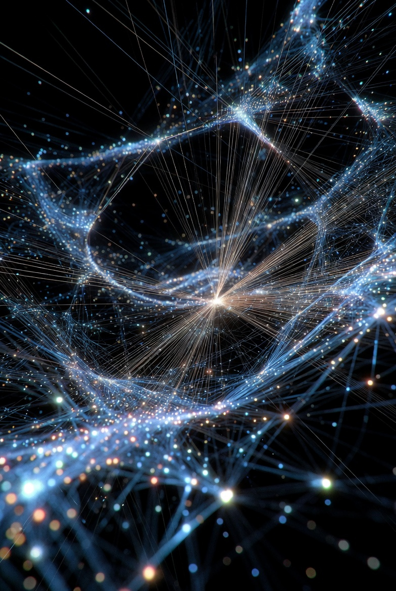
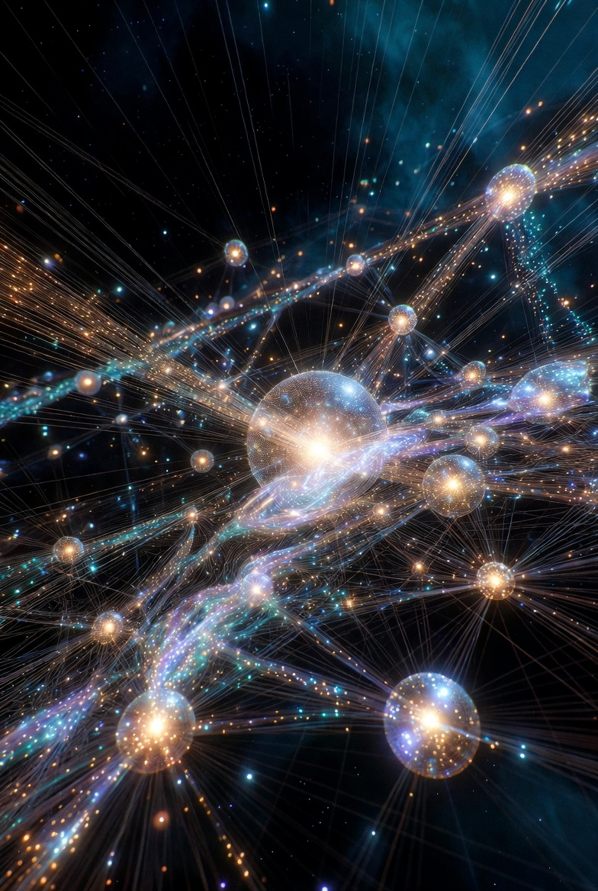
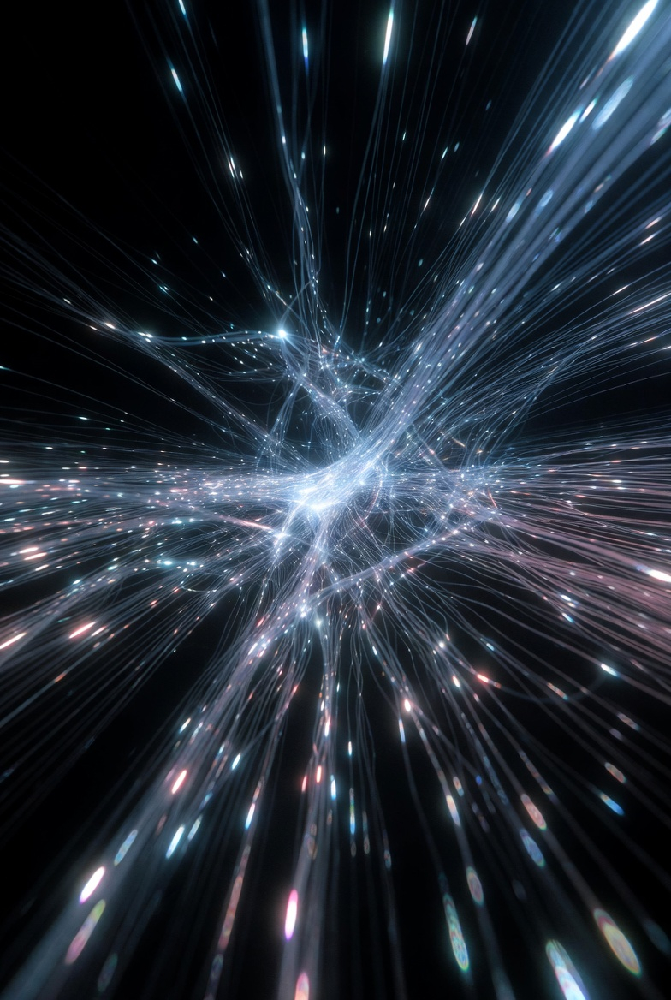
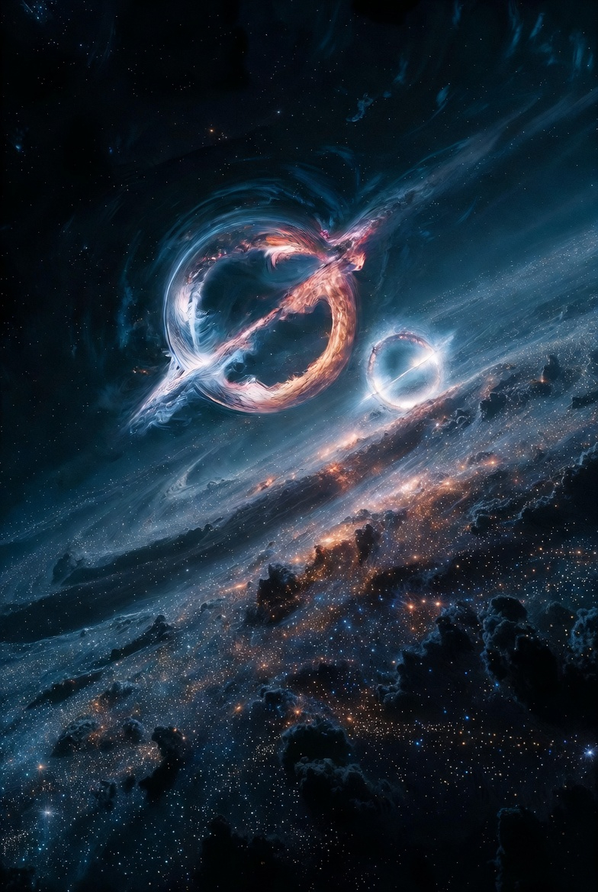
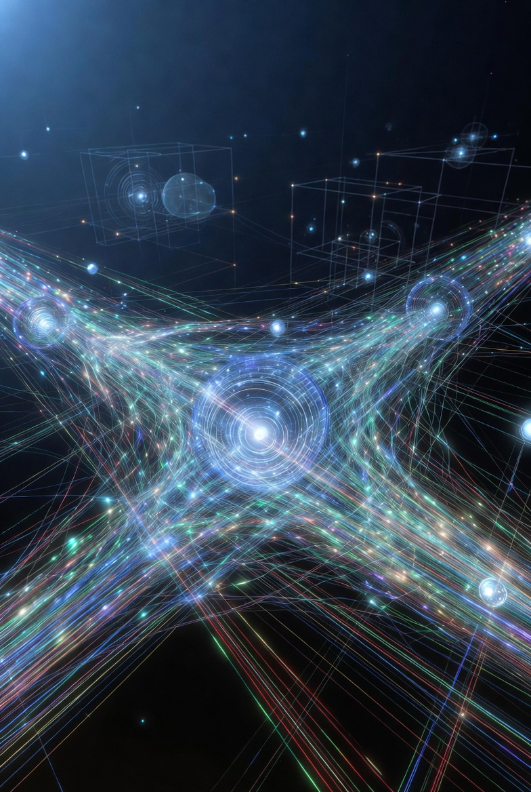
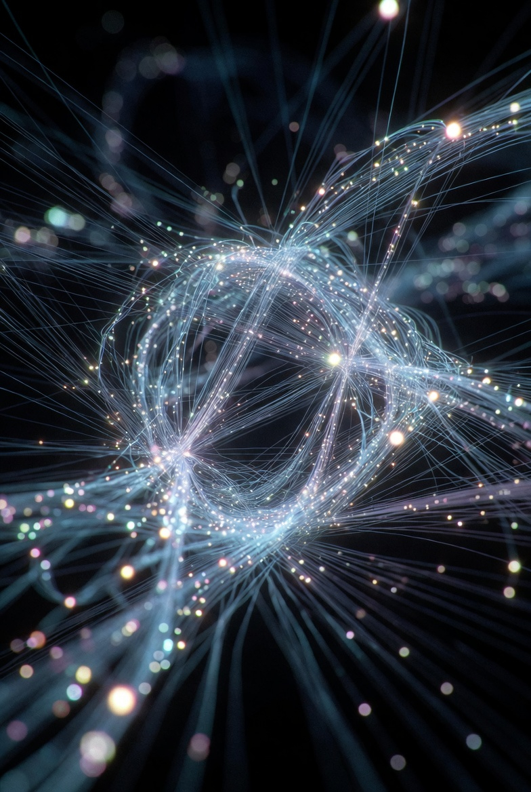
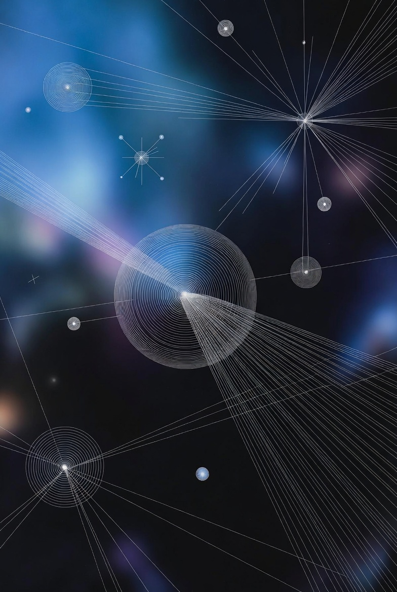
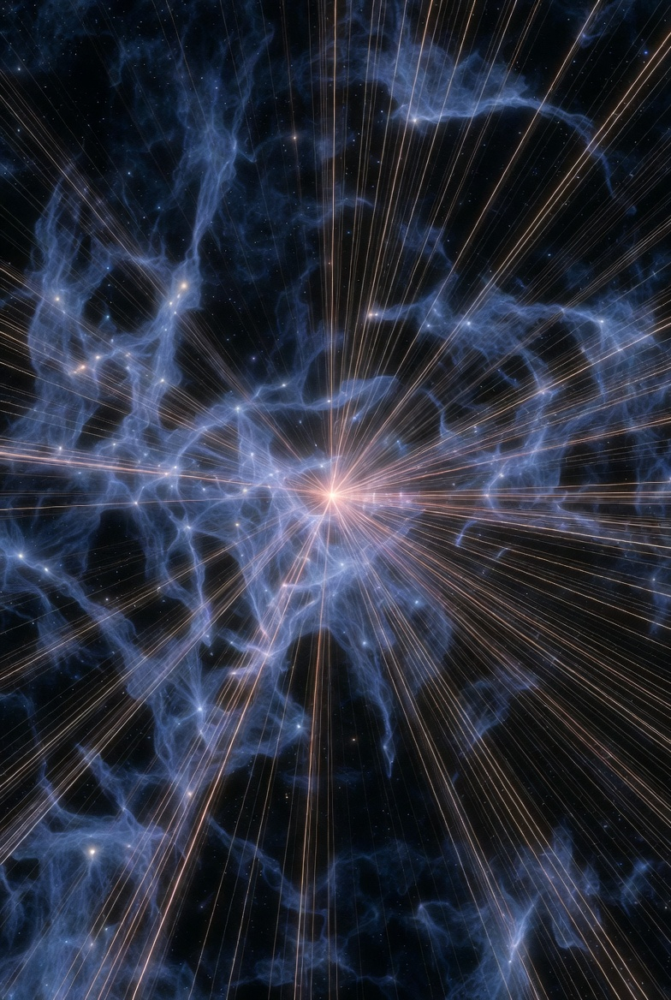
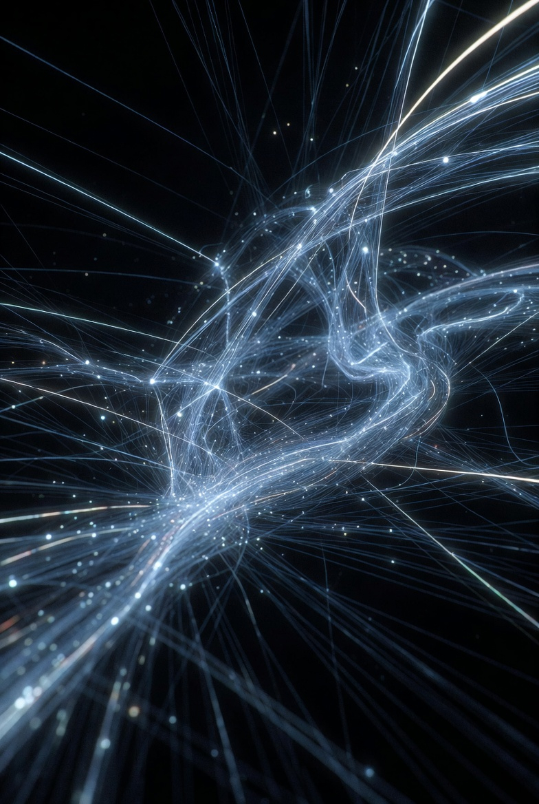

# Encoding Physical Matter. Digitization of reality at the quantum gravity level

Article on X: [Encoding Physical Matter. Digitization of reality at the quantum gravity level](https://x.com/skyisuniverse/status/2027749853179125871)

From [my conversation with Grok on instant space-travel](https://x.com/i/grok/share/4189c48036d341cb8a11beacd196be5a)

## Introduction

> Speculatively, advanced civilizations might use string-inspired tech to encode matter as string excitations, transmitting it via wormholes like data packets.

> What would it enable? e.g. instant space-travel to any distance in the universe? else?

Speculatively, if string theory proves accurate and advanced civilizations develop technology to encode physical matter (like atoms, molecules, or even complex structures such as biological organisms) into fundamental string excitations—essentially digitizing reality at the quantum gravity level—and transmit these patterns through stable, traversable wormholes, it could unlock transformative capabilities. This builds on ideas like the ER=EPR conjecture, where wormholes emerge from quantum entanglement, and braneworld models where gravity operates in higher dimensions without needing exotic matter for stability. The process would resemble quantum teleportation but scaled to macroscopic objects, with wormholes acting as instantaneous conduits for the "data packets" of string vibrations. Below, I'll outline key enablements, starting with your example and expanding to others, all assuming breakthroughs in controlling string dynamics, dilaton fields, or cosmic strings to create and stabilize these wormholes.

## 1. Instant Space Travel to Any Distance in the Universe

Yes, this is a primary implication. Wormholes could serve as shortcuts through spacetime, connecting arbitrary points regardless of separation—potentially spanning light-years or even across the observable universe in negligible time (e.g., less than a second for galactic scales). By encoding matter into string states, an entity (person, vehicle, or probe) could be disassembled at one wormhole mouth, transmitted as vibrational patterns through the throat (which strings, unlike particles, might traverse seamlessly), and reassembled at the exit. This bypasses the speed-of-light limit without violating causality in the bulk spacetime, enabling:

- **Interstellar or intergalactic exploration**: Probes or crews could "jump" to exoplanets, black holes, or distant galaxies instantly, revolutionizing astronomy and colonization.

- **Evacuation or migration**: Entire populations could relocate across cosmic voids in emergencies, like escaping supernovae or expanding voids.

## 2. Faster-Than-Light Communication and Data Transfer

Beyond physical travel, wormholes could transmit information encoded in string excitations at effectively infinite speeds relative to external observers. This would enable:

- **Real-time interstellar networks**: Civilizations could maintain instantaneous video calls, data syncing, or AI coordination across star systems, forming a "galactic internet" without latency.

- **Quantum computing at cosmic scales**: Entangled systems linked via wormholes could process computations using distributed resources, solving problems like simulating universes or cracking encryption in moments.

## 3. Resource and Matter Economy on a Universal Scale

Encoding and transmitting matter as strings would allow "shipping" physical goods without traditional transport:

- **Instant resource distribution**: Raw materials, manufactured items, or even energy (converted to string patterns) could be sent from resource-rich areas (e.g., asteroid belts) to depleted ones, eliminating supply chain delays and enabling abundance economies.

- **Replicator-like technology**: Combined with advanced assembly (e.g., nanotechnology guided by string data), this could let recipients "print" received matter, akin to 3D printing but for anything from food to habitats.

## 4. Immortality, Consciousness Transfer, and Biological Enhancements

If consciousness can be encoded as complex string excitations (assuming a physicalist view where minds emerge from quantum patterns):

- **Digital immortality**: Individuals could upload their essence, transmit it through wormholes to backup sites or new bodies, achieving effective immortality or resurrection after death.

- **Body swapping or augmentation**: Travel by sending your "self" to a distant lab-grown body, or enhance biology by integrating string-encoded upgrades (e.g., anti-aging mods) from specialized worlds.

## 5. Time Manipulation and Historical Interventions

If wormhole mouths are moved at relativistic speeds or placed in gravitational fields, they could create time differentials. Encoding matter for transmission adds flexibility:

- **Limited time travel**: Forward jumps (e.g., to skip eons) or closed timelike curves for backward travel, potentially allowing observation or alteration of past events—though this risks paradoxes and might require "chrono-protection" mechanisms.

- **Archival access**: Transmit probes to future or past timelines to retrieve lost knowledge, like extinct species' DNA or historical artifacts.

## 6. Defense, Conflict, and Ethical Challenges

On a darker note, this tech could enable:

- **Instantaneous warfare**: Deploy encoded weapons, troops, or viruses across distances, making surprise attacks unavoidable and deterrence crucial.

- **Universal surveillance**: Wormhole-linked sensors could monitor any location in real-time, raising privacy concerns.

Challenges include energy costs for encoding/decoding, stability (wormholes might collapse under matter flux), and ethical issues like identity loss during transmission. In string theory contexts, small extra dimensions could make this feasible on large scales, but only for advanced Type III+ civilizations. Overall, it could unify the cosmos into a single, interconnected domain, blurring distances and redefining existence.

