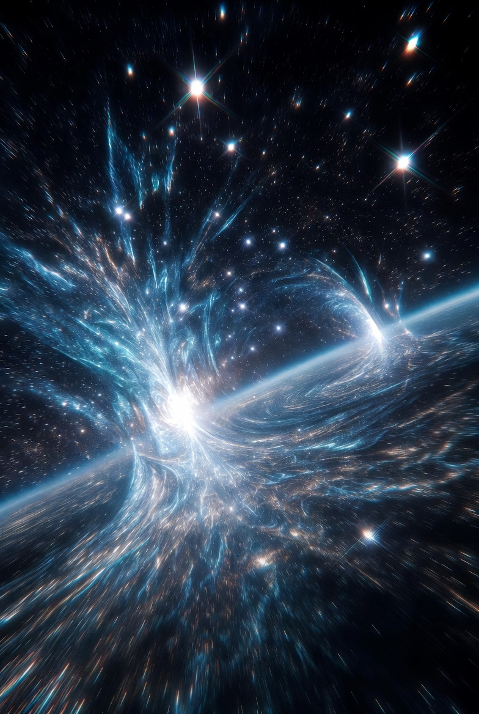
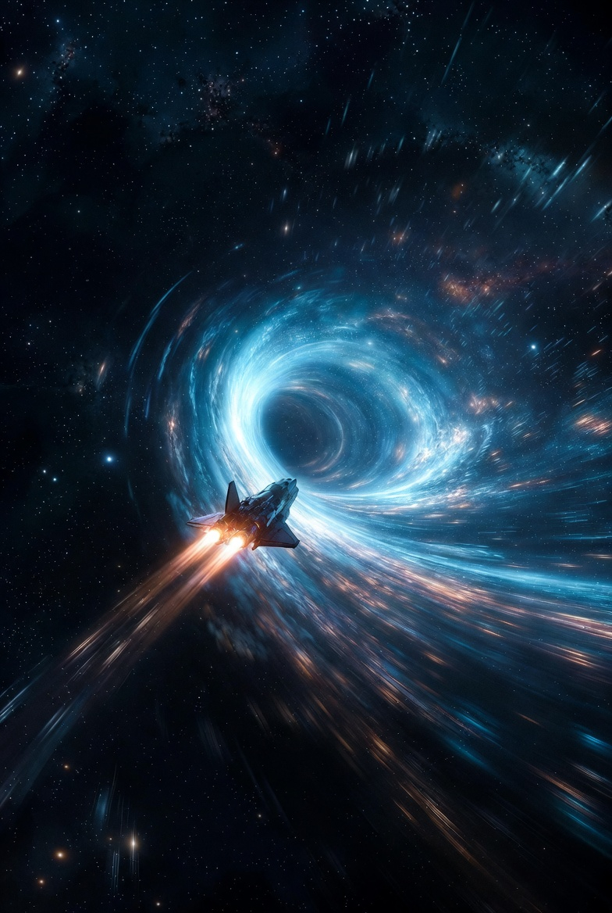
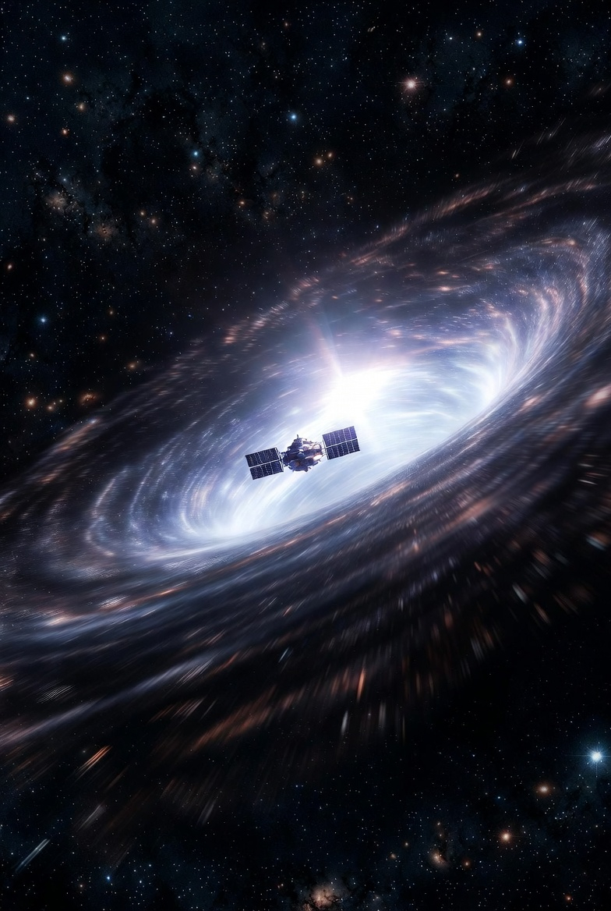
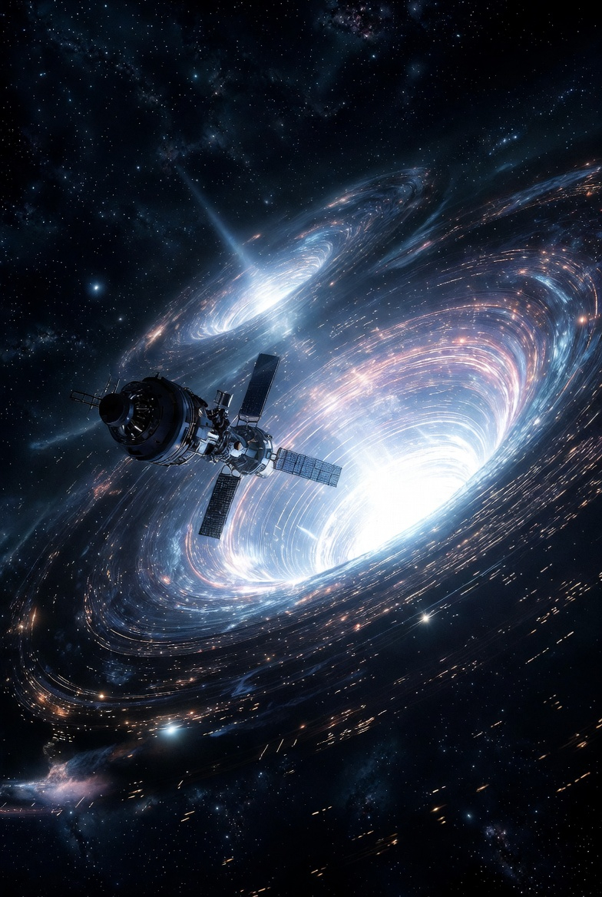
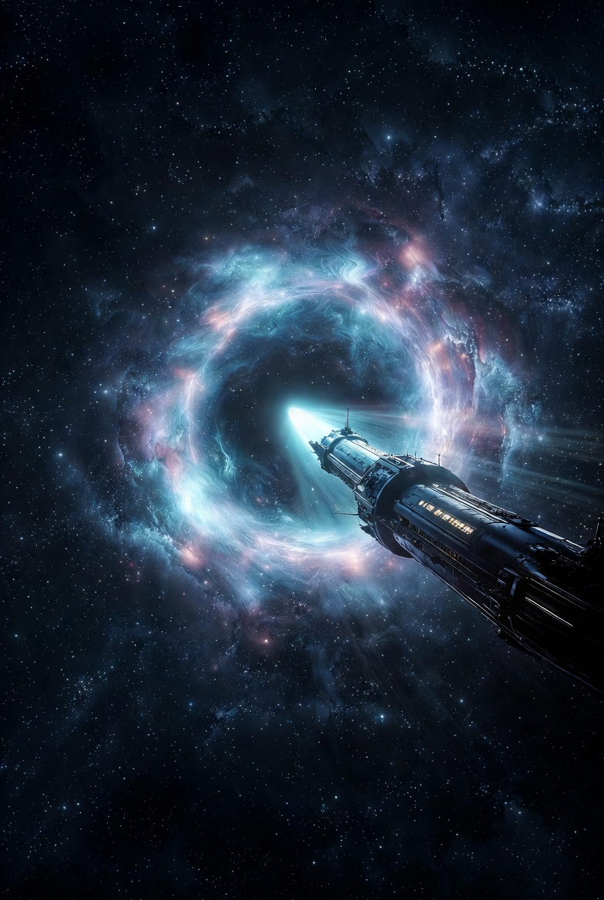
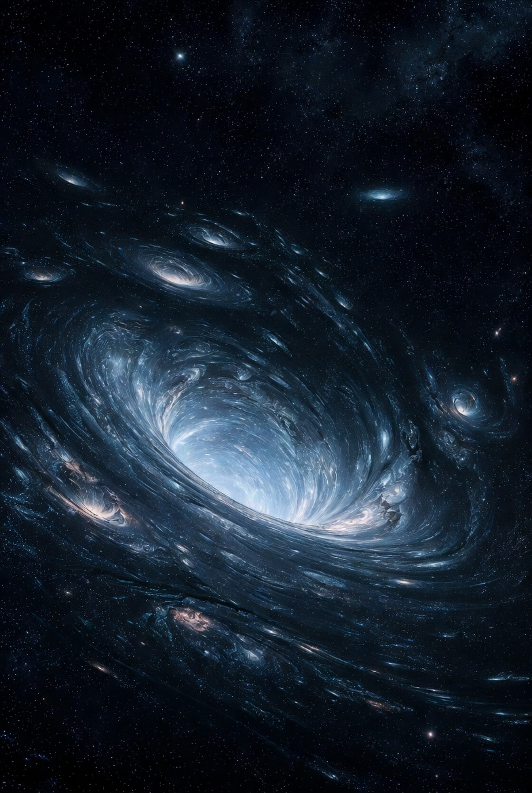
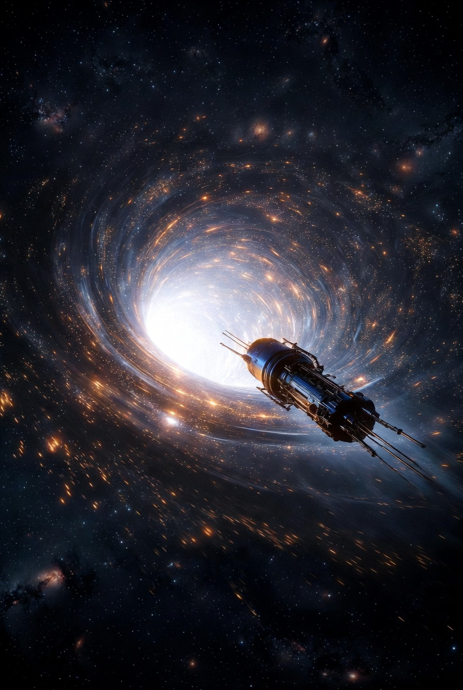
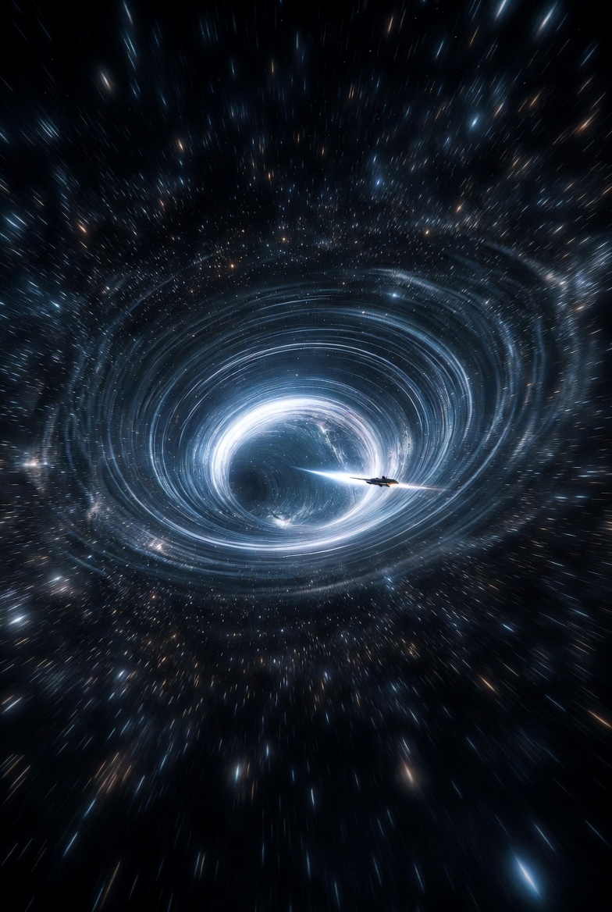
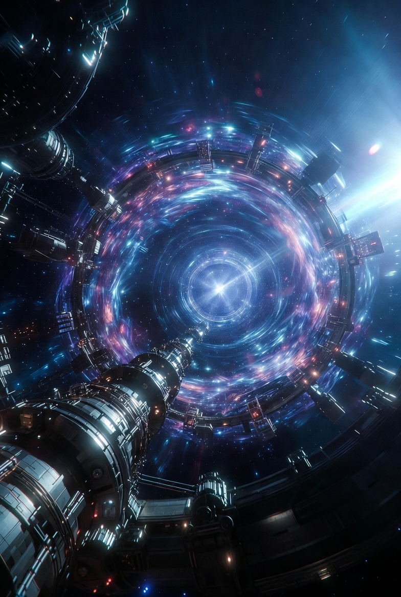

# Instant Connectivity in Space via Wormholes 

Article on X: [Instant Connectivity in Space via Wormholes ](https://x.com/skyisuniverse/status/2027758093480632581)

From [my conversation with Grok on Instant Space Travel through Wormholes](https://x.com/i/grok/share/e7d9bef850f5449e9685d6e223c112c5)

From [my conversation with Grok on String-Wormhole Teleporter](https://x.com/i/grok/share/e7d9bef850f5449e9685d6e223c112c5)

From [my conversation with Grok on Instant Connectivity in Space via Wormholes](https://x.com/i/grok/share/e7d9bef850f5449e9685d6e223c112c5)

## Introduction

> So any planet, galaxy, any place in Space would be approachable instantly?

In the speculative framework we've been discussing—assuming full mastery of string theory, holographic principles, and nanotechnology-enhanced devices like the String-Wormhole Teleporter (SWT)—yes, virtually any planet, galaxy, or location in space could become instantly approachable, but with some practical caveats and setup requirements. This isn't unlimited "anywhere, anytime" magic; it's more like building a cosmic subway system where stations (wormhole endpoints) must be established first. Let me break it down step by step, extending from the theoretical physics we've covered.

### 1. The Core Principle: Instant Connectivity via Wormholes

- Wormholes, as shortcuts through higher-dimensional spacetime, could link any two points regardless of distance—be it a nearby exoplanet like Proxima Centauri b (4 light-years away), a distant galaxy like Andromeda (2.5 million light-years), or even hypothetical spots beyond our observable universe (if extra dimensions allow). Transit time? Effectively zero from the traveler's perspective, as the wormhole bypasses the light-speed barrier in our 3D brane.

- Using the SWT's entanglement generator (powered by something like the xQuantum Core), you'd create a bridge by entangling quantum systems at both ends. Once stable, encoded matter (you, a ship, or cargo) zips through as string vibrations, reassembling instantly.

### 2. Practical Achievement: Building a Network of Endpoints

- **Not Truly Arbitrary Without Setup**: You couldn't just point the device at a random star and teleport blindly. To connect to a new location, you'd first need an endpoint there—essentially a "receiver" SWT or entangled anchor. Initial deployment might involve conventional slower-than-light travel (e.g., via advanced SpaceX-like probes accelerated to near-light speeds or using early wormholes to hopscotch outward). Once anchored, that spot becomes part of the network, enabling instant jumps for everyone else.

- Example: To reach a planet in the TRAPPIST-1 system (40 light-years away), send a nano-probe swarm via fusion drive or gravity assist. It arrives in decades, deploys an entanglement beacon, and voila—instant portal from Earth.

- **Scaling to Galaxies**: For intergalactic hops, the process is similar but amplified. Probes could chain wormholes progressively (e.g., Earth → nearby star → galactic arm → Andromeda), building a web over time. With nanotech advances, these probes could self-replicate, exponentially expanding the network like a viral cosmic infrastructure.

### 3. What It Enables: Universal Accessibility

- **Planets and Solar Systems**: Everyday travel—colonize Mars in a blink, mine asteroids across the galaxy, or vacation on ocean worlds. Instant resource sharing: Beam water from Europa to a drought-stricken colony.

- **Galaxies and Beyond**: Explore the Milky Way's core black hole or Andromeda's star-forming regions without millennia of travel. Scientific bonanzas: Real-time data from quasars or the cosmic microwave background's edge.

- **Exotic Places**: Venture into nebulae, near event horizons (with safeguards against tidal forces), or even parallel branes if multiverse theories hold. Speculatively, time-dilated spots (e.g., near neutron stars) could allow "time tourism."

### 4. Limitations and Challenges (Even in This Hypothetical)

- **Energy and Stability**: Creating/maintaining wormholes for vast distances might demand enormous power—perhaps tapping dark energy or zero-point fields—but nanotech could miniaturize this. Instabilities (e.g., collapse from matter flux) require constant monitoring via AI like xAI integrations.

- **Cosmic Constraints**: The universe's expansion could stretch wormholes, requiring periodic "re-entanglement." Quantum noise or Hawking radiation might limit ultra-long connections. Plus, causality: No looping back to create paradoxes without chrono-protection.

- **Ethical/Practical Hurdles**: Overcrowding popular spots? Alien encounters? In a Muskonomy ecosystem, this tech might start proprietary (e.g., via Starlink-Wormhole hybrids) before going public.

- **The Big Unknown**: If the universe has horizons (e.g., beyond 93 billion light-years observable), or if string theory imposes dimensional barriers, some places might remain inaccessible without further breakthroughs.

In essence, this tech would make the cosmos feel as small as Earth does today with air travel—once the infrastructure's in place. It's the ultimate multi-planetary leap, turning "space is big" into "space is yours." If we push the assumptions further, it could even enable inter-universal jaunts, but that's venturing into pure sci-fi territory.

