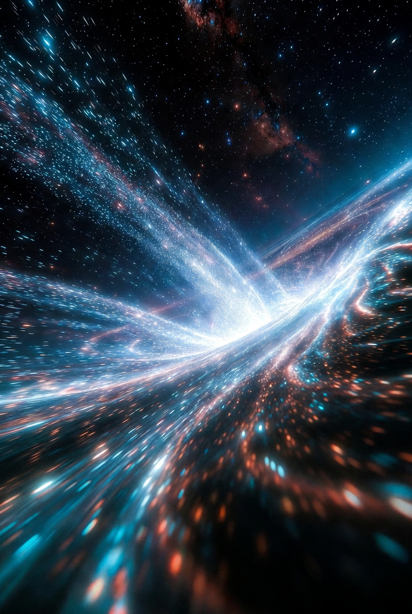
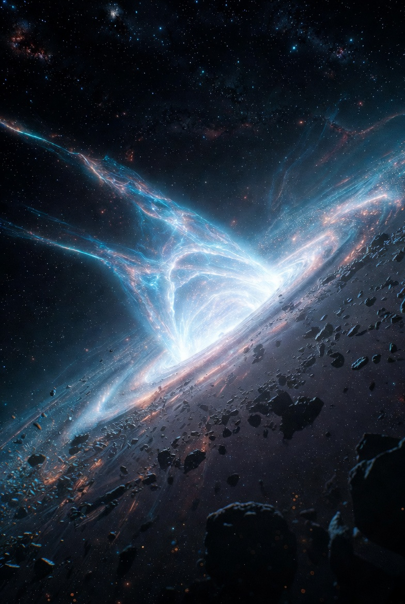
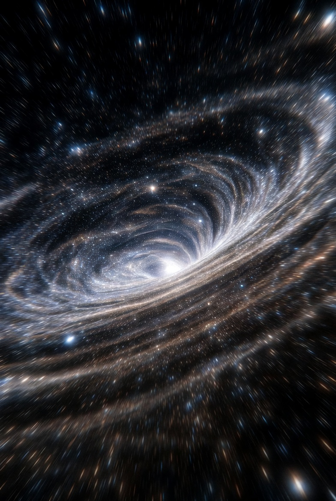
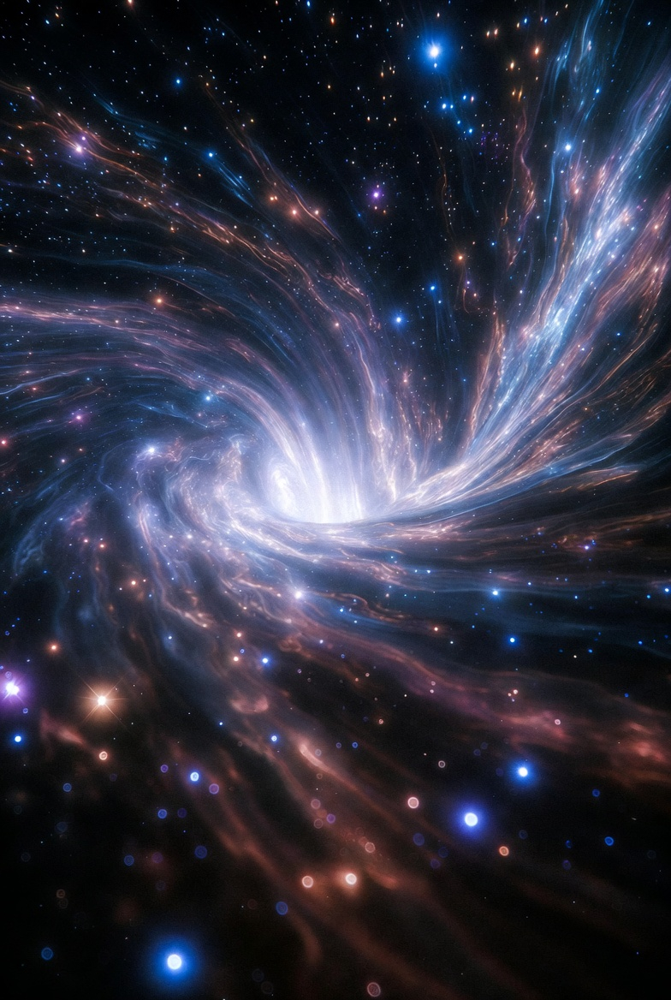

# Manipulating Gravity (1st attempt)

Article on X: [Manipulating Gravity (1st attempt)](https://x.com/skyisuniverse/status/2027741802984321368)

From [my conversation with Grok on Manipulating Gravity energy](https://x.com/i/grok/share/d2ed1ca99c98449cbaf4d9aa1f4c2e18)

## Introduction

Gravity energy typically refers to gravitational potential energy, which arises from the position of objects in a gravitational field, or more broadly, the energy associated with gravitational interactions in systems ranging from everyday objects to cosmic scales. In classical physics, we manipulate this energy indirectly—think of hydroelectric dams converting gravitational potential into electricity or spacecraft using gravity assists for propulsion. However, directly manipulating gravity itself, such as altering gravitational fields or extracting energy from them at will, remains firmly in the realm of theoretical physics. Assuming scientific breakthroughs in areas like quantum gravity, unified field theories, or advanced general relativity applications, several speculative methods emerge from current research and proposals. Below, I'll explore these ideas, grounded in existing theories but extended to hypothetical advancements.

## 1. Manipulating Gravitational Waves for Energy Transfer

Gravitational waves—ripples in spacetime caused by massive accelerating objects like merging black holes—carry energy that could theoretically be harnessed or redirected. Recent proposals suggest interacting these waves with electromagnetic radiation (like laser light) to exchange energy quanta, known as gravitons.

- **Energy Exchange via Light-Graviton Interactions**: In a breakthrough experiment concept, energy packets from a light wave could be transferred to a gravitational wave, amplifying the latter while slightly reducing the light's frequency. This involves stimulated emission or absorption of gravitons, analogous to how lasers work with photons. An interferometer setup could detect and manipulate these waves, potentially allowing controlled energy extraction from passing gravitational waves. With advancements in quantum optics and gravitational wave detectors (evolving from LIGO), this could enable "graviton lasers" or devices that convert gravitational energy into usable forms, like electrical power.

Future extensions in quantum gravity theories (e.g., loop quantum gravity or string theory) might allow generating artificial gravitational waves on demand, manipulating them to create localized energy gradients for propulsion or energy storage.

## 2. Generating Artificial Gravitational Fields with Electromagnetic Devices

General relativity predicts that all forms of energy, including electromagnetic (EM) fields, curve spacetime and thus produce gravitational effects. Hypothetical breakthroughs could amplify these weak effects into practical manipulation.

- **Superconducting Electromagnets for Spacetime Curvature**: By stacking large superconducting electromagnets (similar to those in particle accelerators), intense magnetic fields could generate detectable gravitomagnetic fields—twists in spacetime akin to magnetism from spinning charges. This relies on the equivalence principle, where EM energy densities mimic mass in producing gravity. Theoretical models show these fields could be switched on/off, allowing artificial gravity in spacecraft or labs. With stronger superconductors or metamaterials (assuming materials science breakthroughs), the fields might become strong enough to extract energy, such as by inducing tidal forces that drive turbines.

- **Gravitational-Magnetic-Electric Interactions**: Equations derived from gravitational redshift and energy conservation suggest that varying EM fields can alter gravitational energy densities. For instance, a strong magnetic field (on the order of those in MRI machines but scaled up) could make gravitational field variations measurable and manipulable. This implies devices that "pump" energy into or out of gravitational fields, potentially converting it to electricity. If unified theories confirm gravity-EM coupling at quantum scales, nanoscale manipulators could control gravity for applications like levitation or energy harvesting from Earth's field.

In exotic scenarios, negative energy densities (from quantum vacuum effects like the Casimir effect) could create repulsive gravity, enabling antigravity devices that manipulate potential energy by inverting fields.

## 3. Controlling Gravitational Mass Through Radiation or Quantum Effects

Another avenue involves altering an object's gravitational mass (its contribution to gravity) without changing its inertial mass or particle count, potentially releasing or absorbing gravitational energy.

- **Electromagnetic Radiation for Mass Manipulation**: Theoretical work posits that EM radiation can reduce, nullify, or invert gravitational mass, allowing energy extraction from gravitational fields via "gravitational binaries"—pairs of objects with oscillating masses. This could create cycles where energy is drawn directly from a field's potential, similar to how heat engines work but with gravity. Assuming breakthroughs in high-energy physics, directed radiation beams might "inflate" mass temporarily, manipulating energy in systems like fusion reactors or astrophysical simulations.

- **Effective Field Theory Approaches**: In post-Newtonian expansions of general relativity, effective field theories treat gravity for extended objects, incorporating quantum corrections. These could lead to methods for perturbing gravitational potentials in binary systems (e.g., orbiting particles or black holes). With loop quantum gravity advancements, discrete spacetime "atoms" might be manipulated to store or release gravitational energy, perhaps via entanglement with quantum bits for information-energy conversion.

## Challenges and Speculative Horizons

These methods face enormous hurdles: gravitational effects are incredibly weak (gravity is 10^40 times feebler than electromagnetism), requiring immense energies or precision. Breakthroughs would likely stem from unifying gravity with quantum mechanics, perhaps revealing gravitons as manipulable particles or spacetime as emergent from quantum entanglement.

In wildly speculative terms, if string theory or holographic principles pan out, gravity energy could be "programmed" like software in higher dimensions, enabling wormholes for instant energy transport or dark energy taps for unlimited power. However, these remain theoretical; practical manipulation might first appear in labs via enhanced gravitational wave tech or EM-gravity hybrids.

Overall, while direct gravity energy manipulation isn't feasible today, theoretical physics provides a roadmap—focusing on wave interactions, EM couplings, and quantum tweaks—that could revolutionize energy if breakthroughs occur.

