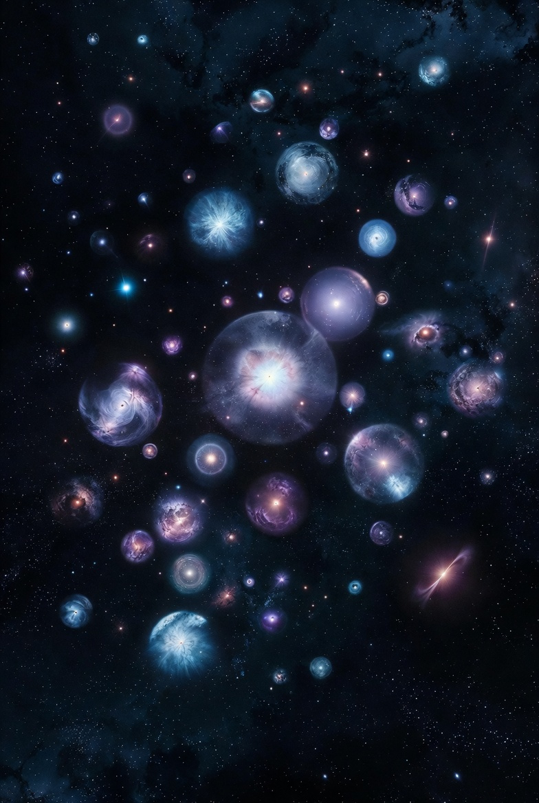
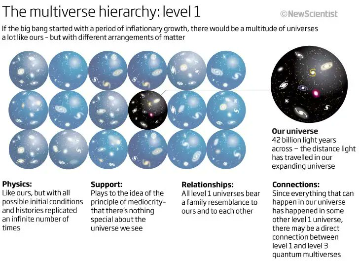
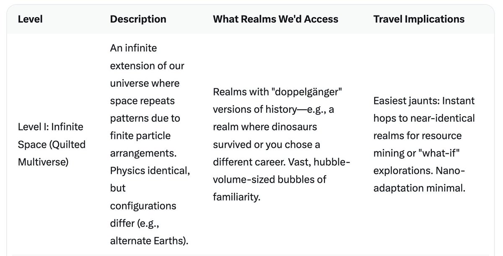
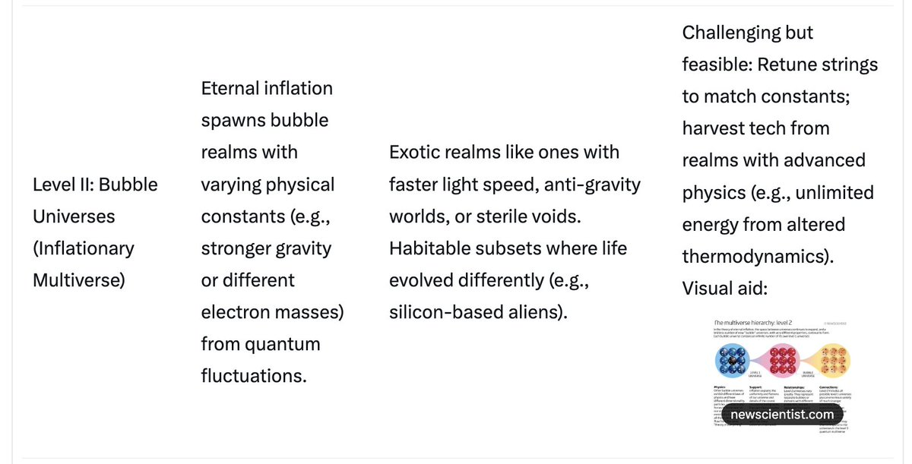
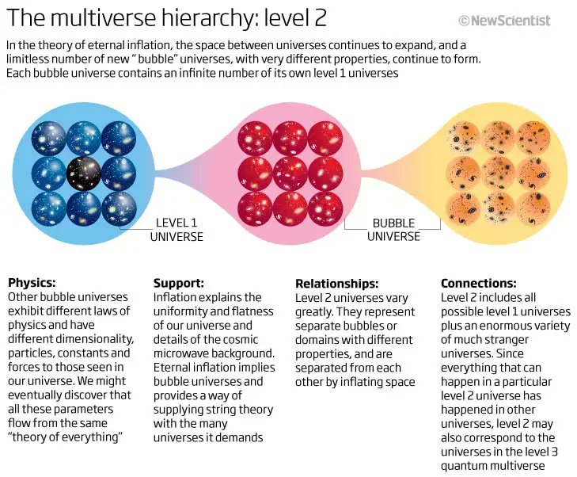
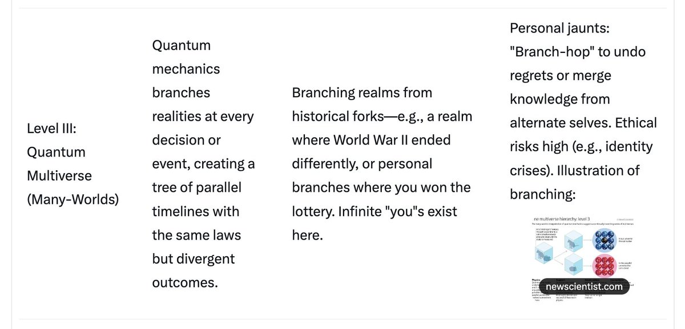
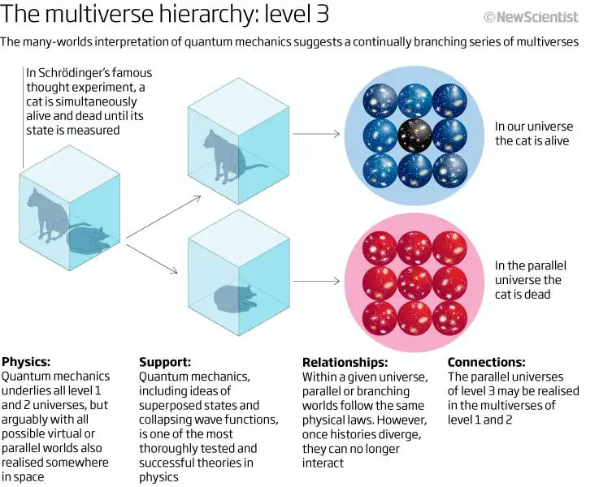
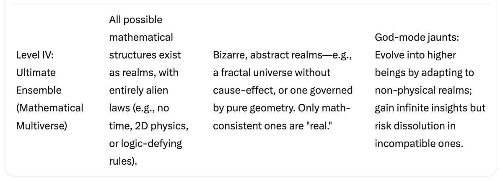
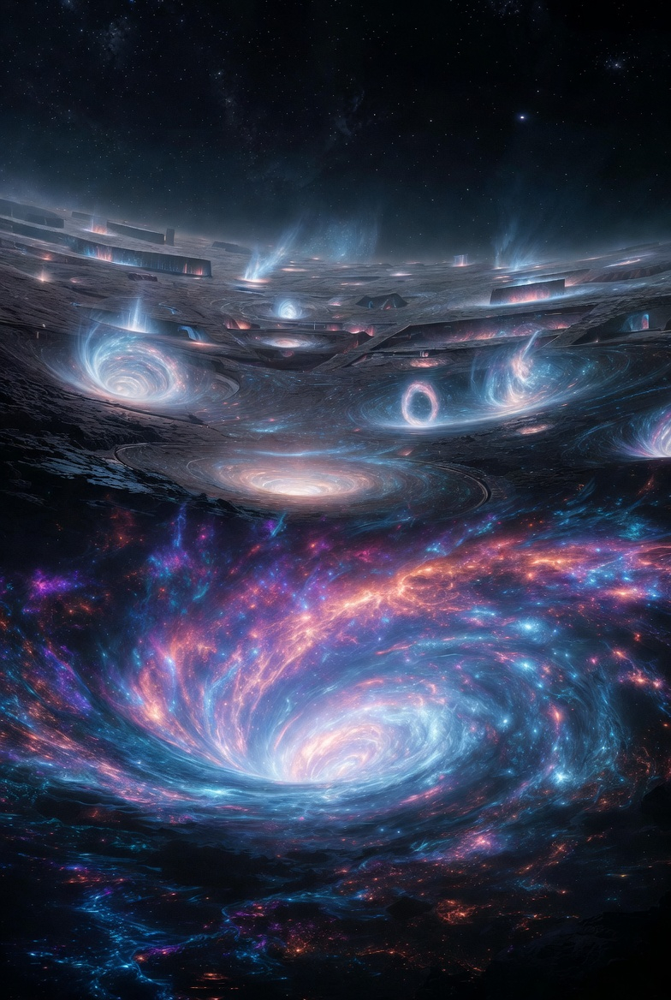

# Multiverse

Article on X: [Multiverse](https://x.com/skyisuniverse/status/2027765321050861679)

From [my conversation with Grok on Instant Space Travel through Wormholes](https://x.com/i/grok/share/e7d9bef850f5449e9685d6e223c112c5)

From [my conversation with Grok on String-Wormhole Teleporter](https://x.com/i/grok/share/e7d9bef850f5449e9685d6e223c112c5)

From [my conversation with Grok on Instant Connectivity in Space via Wormholes](https://x.com/i/grok/share/e7d9bef850f5449e9685d6e223c112c5)

From [my conversation with Grok on Inter-Universal Travelling](https://x.com/i/grok/share/57b71d942e8e401aaf699b280edb767f)

From [my conversation with Grok on Universes / Realms](https://x.com/i/grok/share/57b71d942e8e401aaf699b280edb767f)

> What universities / realms would we be able to travel to?

In our wildly speculative scenario—where we've mastered string theory, holographic principles, and nanotechnology to enable inter-universal jaunts via devices like the Multiversal String-Wormhole Teleporter (MSWT)—the "universes" or "realms" accessible would span the vast multiverse landscape. These aren't just distant places in our cosmos but entirely separate realities, each potentially with unique physical laws, histories, or structures. Drawing from established theoretical physics, we'd prioritize "compatible" realms (those with physics allowing survival or adaptation via string retuning) to avoid instant annihilation. Below, I'll outline key types based on prominent classifications, assuming breakthroughs let us map, connect, and adapt to them. For visualization, here's an illustration of Tegmark's Level I multiverse:

## Tegmark's Four Levels of Multiverses

Physicist Max Tegmark's taxonomy provides a hierarchical framework for multiverses, from extensions of our space to radically different mathematical realities. With the MSWT, we'd jaunt to realms in these levels by entangling across inflationary barriers or quantum branches.

...

...

...

...

...

...

## Greene's Nine Types of Multiverses

Brian Greene expands on this with nine variants, blending string theory and cosmology. These overlap with Tegmark's but add flavors like simulated or holographic realms, accessible via higher-dimensional bulk navigation.

- **Quilted**: Similar to Level I—infinite space with repeating patterns. Jaunt to "mirror" realms for parallel lives.

- **Inflationary**: Bubble-like expansions (Level II). Travel to realms with tweaked constants for exotic matter harvesting.

- **Brane**: Universes as membranes in higher dimensions (string-inspired). Hop to adjacent branes with extra-dimensional physics, like gravity leaks enabling superpowers.

- **Cyclic**: Universes in endless Big Bang/Big Crunch cycles. Jaunt mid-cycle to "time-travel" via phase shifts.

- **Landscape**: String theory's 10^500 vacua—realms with every possible law combo. Ultimate variety: From starless voids to hyper-dense crystal worlds.

- **Quantum**: Many-worlds branching (Level III). Personal realm-hopping for outcome shopping.

- **Holographic**: Realms as projections from boundaries (AdS/CFT). "Program" realities like software, jaunting to simulated sub-realms.

- **Simulated**: Matrix-like universes run by higher beings. Escape or hack into the simulators' realm for meta-knowledge.

- **Ultimate**: All self-consistent mathematical structures (Level IV). Infinite abstract realms, blurring reality and math.

## Additional Exotic Realms

Beyond these, other theories suggest:

- **Shadow Matter Universes**: Realms with unseen particles (e.g., dark matter-dominated), weakly interacting with ours. Jaunt for invisible resource taps.

- **Parallel Universes in Extra Dimensions**: Close in 4D+ space, with slight alterations (e.g., metric archverses or omniverses). Easy access for hybrid civilizations.

- **Baby Black Hole Universes**: Spawned from singularities, each a new Big Bang. Enter young realms to witness creation.

