# Stable Wormholes

Article on X: [Stable Wormholes](https://x.com/skyisuniverse/status/2028509155103781245)

From [my conversation with Grok on Warp-drived Starship](https://x.com/i/grok/share/cdc1453c68324134beb8e748ef73cd8f)

From [my conversation with Grok on Stable Wormholes](https://x.com/i/grok/share/403b0f5c13de42ffb032af8114849758)

## Introduction to Wormholes

Wormholes, also known as Einstein-Rosen bridges, are hypothetical structures in spacetime predicted by Einstein's theory of general relativity. They act as shortcuts connecting two distant points in the universe—or even different universes—potentially allowing for faster-than-light effective travel without violating local speed limits. The concept was first proposed in 1935 by Albert Einstein and Nathan Rosen as a mathematical solution to the field equations, describing a "bridge" between regions of spacetime. However, these early models were non-traversable, collapsing too quickly for anything to pass through.

A classic visualization of a wormhole is a 2D analogy: Imagine spacetime as a flat sheet of paper with two points far apart. Folding the paper and punching a hole connects them directly. In 4D reality, it's more complex, often depicted as a tunnel with spherical entrances. Another diagram shows how a traveler might enter from one side and emerge in a different time or place, potentially creating closed timelike curves (paths allowing time travel).

## Challenges with Stability

In standard general relativity, wormholes are inherently unstable. Simple solutions, like the Schwarzschild wormhole (linked to black holes), pinch off almost instantly due to gravitational collapse, forming singularities where physics breaks down. To make a wormhole "stable" and traversable (allowing safe passage for matter or light), it must satisfy the "flare-out" condition: The throat (narrowest point) must remain open against gravity's pull. This requires violating classical energy conditions, such as the Null Energy Condition (NEC) or Weak Energy Condition (WEC), which state that energy density should be non-negative for ordinary matter. 

Pioneering work by Michael Morris and Kip Thorne in 1988 showed that traversable wormholes need "exotic matter"—hypothetical material with negative energy density or pressure, exerting repulsive gravity to prop open the throat. Exotic matter hasn't been observed, but quantum effects like the Casimir effect (where vacuum fluctuations create negative energy between plates) suggest it's possible in principle. Without it, wormholes collapse, making them non-viable for travel.

## Recent Theoretical Advances

While no stable wormholes have been detected, recent research explores ways to stabilize them without relying solely on exotic matter. In extended gravity theories beyond Einstein's, such as f(R) gravity (modifying the gravitational action) or Einstein Dilaton Gauss-Bonnet (EdGB) gravity, solutions exist that potentially reduce or eliminate the need for exotic matter by altering spacetime geometry. For example, a 2024 review highlights wormhole models in f(R) theories where violations of energy conditions are minimized, though some exotic matter may still be required at the throat.

A 2025 study by a mathematician proposes thin-shell wormholes in Lorentz-violating spacetimes, where exotic matter is concentrated in a small area for better stability. Smaller wormholes might attract objects, while larger ones repel, but they still need negative energy. Other ideas include Casimir wormholes (using quantum vacuum energy), dark matter halo wormholes, or nonlocal gravity models, which aim to stabilize structures with less exotic input. A 2021 paper suggests some wormholes could be stable in modified theories, extending black hole concepts.

However, debates persist: A 2018 analysis argues that stable wormholes with quantum corrections are critically unstable, prone to collapse from fluctuations. Critics note that claims of exotic-matter-free wormholes often involve calculation errors or fail to check throat discontinuities.

## Potential Implications and Existence

If stable wormholes exist, they could revolutionize travel, enabling shortcuts across the cosmos or even time loops (though chronology protection mechanisms, like Hawking's conjecture, might prevent paradoxes via quantum instabilities). Some speculate primordial wormholes from the Big Bang could persist as dark matter candidates. Visually, a wormhole might appear spherical rather than hole-like, bending light like a gravitational lens.

Despite theoretical intrigue, wormholes remain unproven. They can't form naturally from known processes, and creating one artificially would require advanced civilizations manipulating immense energies. Ongoing research in gravitational waves (e.g., via LIGO) or quantum analogs might provide indirect evidence, but for now, they inspire science fiction more than science fact.

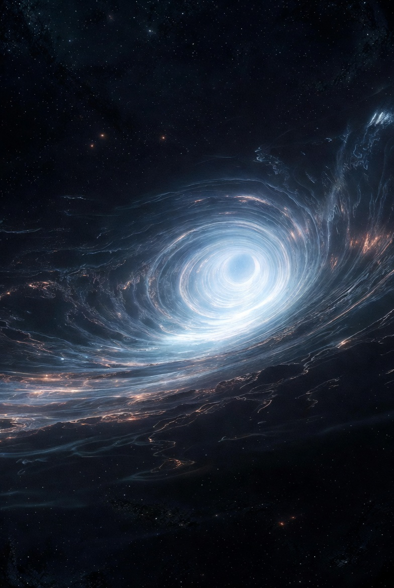

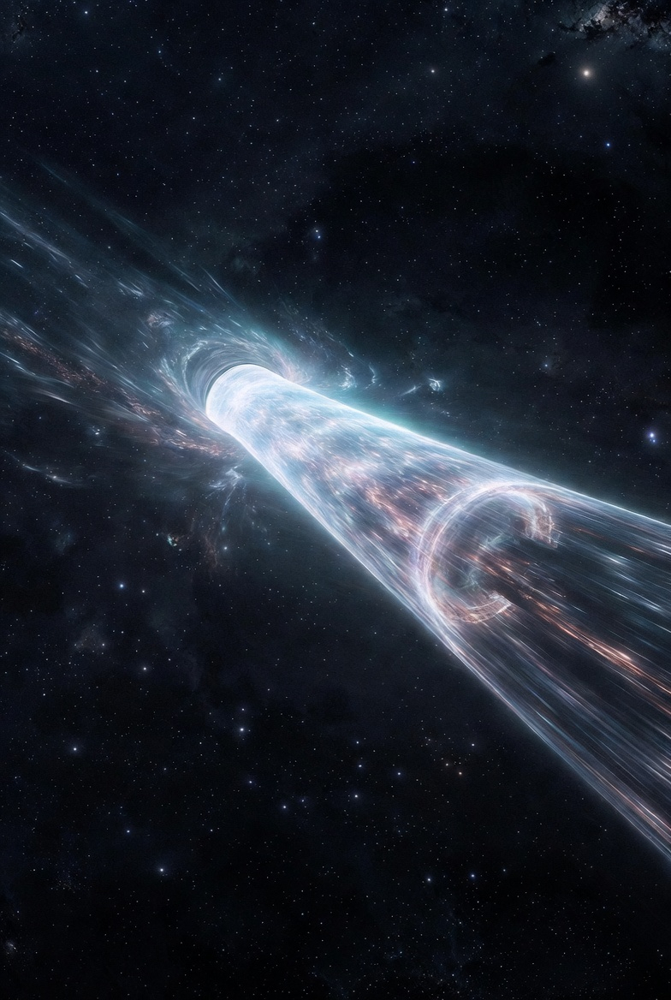

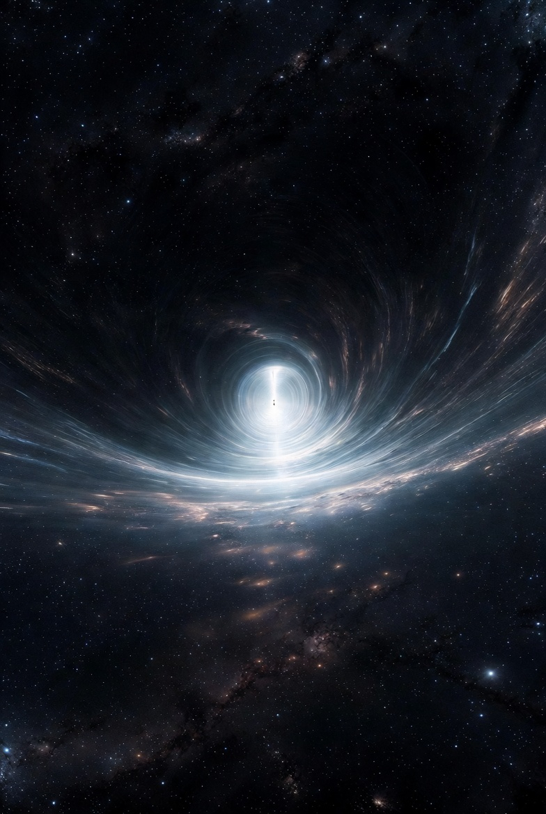

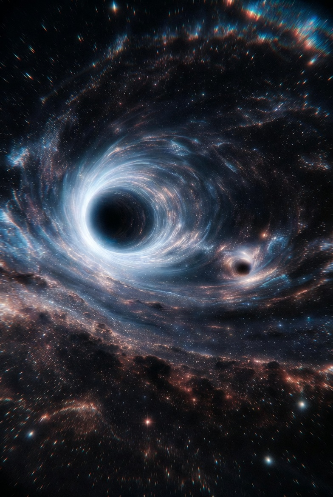

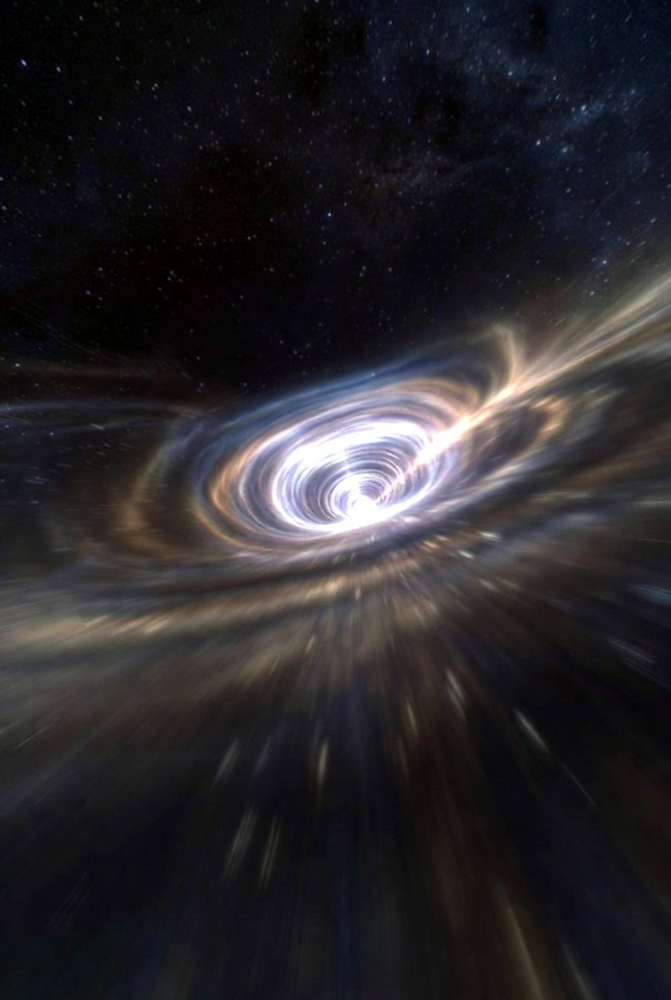

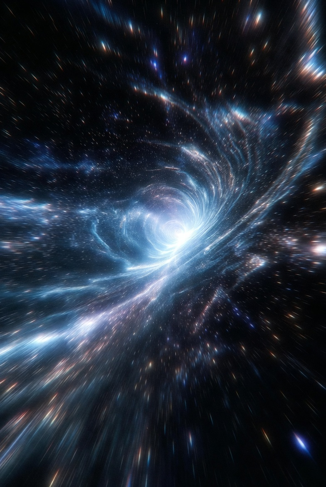

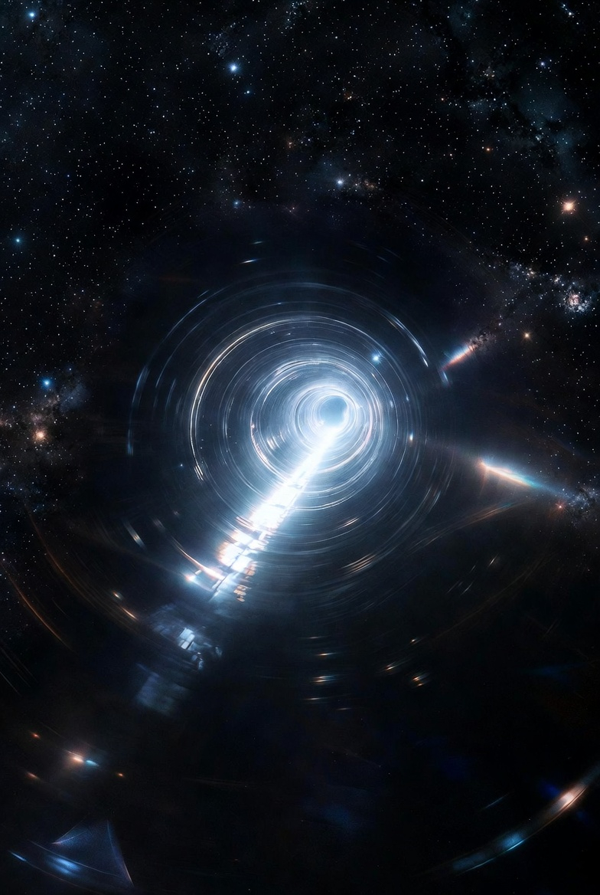

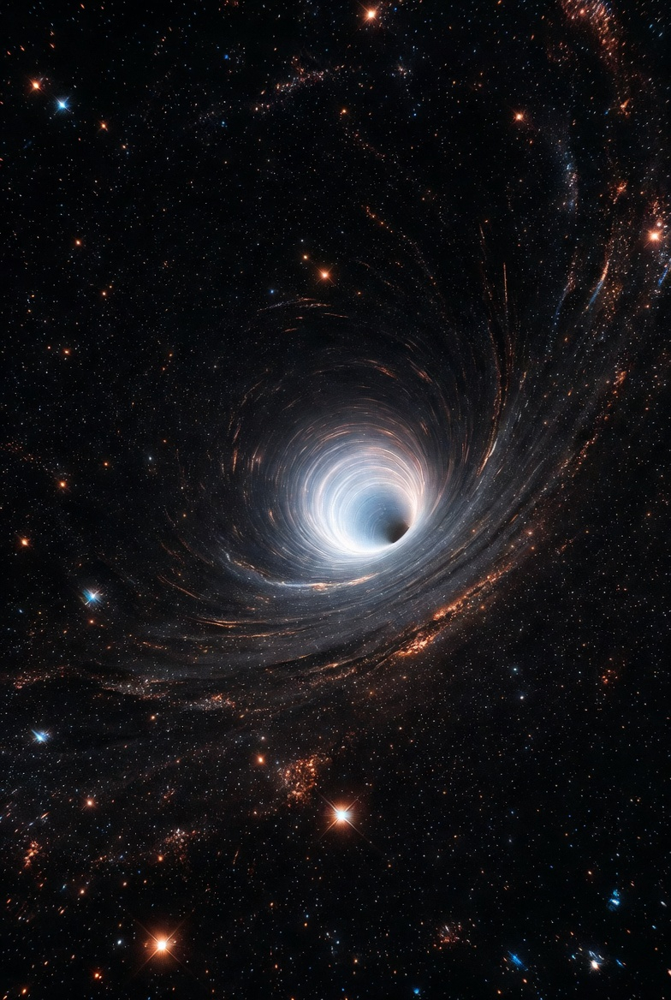

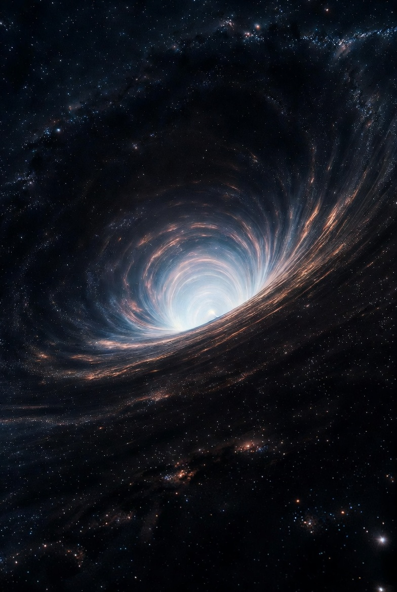

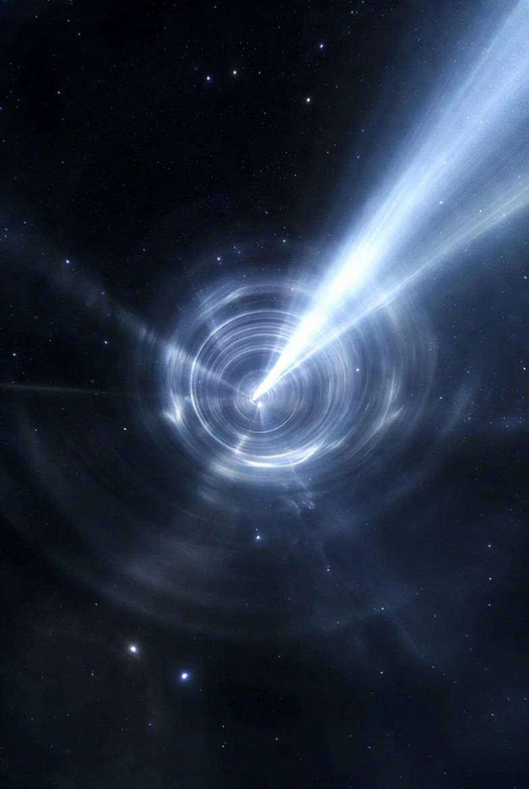

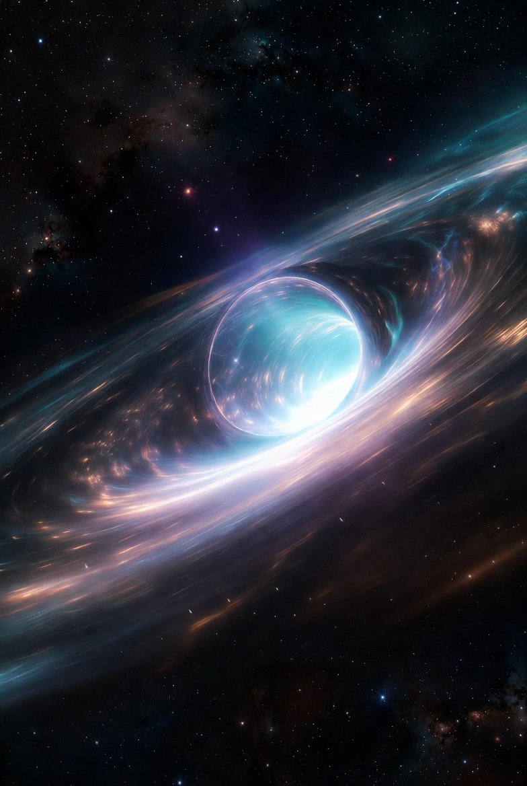

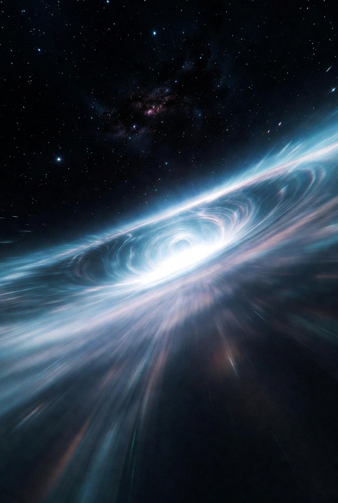

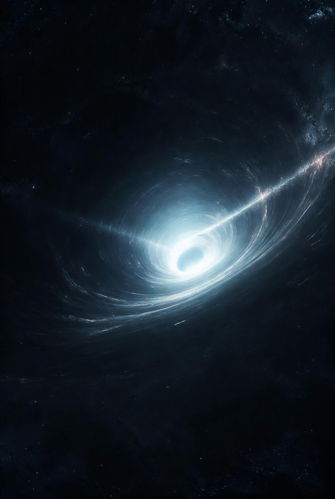

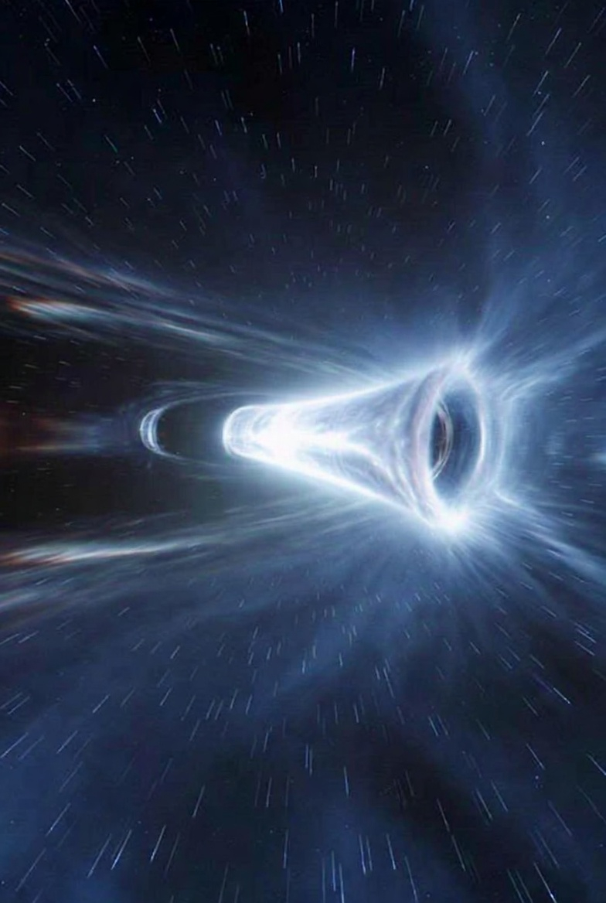

