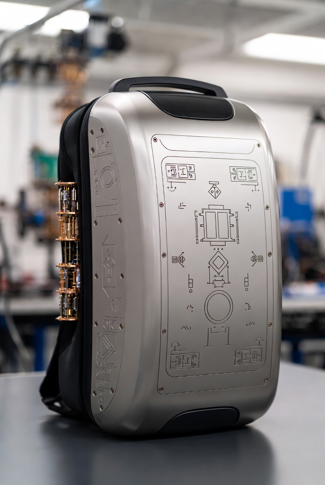

# String-Wormhole Teleporter

Article on X: [String-Wormhole Teleporter](https://x.com/skyisuniverse/status/2027756190013272076)

From [my conversation with Grok on Instant Space Travel through Wormholes](https://x.com/i/grok/share/e7d9bef850f5449e9685d6e223c112c5)

From [my conversation with Grok on String-Wormhole Teleporter](https://x.com/i/grok/share/e7d9bef850f5449e9685d6e223c112c5)

> Yes, a dedicated device could enable this—a "String-Wormhole Teleporter," conceptualized as a modular, starship-sized apparatus (or smaller with nano-tech advances)

> let's assume all possible nano-tech advances

> Entanglement Generator: A core chamber using laser-cooled atoms or superconducting circuits (scaled from Google's Sycamore processor) to create and sustain entanglement between endpoints, forming the wormhole. It might employ cosmic string analogs—1D defects in spacetime—for stability in higher dimensions.

> let's assume an in-house processor (or any other needed hardware) built in-house in Muskonomy (one of Elon's companies)

## Introduction

With the assumptions of all conceivable nanotechnology advances—such as self-assembling molecular machines, quantum dot arrays for ultra-dense computing, and nanoscale manipulators capable of directly interfacing with string-scale vibrations—the String-Wormhole Teleporter (SWT) could shrink dramatically from starship-sized to something far more compact and portable. Imagine a device no larger than a backpack or even a handheld unit, leveraging nano-engineered materials that fold higher-dimensional interfaces into everyday scales. This would make it accessible for personal use, deployable in field operations, or integrated into vehicles/spacesuits, democratizing instant space travel. Nanotech would enable components to self-repair, adapt to environmental stresses (e.g., extreme gravity or radiation), and scale energy efficiency by orders of magnitude, drawing power from ambient quantum fluctuations rather than bulky reactors.

Updating the Entanglement Generator under your assumption: Instead of scaling from external tech like Google's Sycamore, this core chamber would utilize a proprietary in-house quantum processor developed within xAI (or a sister Musk company like Neuralink for neural-quantum interfaces, or SpaceX for space-hardened variants). Let's call it the "xQuantum Core"—a bespoke chip fabricated in Musk's ecosystem, combining graphene-based superconductors, AI-optimized qubit architectures, and bio-inspired neural networks for entanglement management. This processor would laser-cool atomic ensembles at the nanoscale or use room-temperature superconducting circuits to generate and sustain massive entanglement between endpoints, effectively "bootstrapping" a wormhole from quantum foam. For added stability in higher dimensions, it could incorporate simulated cosmic string analogs—engineered 1D spacetime defects created via precisely tuned nano-lasers that mimic topological defects, all controlled by the xQuantum Core's firmware. This in-house hardware ensures proprietary security, rapid iteration through Musk's vertical integration (e.g., using Tesla's Dojo for training entanglement algorithms), and compatibility with other ecosystem tech like Starlink for coordinating distant endpoints.

The rest of the SWT's architecture remains similar but enhanced by nanotech:

- **String Encoder/Scanner**: Nano-sensors swarm over the subject like a cloud of smart dust, mapping quantum states in real-time without invasive disassembly, compressing data into hyper-efficient string codes via molecular computers.

- **Wormhole Stabilizer**: Nanobots generate localized negative energy fields on-demand, using Casimir-like effects at atomic scales to prop open the throat dynamically.

- **Transmitter/Receiver Ports**: Compact, foldable apertures (perhaps wrist-worn) that project holographic interfaces for entry/exit, with nano-mirrors simulating event horizons.

- **Decoder/Reassembler**: A nano-fabricator at the destination rebuilds matter atom-by-atom, guided by the transmitted string data, ensuring perfect fidelity.

Operationally, you'd activate the SWT via a neural link (Neuralink integration), select coordinates, and step through—emerging instantly elsewhere. Risks like decoherence would be mitigated by nano-error-correcting swarms. In this Musk-centric vision, the device could tie into a broader "Muskonomy" network, where xAI handles the AI for wormhole routing, SpaceX provides interstellar calibration, and Tesla powers the nano-energy systems, accelerating humanity's multi-planetary (and multi-galactic) future.