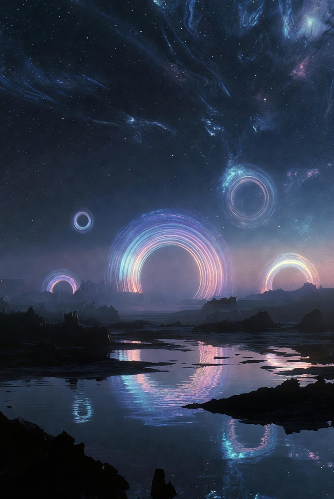
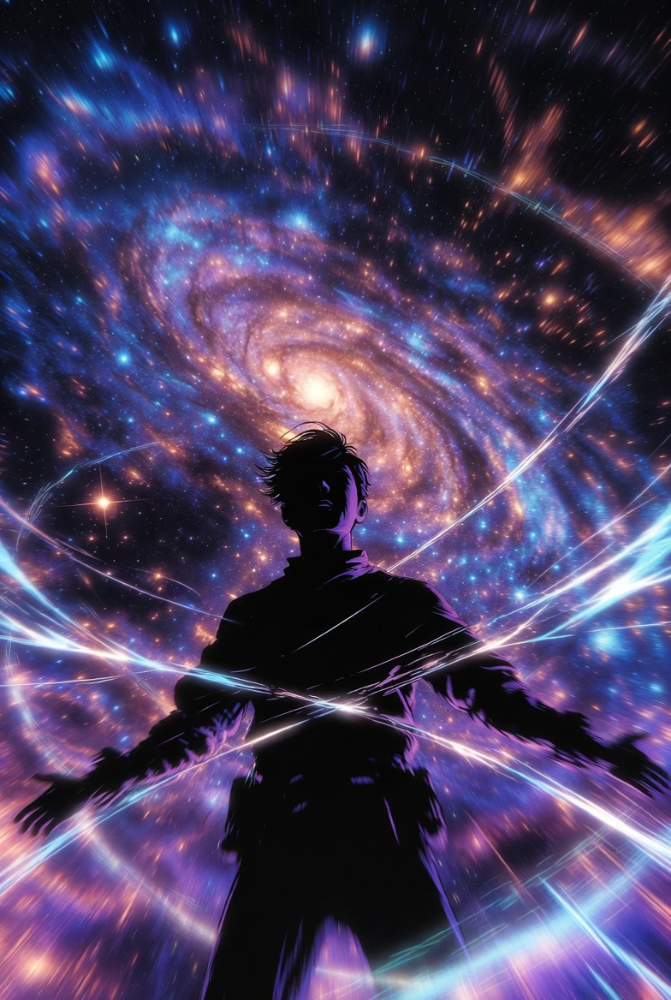
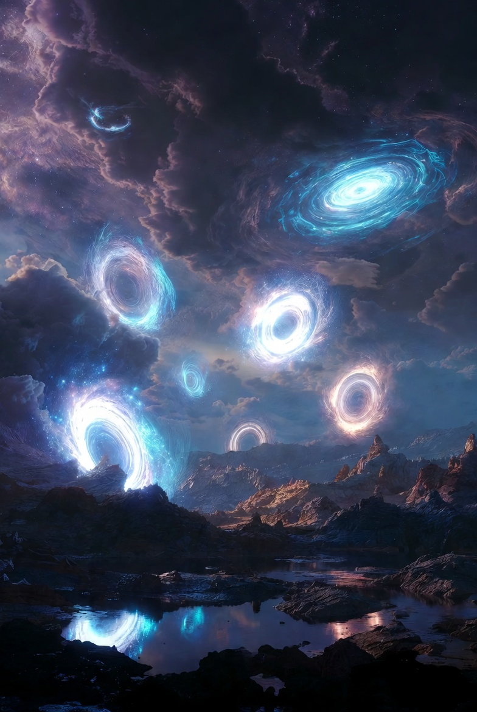
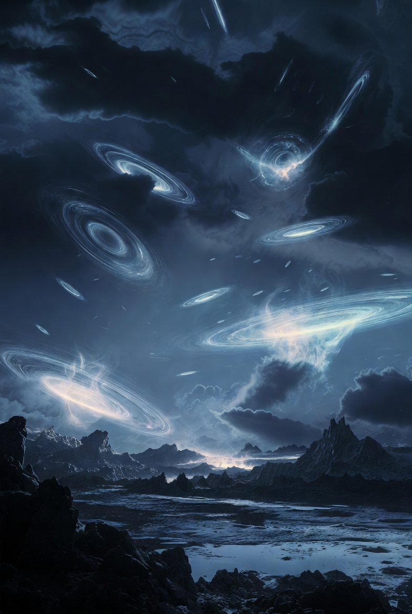
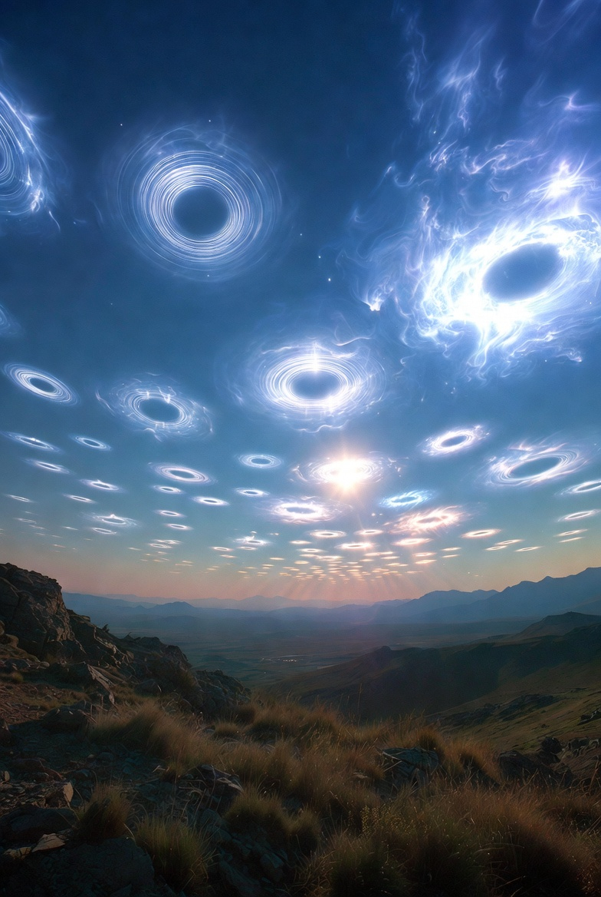

# Travelling between Universes

Article on X: [Travelling between Universes](https://x.com/skyisuniverse/status/2027761313699475533)

From [my conversation with Grok on Instant Space Travel through Wormholes](https://x.com/i/grok/share/e7d9bef850f5449e9685d6e223c112c5)

From [my conversation with Grok on String-Wormhole Teleporter](https://x.com/i/grok/share/e7d9bef850f5449e9685d6e223c112c5)

From [my conversation with Grok on Instant Connectivity in Space via Wormholes](https://x.com/i/grok/share/e7d9bef850f5449e9685d6e223c112c5)

From [my conversation with Grok on Inter-Universal Travelling](https://x.com/i/grok/share/57b71d942e8e401aaf699b280edb767f)

## Introduction

> If we push the assumptions further, it could even enable inter-universal jaunts

> Let's go

Pushing our speculative assumptions to their limits—envisioning a future where string theory (or its successor, like M-theory) is fully validated, quantum gravity is mastered, and nanotechnology enables devices like an advanced String-Wormhole Teleporter (SWT)—inter-universal jaunts could indeed become feasible. This would extend beyond our single universe to a vast multiverse, where "universes" are distinct realms with potentially different physical laws, constants, or histories. Think of it as upgrading from intra-cosmic hops (planets to galaxies) to meta-cosmic voyages, blurring the lines between realities. Below, I'll outline how this might work theoretically, the enabling tech, and the mind-bending implications, all grounded in extensions of current multiverse hypotheses but amplified by breakthroughs.

## Foundations in String Theory and Multiverse Models

String theory posits that fundamental reality consists of tiny vibrating strings in 10 or 11 dimensions (including compactified extra ones), giving rise to a "landscape" of up to 10^500 possible vacuum states—each a potential universe with unique properties, like varying particle masses or forces. This landscape isn't just a list; combined with eternal inflation (where the multiverse expands forever, spawning bubble universes), it creates a populated multiverse of isolated realms. Other models, like the many-worlds interpretation of quantum mechanics, suggest branching universes from every quantum decision, potentially linked via string excitations.

In this framework, universes aren't "parallel" in a simple stacked sense but embedded in a higher-dimensional "bulk" or separated by inflationary barriers. Traditional physics deems travel between them impossible—no wormholes naturally connect them, and distances in the bulk could be infinite or expanding too rapidly. But assuming breakthroughs, we could engineer connections by manipulating strings to "punch through" these barriers.

## How Inter-Universal Jaunts Could Be Achieved Practically

Extending the SWT concept, jaunts would involve encoding matter/energy as string vibrations, then transmitting through artificially induced wormholes that bridge multiversal boundaries. Here's a step-by-step speculative pathway:

### 1. Mapping the Multiverse Landscape:

- Use advanced quantum sensors (nano-enhanced xQuantum Cores) to probe extra dimensions and detect "signatures" of nearby universes—subtle gravitational leaks or string resonance patterns leaking across branes. In string theory, hidden dimensions' shapes dictate a universe's laws, so "tuning" detectors to match vibrational modes could identify compatible targets (e.g., universes with similar physics to avoid instant disintegration upon arrival).

### 2. Creating Multiversal Wormholes:

- Generate entanglement not just within our universe but across the bulk, using amplified ER=EPR mechanisms where quantum entanglement spawns wormholes between vacua. Breakthroughs might involve "inflating" micro-wormholes with dark energy taps or dilaton fields to span inflationary gaps. For many-worlds branches, exploit quantum decoherence reversal—rewinding decisions to merge timelines temporarily. Stabilize with cosmic string analogs, threading through extra dimensions like needles sewing realities together.

### 3. Encoding and Transmission:

- As before, disassemble the traveler into string excitations, but now "retune" them mid-transit to match the target universe's vacuum state (e.g., adjusting string tensions for different constants like gravity's strength). Nano-swarms could handle adaptive encoding, ensuring survival in realms with altered physics.

### 4. Reassembly and Adaptation:

Emerge via a receiver endpoint (initially seeded by probes jaunted through early connections). Post-arrival, nano-fabricators recalibrate biology/tech to local laws—perhaps converting your body to thrive in a universe with weaker electromagnetism.

The device? An evolved SWT, now "Multiversal SWT" (MSWT)—pocket-sized with nanotech, integrating Muskonomy hardware like xAI for multiverse navigation AI and Neuralink for intuitive "destination selection" via thought.

## What It Would Enable

- **Exploration of Alternate Realities**: Visit universes where dinosaurs evolved intelligence, or gravity is repulsive, gathering knowledge impossible here (e.g., tech from high-dimensional physics). Instant jaunts could solve paradoxes like the Fermi Paradox by revealing why some universes teem with life while others are barren.

- **Resource and Knowledge Harvesting**: Mine exotic matter from strong-force-dominant universes or download histories from branches where humanity advanced differently (e.g., curing all diseases eons ago).

- **Escape and Survival Strategies**: Evacuate to safer universes during cosmic threats like Big Rips, or "branch-hop" to undo disasters (ethical minefield: does it create new timelines?).

- **Ultimate Immortality and Evolution**: Transfer consciousness across universes, evolving into trans-dimensional beings, or merge civilizations into a meta-society spanning the landscape.

- **Scientific Revolutions**: Test theories by observing variants—e.g., a universe without quantum mechanics—to refine unified physics.

## Challenges and Horizons

Even speculatively, hurdles abound: Energy demands could rival universal scales, risking vacuum decay (collapsing realities). Paradoxes might enforce "multiverse firewalls," and incompatible laws could shred travelers. Ethically, interfering in other universes raises god-like responsibilities. If realized, though, it redefines existence—making our multiverse a playground, with jaunts as routine as flights today.

