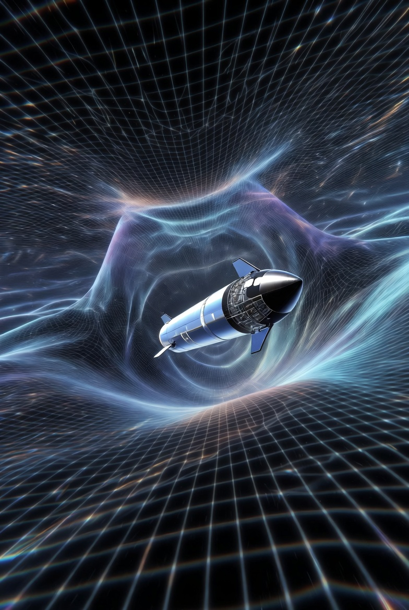
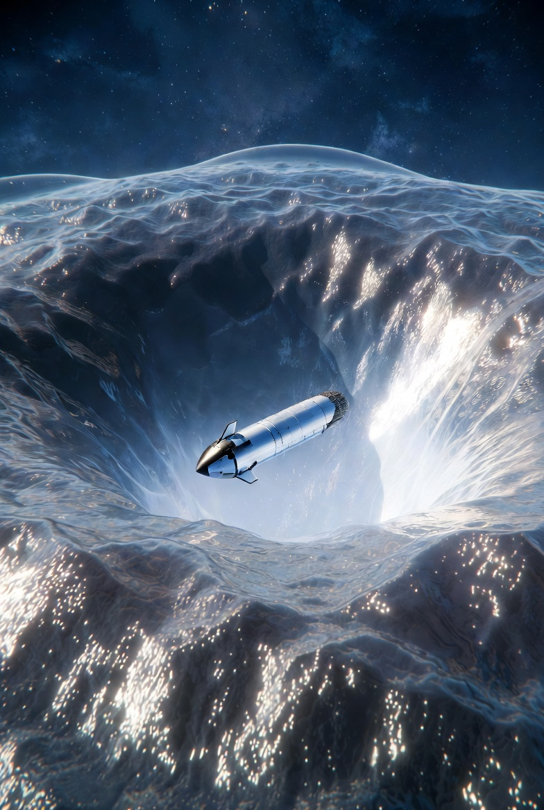
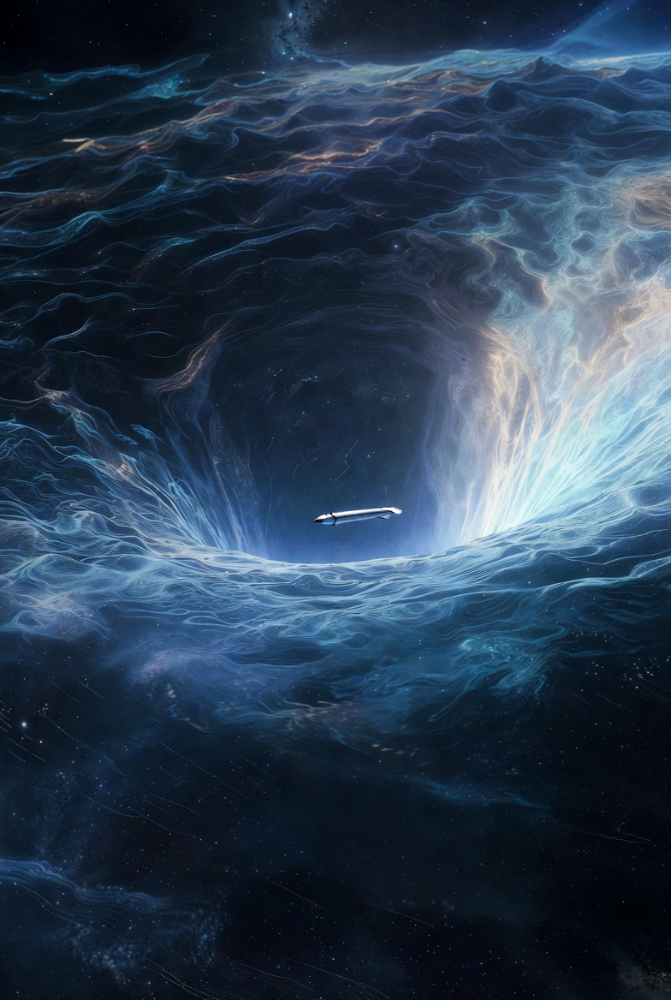
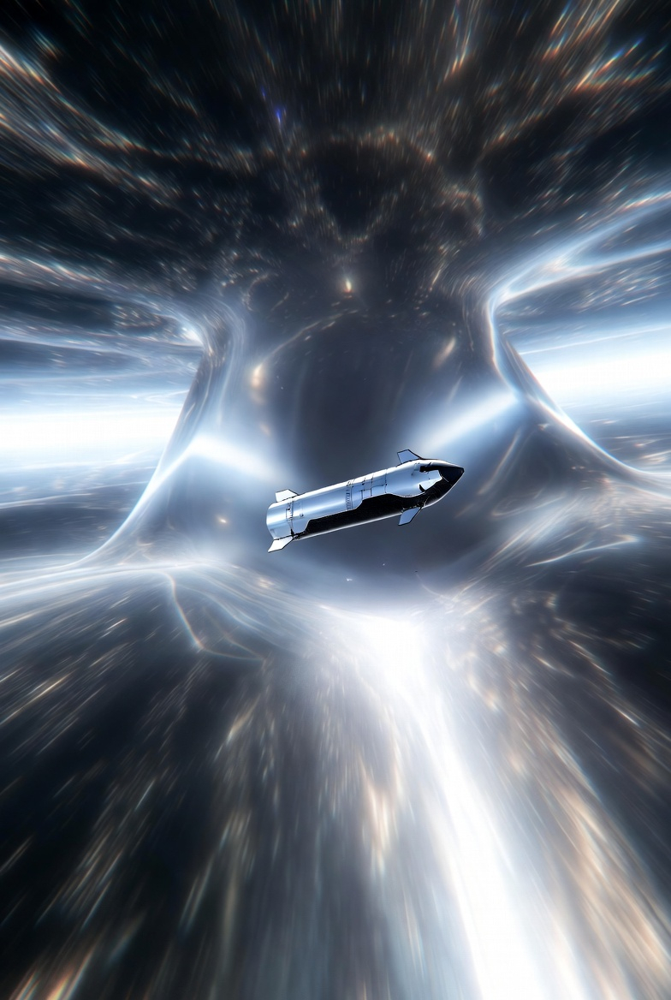
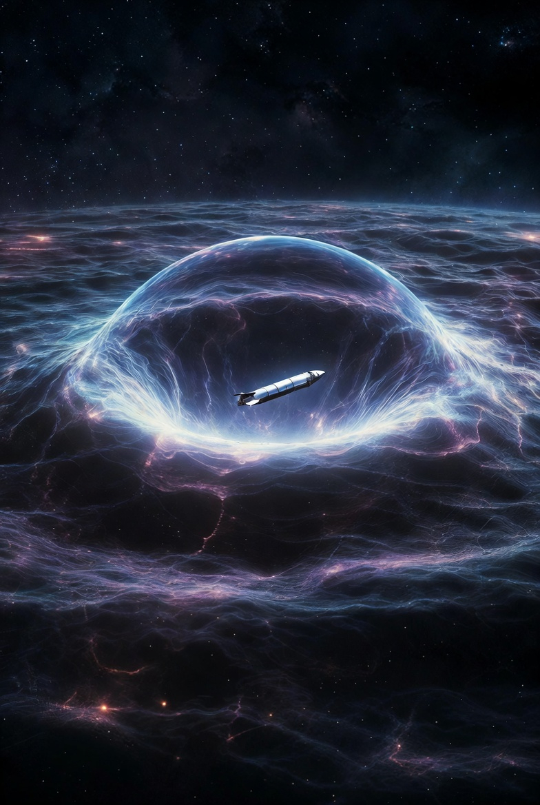
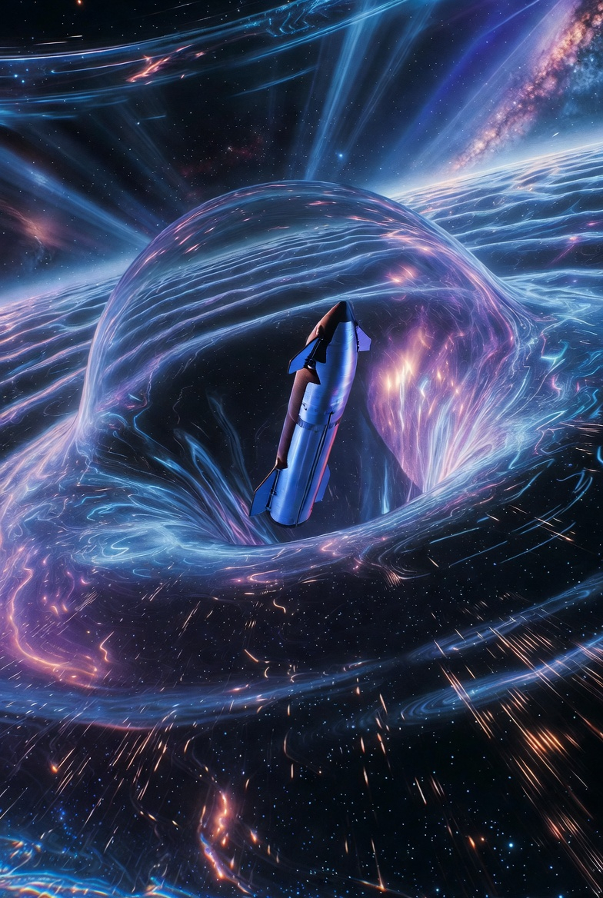
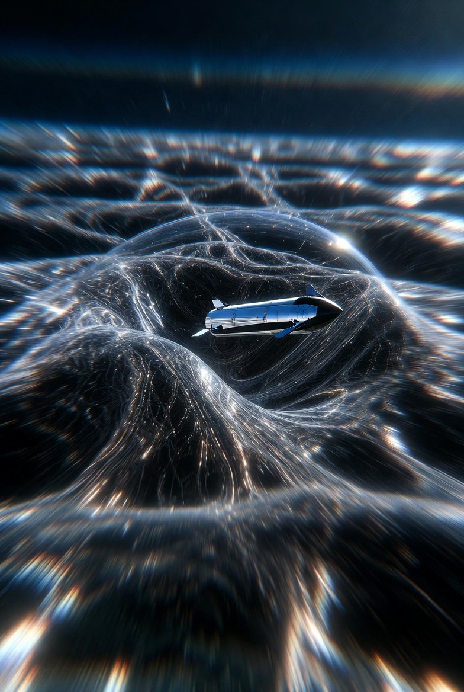

# Hyper-Fast (10c/100c) Soliton Warp Drive

Article on X: [Hyper-Fast (10c/100c) Soliton Warp Drive](https://x.com/skyisuniverse/status/2028496094070472924)

From [my conversation with Grok on Warp-drived Starship](https://x.com/i/grok/share/cdc1453c68324134beb8e748ef73cd8f)

From [my conversation with Grok on Hyper-Fast (10c/100c) Soliton Warp Drive](https://x.com/i/grok/share/cdc1453c68324134beb8e748ef73cd8f)

## Introduction

The "10c model" and "100c model" refer to specific parameterizations of Erik Lentz's 2021 theoretical framework for a warp drive, where the apparent velocity of the soliton (the self-sustaining warp bubble) is tuned to 10 times or 100 times the speed of light (c), respectively. This is not two separate models but the same soliton-based system scaled to different hyper-fast (superluminal) speeds. Lentz's innovation lies in constructing these solitons using Einstein-Maxwell-plasma theory, where electromagnetic fields coupled with a plasma medium source the spacetime curvature, allowing arbitrary superluminal apparent velocities while claiming to use only positive energy densities—avoiding the exotic negative energy typically required in earlier warp drive concepts like Alcubierre's. However, subsequent analyses (e.g., in 2021-2022) have debated this, arguing that superluminal configurations may still violate certain energy conditions (like the dominant or null energy conditions) or appear to require negative energy in some reference frames, potentially rendering them unphysical.

## Core Mechanism of the Model

Lentz's solitons are localized, wave-like disturbances in spacetime that propagate at constant velocity without dispersing, analogous to stable solitary waves in other physical systems. The warp bubble forms around a spacecraft, with flat spacetime inside (Minkowski metric) and curved spacetime outside, driven by the plasma-electromagnetic stress-energy tensor. The key equations stem from solving the Einstein field equations coupled with Maxwell's equations in a plasma medium:

- The metric is designed such that the shift vector (which dictates the "flow" of space) allows for a superluminal boost.
- (the soliton's speed) can be set arbitrarily greater than c, with no theoretical upper limit in the model
- Energy density remains positive everywhere, satisfying the weak energy condition (WEC), but critics note violations of the dominant energy condition (DEC) for vs>c , which could imply instabilities or causality issues.

The soliton is inertial (constant velocity), requiring external propulsion to initiate or change speed, but once moving, it sustains itself.

## The 10c Configuration

- **Setup and Differences**: This scales the soliton's velocity to vs=10c. The bubble's geometry is optimized (e.g., via flattening along the direction of motion) to minimize energy while maintaining stability. Compared to lower speeds, the curvature gradient is steeper, but the plasma sourcing keeps energies positive. No fundamental structural change from subluminal or 1c versions—it's a parameter adjustment in the metric and energy distribution.

- **Energy Requirements**: For a 100-meter radius spacecraft at 1c, the baseline energy is ~100-200 times Jupiter's mass (converted via E=mc2). At 10c, energy scales roughly with vs^2, so it would be ~100 times higher than at 1c (i.e., tens of thousands of Jupiter masses). Optimizations like bubble flattening or advanced plasma configurations could reduce this by orders of magnitude (potentially 30-60), bringing it closer to feasible levels with hypothetical future tech like advanced fusion.

- **Implications for Travel**: Apparent speed of 10c means crossing 4.3 light-years to Alpha Centauri in ~5.2 months from an external (Earth) observer's perspective, with onboard time potentially even shorter due to relativistic effects (though minimal inside the flat bubble). For galactic scales, the 26,000 light-years to the center could take ~2,600 years externally—still immense but conceivable for probes or multi-generational ships.

- **Challenges**: Higher velocity amplifies risks like quantum instabilities at the bubble's horizon, potential causality violations (e.g., closed timelike curves leading to paradoxes), and the need for immense initial acceleration.

## The 100c Configuration

- **Setup and Differences**: Similar to 10c but with vs = 100c, requiring even more extreme optimization of the soliton shape (e.g., greater flattening to near-Planck scales in the motion direction). The plasma-electromagnetic sourcing scales up, but the model allows it without altering the core equations. This pushes the limits of the theory, with the bubble's "thickness" minimized to maintain positive energies.

- **Energy Requirements**: Scaling with vs^2, energy at 100c would be ~10,000 times the 1c baseline—potentially millions of Jupiter masses without optimizations. However, Lentz suggests mechanisms (e.g., from prior research) could slash this by 60 orders of magnitude, theoretically making it approachable with advanced energy tech. Critics argue this still implies hidden negative energies or condition violations.

- **Implications for Travel**: Dramatically compresses distances—Alpha Centauri in ~15.7 days externally; galactic center in ~260 years. Intergalactic travel (e.g., to Andromeda, 2.5 million light-years) could take ~25,000 years externally, opening possibilities for cosmic exploration within human civilization timescales.

- **Challenges**: Amplified from 10c, including greater risks of spacetime instabilities, higher propulsion needs to reach such velocities, and stronger debates over physical viability due to energy condition disputes.

In summary, these configurations highlight Lentz's breakthrough in proposing positive-energy superluminal travel, but ongoing physics debates (as of 2026) question their feasibility without exotic matter or condition violations. Future refinements, like those by Fell and Heisenberg, aim to address these issues.

