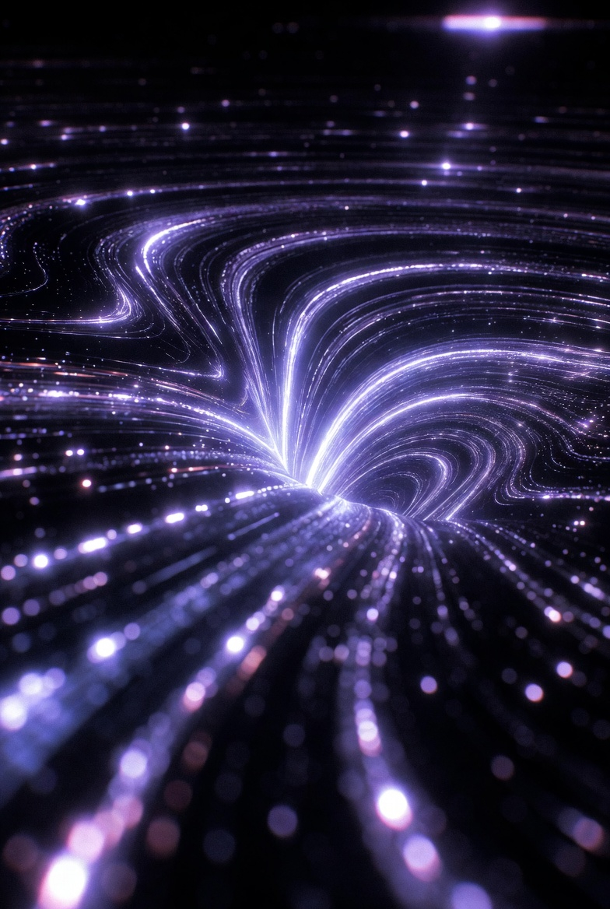

# Metamaterials for SpaceTime curvature control

[Metamaterials for SpaceTime curvature control](https://x.com/skyisuniverse/status/2028502941183668524)

From [my conversation with Grok on Warp-drived Starship](https://x.com/i/grok/share/cdc1453c68324134beb8e748ef73cd8f)

From [my conversation with Grok on Metamaterials for SpaceTime curvature control](https://x.com/i/grok/share/8e556a98dbc84f7bae5e69d09584d1c0)

## Hyperbolic Metamaterials for Gravitational Analog Containment

Hyperbolic metamaterials, characterized by their indefinite permittivity or permeability tensors (e.g., one positive and two negative components), could be engineered to contain gravitational-like fields by simulating effective curved spacetimes. In warp drive contexts, these materials create "analog gravity" environments where electromagnetic waves propagate as if in a gravitational field, enabling confinement of the warp bubble's stress-energy distortions. With breakthroughs like nano-assembly (e.g., layered plasmonic structures or self-assembling nanoparticle arrays), they could be tuned for negative effective mass densities, containing fields by inducing evanescent modes that prevent leakage. This would allow precise localization of curvature gradients, reducing energy spillover and stabilizing solitons at scales from microns to meters.

## Space-Time Metamaterials for Dynamic Field Manipulation

Space-time metamaterials, which vary their properties both spatially and temporally (e.g., via modulated refractive indices using electro-optic effects), offer advanced containment by enabling four-dimensional control over electromagnetic and potentially gravitational fields. Assuming breakthroughs in quantum gravity integration (e.g., embedding string-inspired dualities), these could "cloak" or confine warp-induced perturbations, preventing causality violations like horizon instabilities. Nano-engineered versions, such as graphene-based modulators with femtosecond switching, would allow real-time adaptation to field fluctuations, containing the bubble's expansion/contraction phases. This dynamic tunability could reduce energy requirements by orders of magnitude, making them ideal for nacelle components in a Warp Starship.

## Weyl Metamaterials for Quantum Gravitational Containment

Weyl metamaterials, designed to host Weyl fermions (massless particles with chiral properties) in a synthetic curved geometry, could contain fields by mimicking relativistic effects in condensed matter systems. With scientific advances like topological protection via 3D-printed nanostructures or Dirac cone engineering in photonic crystals, they enable chiral transport that "traps" pseudospinors, effectively containing gravitational analogs at quantum scales. For warp drives, this would prevent quantum decoherence in the bubble's interior, using strain-induced gauge fields to simulate and confine spacetime torsion. Breakthroughs in hybrid Weyl-superconductor composites could extend this to macroscopic gravity manipulation, ensuring field isolation without exotic matter.

## Transformation Optics-Based Metamaterials for Curvature Shielding

Drawing from transformation optics, metamaterials could be crafted to bend or contain fields by mapping flat-space coordinates to curved ones, effectively shielding external spacetime from warp distortions. Assuming breakthroughs in broadband, lossless designs (e.g., via zero-index metamaterials with embedded quantum dots), these would create "invisibility cloaks" for gravitational waves, containing the bubble's ripple effects. Nano-assembly could produce conformal layers that adapt to the ship's hull, using active elements like phase-change materials for on-demand permeability adjustments. This would be crucial for safety, preventing unintended gravitational lensing or wave pollution during operation.

## Exotic Gravitational Metamaterials with Quantum Enhancements

In hypothetical scenarios with unified quantum gravity, "gravitational metamaterials" could directly couple to the metric tensor, containing fields through engineered gravitomagnetic effects (analogous to electromagnetism but for gravity). Breakthroughs like spin-network embeddings from loop quantum gravity or brane-inspired structures from string theory would enable materials with tunable gravitophotonic responses, confining curvature via negative refractive indices for gravitons. Nano-fabricated versions, such as atomic lattices with entangled spins, could achieve zero-point energy modulation for field barriers, revolutionizing containment by making warp bubbles self-sustaining and leak-proof.

These metamaterials would integrate seamlessly with advanced AI for curvature control, using feedback loops to optimize containment in real-time, potentially enabling efficient, scalable warp prototypes by the 2070s+.

