# Particle Accelerators & Interferometers for Warp Fields

Article on X: [Particle Accelerators  & Interferometers for Warp Fields](https://x.com/skyisuniverse/status/2028501571407876554)

From [my conversation with Grok on Warp-drived Starship](https://x.com/i/grok/share/cdc1453c68324134beb8e748ef73cd8f)

From [my conversation with Grok on Particle Accelerators  & Interferometers  for Warp Fields](https://x.com/i/grok/share/914cd31980b74d0b8f0c09c37421fc1b)

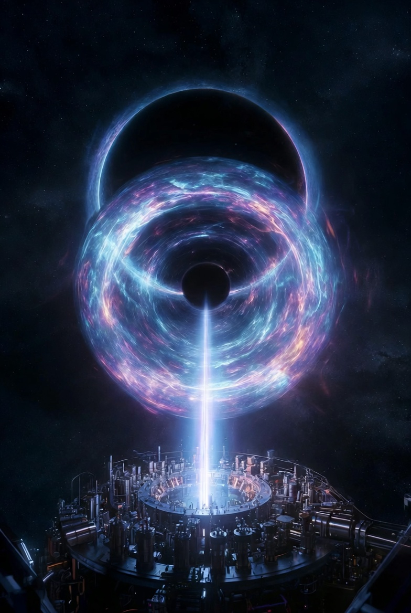

## Particle Accelerators for Creating Micro-Warp Fields

Particle accelerators could play a crucial role in generating the high-energy plasmas or electromagnetic fields needed to induce micro-warp effects, such as localized spacetime curvature or soliton-like structures in models like Lentz's hyper-fast warp drive. Traditional accelerators like the Large Hadron Collider (LHC) are massive and energy-intensive, but for warp experiments, compact designs are essential to create controlled, high-density environments (e.g., via plasma wakes or z-pinches) that mimic the stress-energy tensor manipulations required for warp bubbles. Assuming scientific breakthroughs in nano-assembly—such as DNA-directed self-assembly for precise nanomaterial structuring or optofluidic 3D printing for multi-material integration—these could enable ultra-compact, efficient accelerators with atomic-scale precision, reducing size, cost, and energy needs while enhancing control over field generation.

### Key Types Needed

#### Laser-Plasma Wakefield Accelerators (LPWAs): 

These use intense, ultra-short laser pulses focused into a plasma (ionized gas) to create wakefields that accelerate particles over centimeters instead of kilometers. For micro-warp fields, LPWAs could generate high-energy electron beams or plasmas to test soliton formations or electromagnetic sourcing of curvature, as in Einstein-Maxwell-plasma theories. Current examples include achieving 8 GeV electron beams in just 20 cm at Lawrence Berkeley National Lab, using capillary discharge plasmas heated by lasers for guiding. This is ideal for lab-scale warp tests, where the plasma could simulate the positive-energy densities needed for bubble stability.

#### Z-Pinch or Dense Plasma Focus (DPF) Accelerators: 

These compress plasmas using magnetic fields to produce intense ion beams or radiation. The WARP Reactor concept, for instance, uses dual DPFs and ion ring generators to boost ion energies by factors of 1,000, potentially creating relativistic high-energy density (RHED) regimes for probing warp effects like Unruh radiation. They're compact and could integrate with warp core designs for pulsed micro-bubbles.

#### Laser-Driven Ion Accelerators:

Variants like those at Peking University's Compact Laser Plasma Accelerator (CLAPA) produce monoenergetic proton beams (up to 10 MeV) with low energy spread, useful for irradiating targets to induce quantum fluctuations or test energy conditions.

### Best Options with Nano-Assembly Breakthroughs

#### Nano-Engineered LPWAs: 

The optimal choice would be chip-scale accelerators, like Stanford's nano-scale design on silicon chips, which use nanostructured waveguides to accelerate electrons with laser pulses. With nano-assembly (e.g., entropy-guided hierarchical structures or voxel-based DNA scaffolds), these could be fabricated in arrays for parallel testing, achieving GeV energies in millimeters while precisely controlling plasma densities for micro-warp induction. Breakthroughs could integrate metamaterials for field containment, enabling portable setups for iterative warp experiments.

#### Hybrid Nano-Z-Pinch Systems:

Combining nano-assembled superconductors (e.g., high-temperature variants via optofluidic methods) with DPFs, as in the WARP Reactor, for megawatt pulsed operations. This could create stable micro-warps by compressing nano-plasmas, with AI-optimized geometries reducing instabilities.

#### Advantages: 

These compact options (e.g., fitting in lab benches) allow rapid prototyping and testing, with nano-precision minimizing energy waste and enabling integration with interferometers for real-time feedback. Energy requirements could drop by orders of magnitude, making them feasible for in-house validation.

## Space-Based Interferometers for Detecting Micro-Warp Fields

While particle accelerators focus on creating fields, space-based interferometers would detect the resulting spacetime perturbations, such as phase shifts from micro-warps or induced gravitational waves (GWs). Ground-based detectors like LIGO face noise from vibrations and atmosphere, so space offers a low-noise environment for ultra-sensitive measurements of quantum gravity effects or tiny curvature fluctuations. With nano-assembly breakthroughs, these could feature self-assembling optical components or quantum-entangled sensors for enhanced precision.

### Key Types Needed

#### Laser Interferometer Space Antenna (LISA)-Like Systems: 

Triangular formations of spacecraft (e.g., 2.5 million km arms) using laser links to measure arm-length oscillations from GWs or spacetime fluctuations. For micro-warps, they could detect low-frequency signals (mHz range) from lab-generated bubbles propagated to space or orbital tests.

#### Atom Interferometers (AIs) in Space:

Use cold atoms as test masses for measuring gravity gradients or spacetime curvature via phase shear. NASA's proposed AI-based GW detector could probe quantum effects, linking phase shifts to curvature via generalized Gauss-Bonnet theorems.

#### Advanced Michelson Interferometers:

Space versions like HOMER or GQuEST use photon-counting to detect geontropic fluctuations or GWs from quantum entanglement.

### Best Options with Nano-Assembly Breakthroughs

#### Nano-Assembled LISA Variants: 

Enhanced LISA (adopted by ESA in 2024) with nano-fabricated mirrors and lasers for drag-free spacecraft, achieving sub-atomic sensitivity. Breakthroughs could enable swarms of small satellites (e.g., CubeSats with self-assembling interferometers) for networked detection, covering broader frequencies and resolving micro-warp signals with AI-processed data.

#### Quantum-Enhanced Atom Interferometers: 

Space-based AIs with nano-entangled atoms for direct curvature measurement, as in GQuEST. Nano-assembly could create compact, vibration-isolated modules, ideal for orbital validation of ground-generated micro-warps.

#### Advantages: 

Space eliminates terrestrial noise, enabling detection of fluctuations as small as 1 part in 10^10 (as in warp interferometers). With breakthroughs, these could integrate with accelerators for hybrid experiments, like launching test articles to orbit for interference fringe analysis.

In integration, accelerators would generate fields (e.g., via plasma), while interferometers validate them through detection, accelerating warp drive R&D in a closed-loop system.

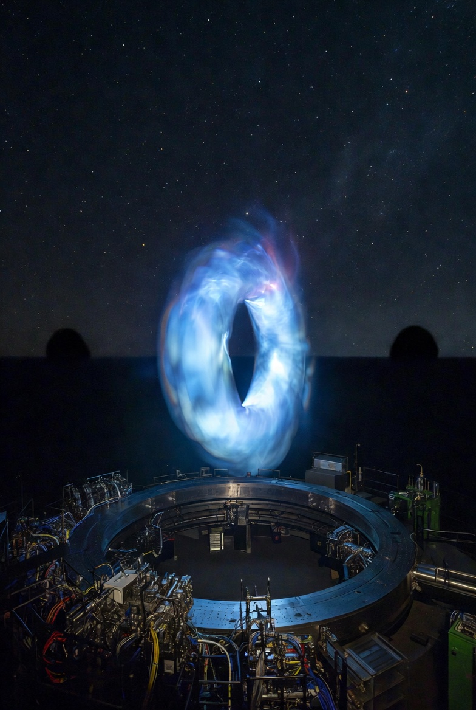

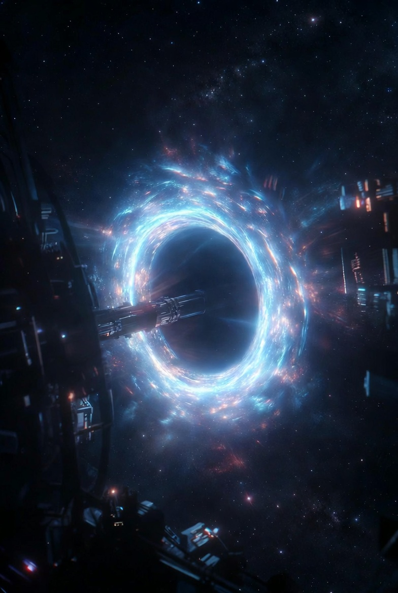

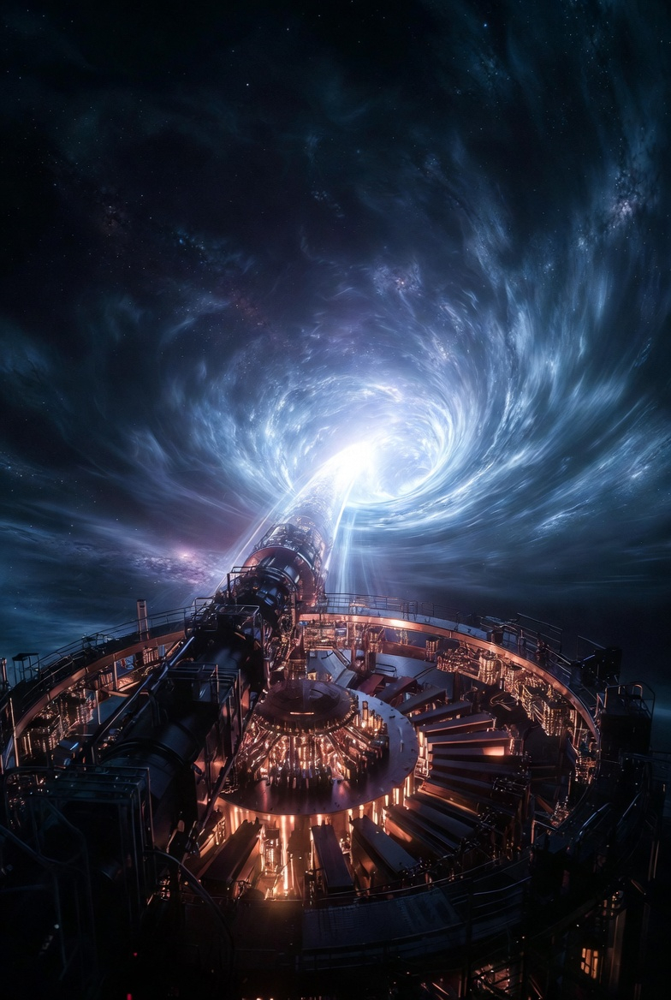

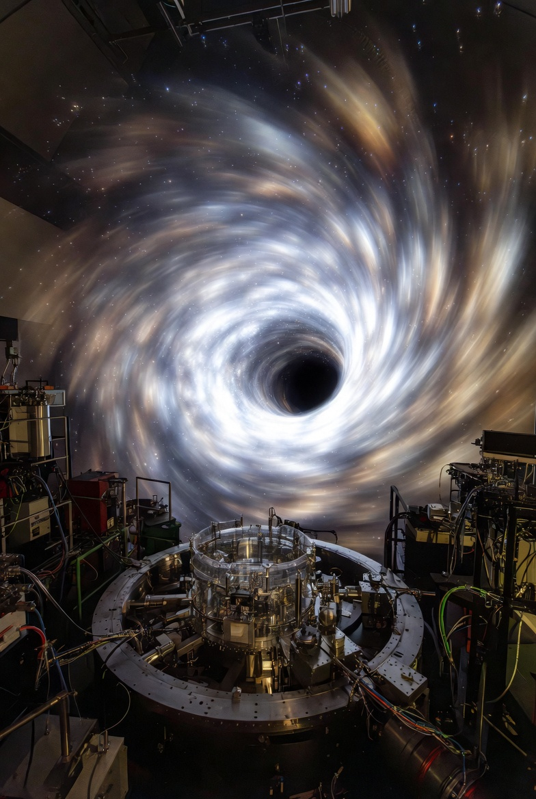

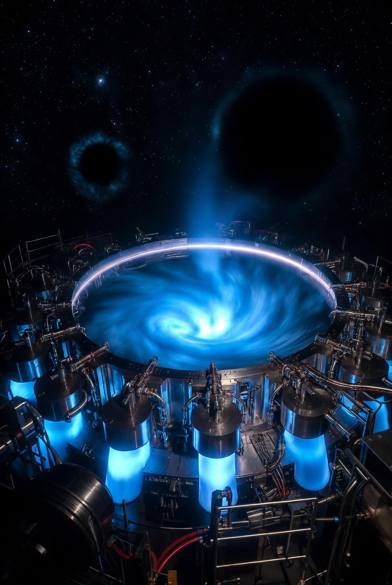

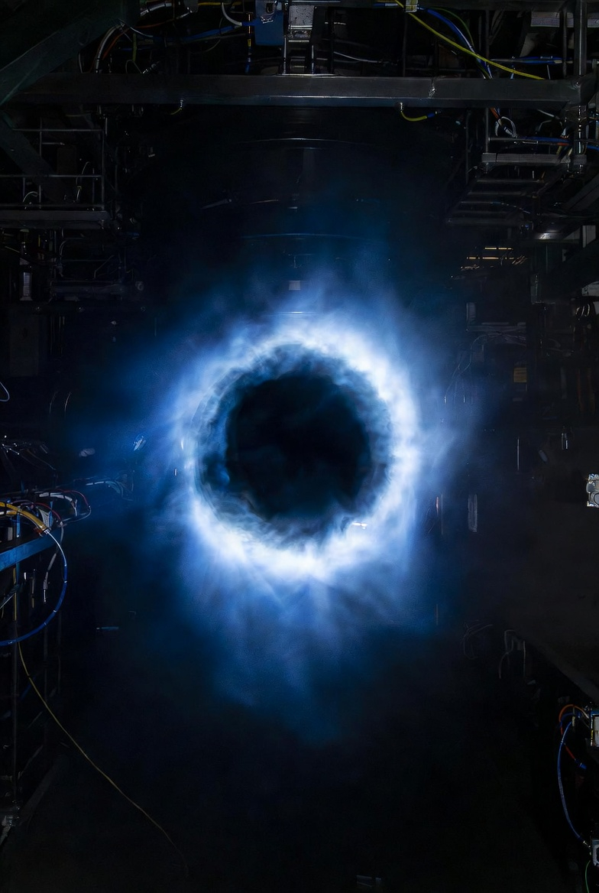

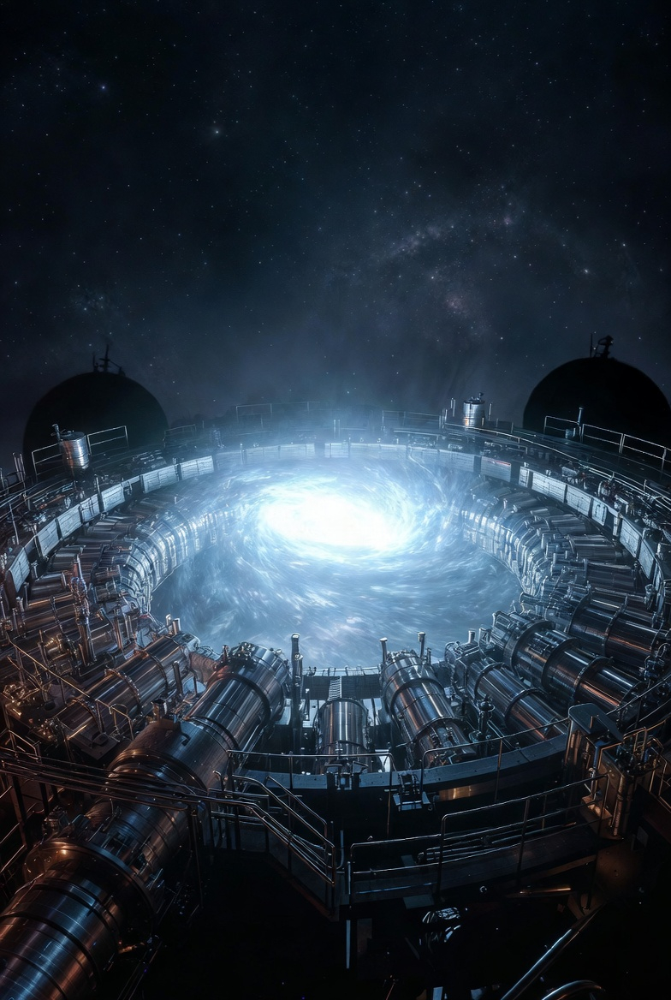

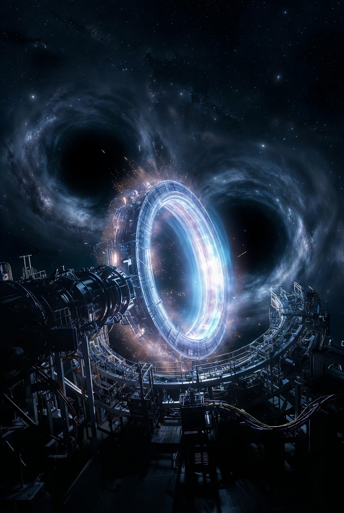

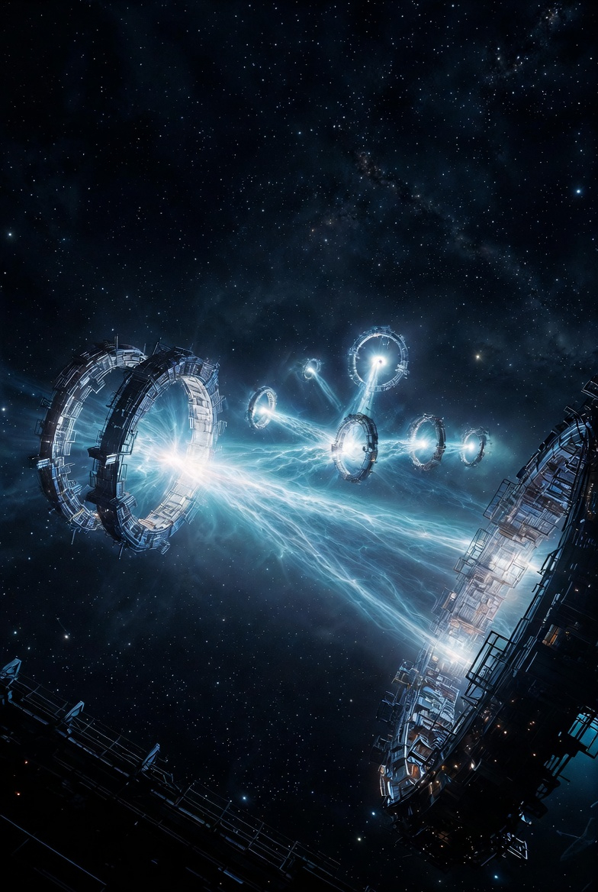

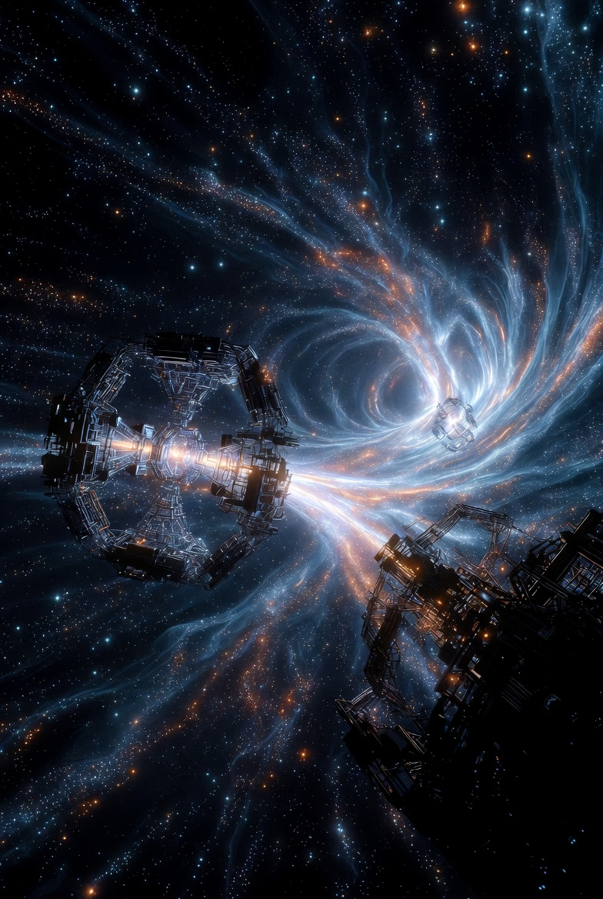

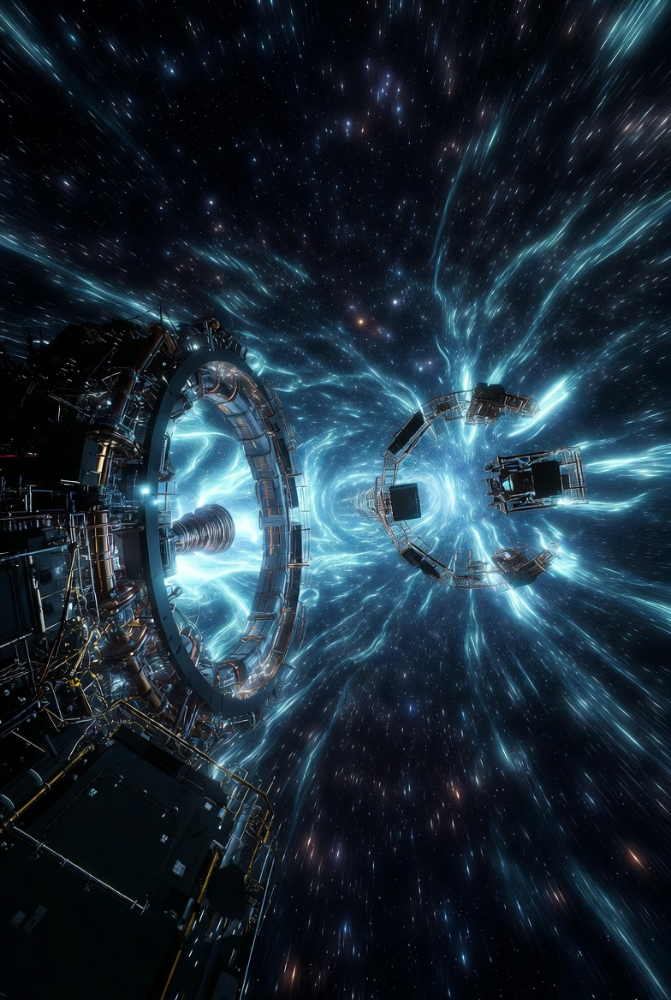

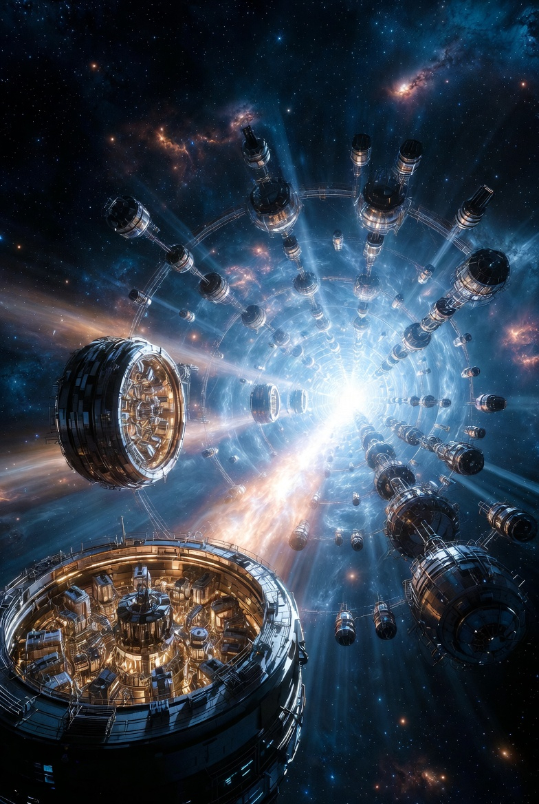