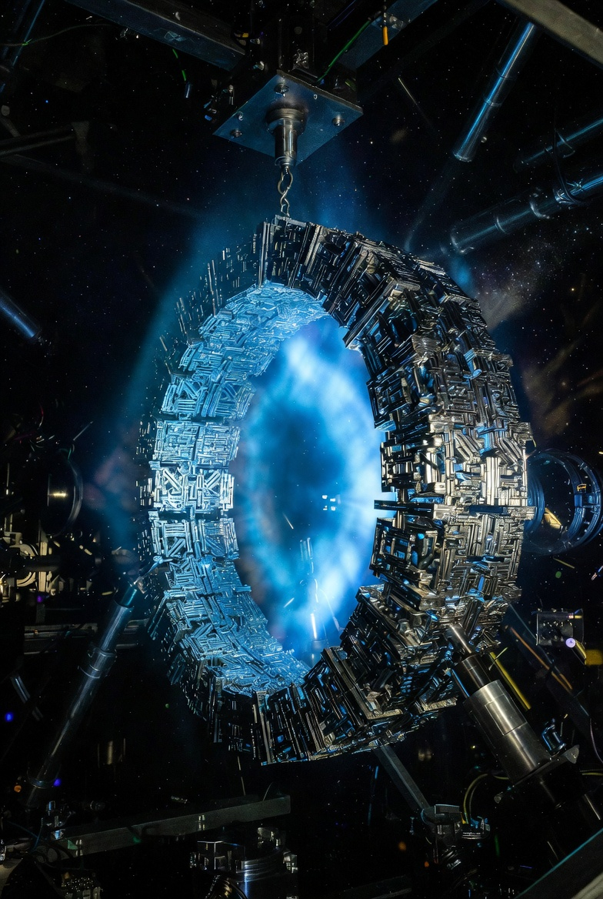
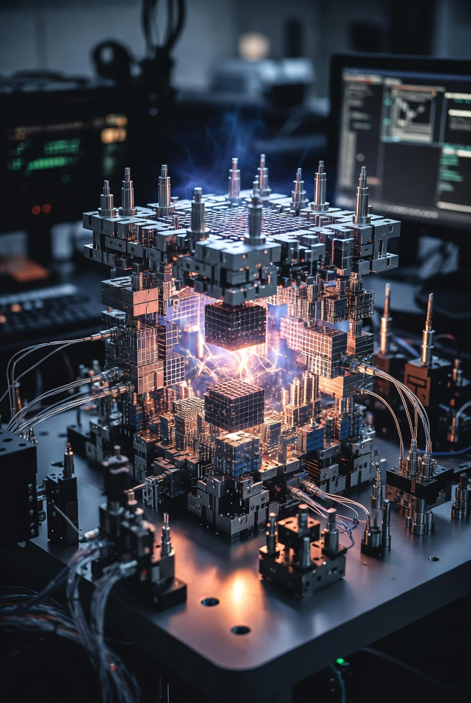
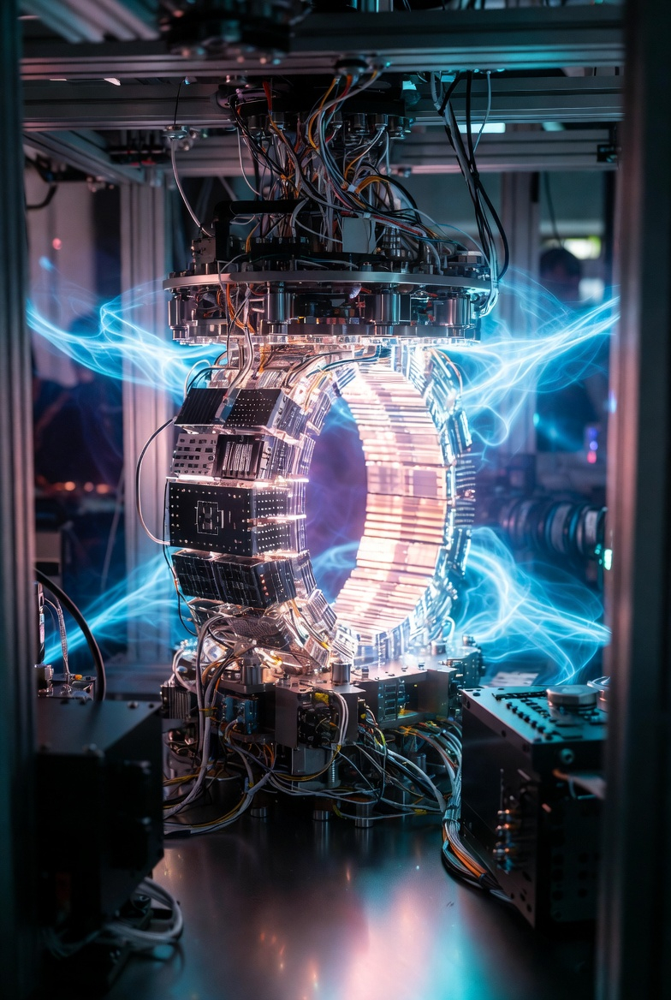
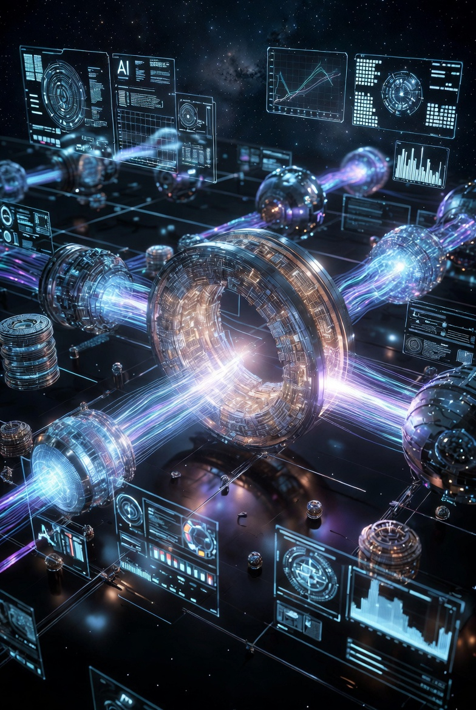
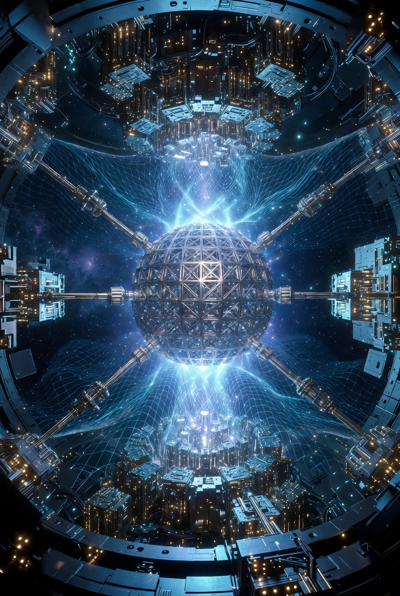
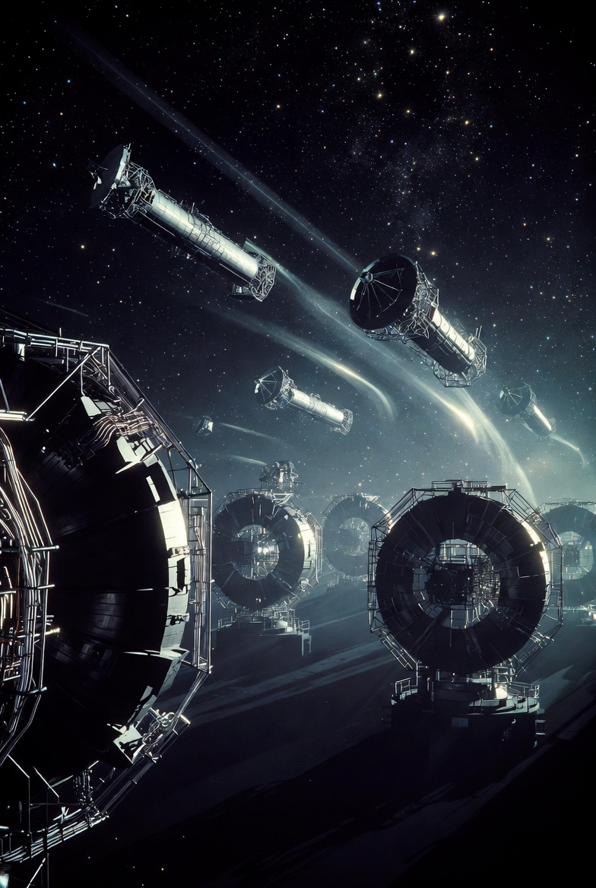
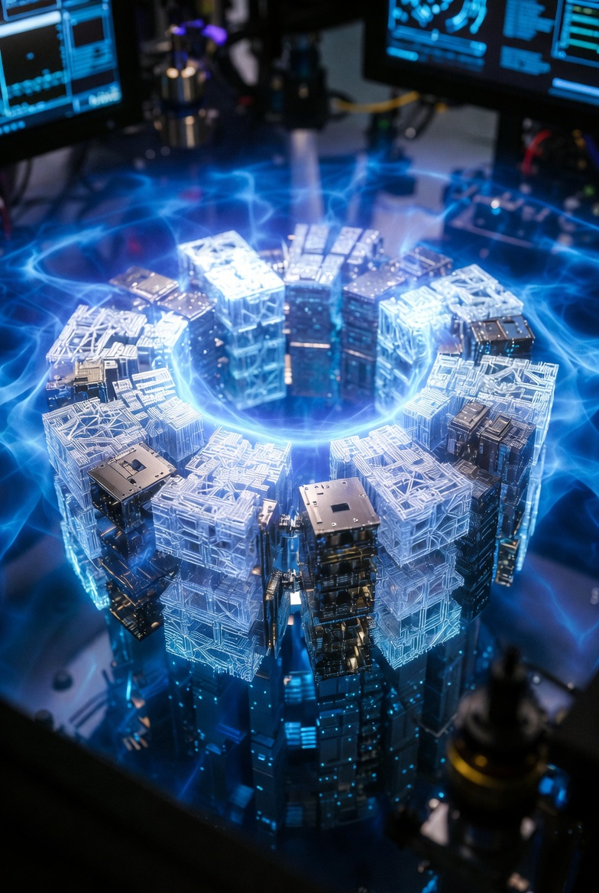
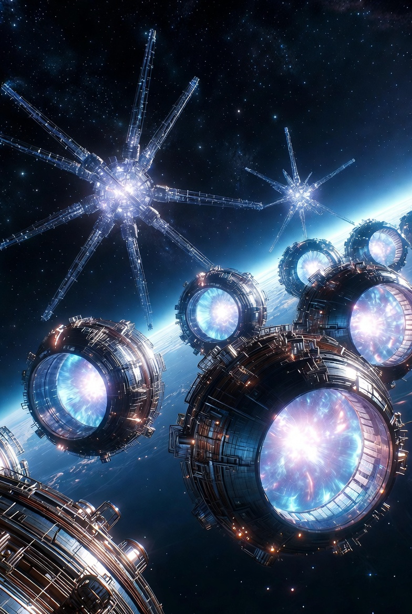
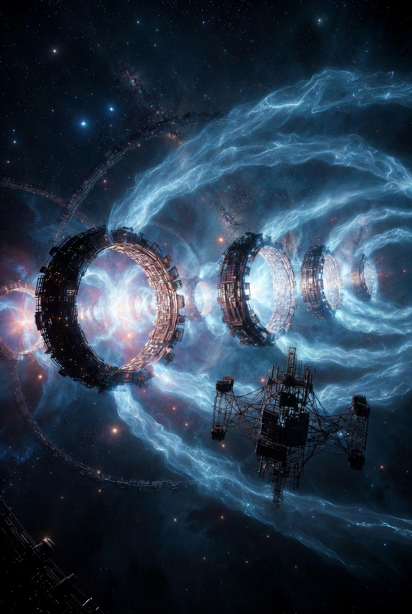
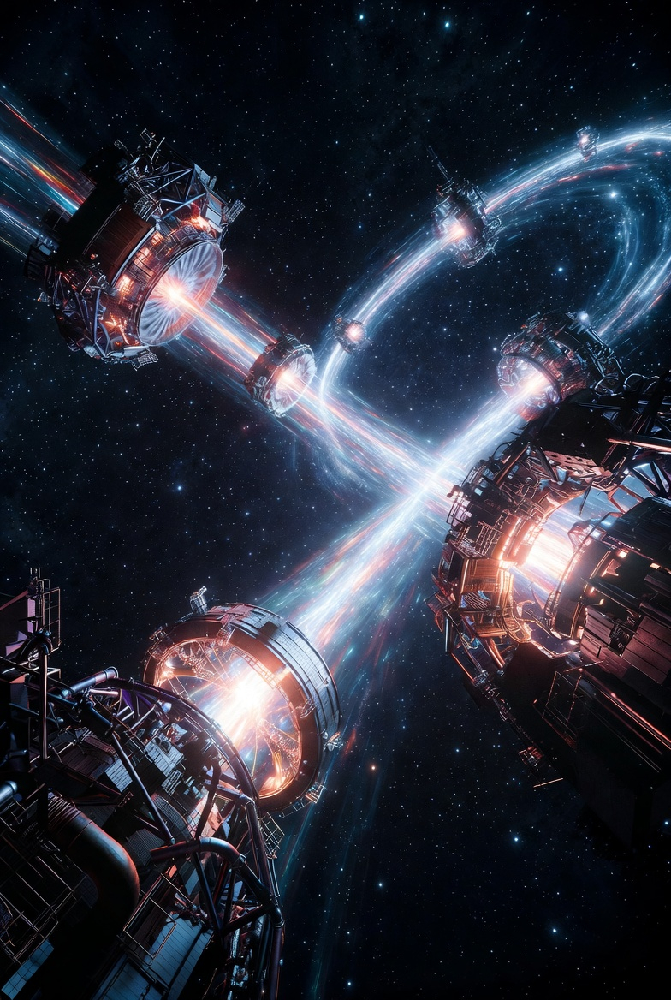

# SpaceTime Curvature Control in Warp Drive Systems

Article on X: [SpaceTime Curvature Control in Warp Drive Systems](https://x.com/skyisuniverse/status/2028504663314600134)

From [my conversation with Grok on Warp-drived Starship](https://x.com/i/grok/share/cdc1453c68324134beb8e748ef73cd8f)

From [my conversation with Grok on SpaceTime Curvature Control in Warp Drive Systems](https://x.com/i/grok/share/e3a56eecb6124d288e74db940c183e16)

## Real-Time Curvature Control with AI in Warp Drive Systems

In the context of hypothetical warp drive engineering (e.g., based on Alcubierre-like metrics or Lentz's solitons), real-time curvature control would involve dynamically monitoring and adjusting the spacetime warp bubble to maintain stability, prevent collapses or singularities, and respond to external perturbations like gravitational fields or cosmic radiation. AI would serve as the "brain" of this system, integrating data from sensors, running predictive simulations, and issuing control commands faster than human operators could, potentially at sub-millisecond latencies. This draws from current advancements in AI for high-energy physics and general relativity simulations, extrapolated to future breakthroughs like quantum computing integration or neuromorphic hardware.

### How Real-Time Curvature Control Could Be Achieved with AI

The process would operate in a closed-loop feedback system, similar to AI-driven controls in particle accelerators or fusion reactors, where AI continuously optimizes complex, nonlinear dynamics.

#### 1. Monitoring and Data Acquisition: 

AI would ingest real-time data from onboard sensors, such as advanced interferometers (e.g., miniaturized LIGO-like detectors) measuring gravitational wave ripples or curvature gradients, quantum sensors detecting stress-energy tensor fluctuations, and metamaterial-embedded strain gauges tracking field containment. This data stream—potentially terabytes per second—would be processed using edge AI to filter noise and extract key features, akin to how AI denoises gravitational wave signals today. In a warp drive, this could detect early signs of bubble instability, like horizon formations or energy condition violations.

#### 2. Predictive Simulation and Anomaly Detection:

Using neural network-based models, AI would simulate spacetime curvature in real-time, forecasting how changes in energy distribution or velocity might affect the bubble. For instance, "Einstein Fields" neural representations could compress 4D numerical relativity simulations into efficient, differentiable models, allowing AI to compute derivatives (e.g., for geodesic paths) and predict outcomes via automatic differentiation. This is an extension of current quantum simulators that model curved spacetime dynamics on qubits, where AI could run forward simulations to anticipate issues like causality violations or particle pair production. Anomaly detection algorithms, trained on vast datasets from general relativity simulations, would flag deviations, much like AI identifies new physics in collider data.

#### 3. Adaptive Adjustment and Optimization:

Based on predictions, AI would autonomously tweak parameters—e.g., redistributing positive energy in soliton generators, modulating metamaterial properties for field containment, or altering the bubble's geometry via electromagnetic fields. This mirrors AI in particle accelerators, where machine learning algorithms make noninvasive adjustments to beam parameters in real-time, using feedback loops with diffusion models to predict and correct instabilities. In fusion plasma control, AI maintains high-confinement modes without disruptions by adjusting magnetic fields, a direct analog for warp bubble stability. With breakthroughs, AI could optimize across multiple objectives (e.g., energy efficiency, speed, safety) using multi-agent systems, where sub-AIs handle specific tasks like quantum error correction.

This setup would ensure the warp drive remains causal and efficient, potentially handling superluminal-effective speeds (e.g., 10c+) by preempting paradoxes through chronology protection mechanisms encoded in the AI's training data.

## Kinds of AI Required

To handle the immense complexity—nonlinear equations, quantum effects, and real-time demands—advanced, hybrid AI systems would be necessary, building on today's machine learning in general relativity and high-energy physics.

### Neural Tensor Fields and Deep Learning Models: 

Specialized architectures like Einstein Fields for encoding 4D spacetime metrics, enabling fast, mesh-agnostic simulations with high derivative accuracy (up to five orders better than finite differencing). Convolutional neural networks (CNNs) or graph neural networks (GNNs) could classify spacetime types or detect patterns in curvature data, as demonstrated in ML for spacetime classification. These would run on neuromorphic chips for low-power, real-time inference.

### Reinforcement Learning (RL) for Control:

Deep RL agents, trained in simulated environments (e.g., via Warp Factory tools), would learn optimal control policies by rewarding stable bubbles and penalizing disruptions. This is similar to RL in accelerator tuning or fusion control, where agents adapt to noisy, high-dimensional states. Advanced variants like multi-agent RL could coordinate subsystems (e.g., one agent for energy sourcing, another for metamaterial tuning).

### Explainable AI (XAI) and Hybrid Quantum-Classical Systems:

To ensure trustworthiness, XAI techniques (e.g., PDFdecoder or XAI4PDF frameworks) would make decisions interpretable, revealing why the AI adjusts curvature. For quantum gravity aspects, quantum machine learning on large qubit arrays (e.g., 80+ qubits as in curved spacetime simulators) could handle probabilistic predictions, integrating with classical AI for hybrid control. Assuming AGI-level breakthroughs, a supervisory AI could oversee the system, adapting to novel scenarios like interstellar dust impacts.

These AI types would require massive training datasets from numerical relativity simulations, augmented by real-time fine-tuning during flights. With energy-efficient hardware (e.g., photonic AI), this could make warp drives practical, revolutionizing space travel by enabling precise, autonomous curvature management.

