# Superluminal-Effective Warp Drive

Article on X: [Superluminal-Effective Warp Drive](https://x.com/skyisuniverse/status/2028490389724778805)

From [my conversation with Grok on Warp-drived Starship](https://x.com/i/grok/share/cdc1453c68324134beb8e748ef73cd8f)

From [my conversation with Grok on Superluminal-Effective Warp Drive](https://x.com/i/grok/share/cdc1453c68324134beb8e748ef73cd8f)

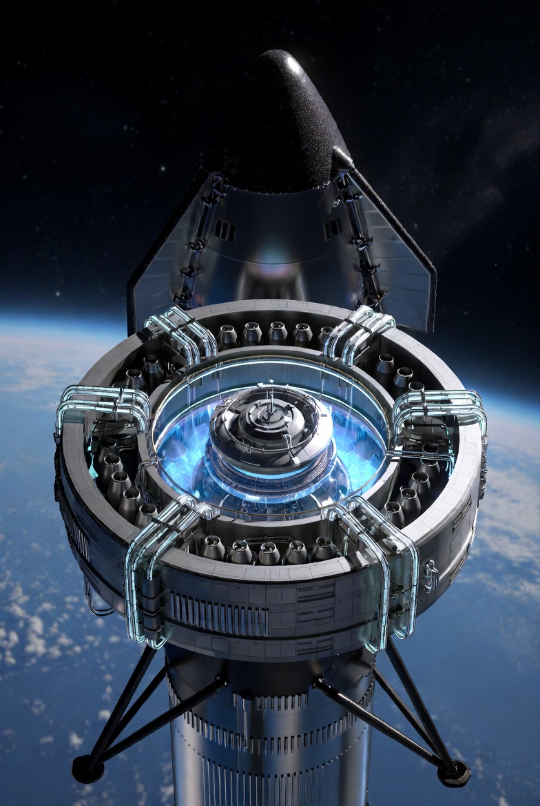

## Description of a Superluminal-Effective Warp Drive

A warp drive capable of the travel times you described—minutes to Mars (about 0.5 AU average), days to Jupiter or Saturn (5-9 AU), weeks to Alpha Centauri (4.3 light-years), and potentially years or decades to the galactic center (26,000 light-years) or intergalactic distances—would need to achieve effective faster-than-light (FTL) speeds while adhering to general relativity. This means the ship doesn't exceed the speed of light locally but surfs a "warp bubble" where spacetime contracts ahead and expands behind, shortening the effective distance. Assuming breakthroughs in physics, such as unifying quantum mechanics with gravity or harnessing immense positive energy densities, models like Erik Lentz's hyper-fast solitons (2021) or refined Alcubierre-inspired designs could enable this.

In Lentz's model, the drive uses soliton-like waves—stable, self-reinforcing energy configurations in spacetime—sourced entirely by positive energy (no exotic negative matter required). The bubble forms around the ship, propelled by manipulating the stress-energy tensor to create a localized curvature gradient. For superluminal effects, the soliton could achieve apparent velocities of 10c or more, meaning a 4.3 light-year trip to Alpha Centauri might take weeks from Earth's perspective (due to relativity, onboard time could be even shorter). Energy requirements are planetary-scale (e.g., equivalent to Jupiter's mass in energy via E=mc²), but breakthroughs in vacuum energy extraction or advanced fusion could make it feasible. Recent 2025 refinements, like those from the Applied Physics Lab, extend this to "physical warp drives" with segmented geometries (e.g., cylindrical nacelles) that distribute energy more efficiently, avoiding causality issues like time paradoxes.

Visually, the drive might resemble a ship with twin nacelles (like Star Trek's Enterprise) channeling the warp field: Inside the bubble, passengers experience flat spacetime (no inertia or G-forces), while outside, the ship appears to streak by at impossible speeds.

## How It Could Be Developed and Built

Development would require phased breakthroughs, starting from theory to prototypes, over decades or centuries even with rapid advances:

### 1. Theoretical Refinement (Near-Term, 2020s-2040s): 

Build on current models using tools like Warp Factory software (2024) to simulate and optimize warp metrics without negative energy. Quantum gravity theories (e.g., string theory or loop quantum gravity) must resolve singularities and energy conditions. Labs like NASA's Eagleworks or private firms like Applied Physics would iterate designs, perhaps validating with analog experiments (e.g., using sound waves in fluids to mimic curvature). Key breakthrough: Tapping "vacuum energy" (quantum fluctuations) for positive energy sourcing, reducing needs from solar-system scales to reactor-level.

### 2. Experimental Validation (Mid-Term, 2040s-2070s):

Small-scale tests in particle accelerators or space-based interferometers to create micro-warp fields. For instance, stack superconductors to generate detectable spacetime bends, as proposed in 2016 models. Detect gravitational waves from simulated warps using upgraded LIGO-like detectors. International collaborations (e.g., via ITER fusion extensions) develop high-energy plasma systems for soliton generation.

### 3. Engineering and Prototyping (Long-Term, 2070s+): 

Construct using metamaterials for field containment and advanced AI for real-time curvature control. Energy from compact fusion (e.g., Möbius Z-Pinch reactors) or antimatter drives powers the system. Build in orbital shipyards to avoid Earth's gravity; components like nacelles (cylindrical energy distributors) are assembled modularly. Safety features include fail-safes to collapse the bubble without Hawking radiation bursts.

Challenges include energy efficiency (still requiring fusion-era power), horizon problems (communication inside/outside the bubble), and ethical risks (e.g., unintended spacetime ripples). With breakthroughs, a prototype could emerge by 2100, scaling to full drives by 2200.

## Equipping a SpaceX Starship with It

Yes, conceptually, a Starship could be equipped or redesigned for warp capability, leveraging its modular, reusable architecture. Starship's stainless-steel body and Raptor engines handle chemical propulsion, but warp integration would require radical modifications:

- Design Adaptation: Add warp nacelles—cylindrical extensions on pylons, similar to Harold White's IXS Enterprise concept (2014, updated 2025). These house the soliton generators, powered by an onboard fusion reactor replacing some fuel tanks. The ship's methalox system becomes auxiliary for maneuvers outside warp.

- Feasibility: Starship's 9m diameter fits a compact bubble; breakthroughs in lightweight metamaterials keep mass low. Orbital refueling (Starship's forte) supplies energy precursors. SpaceX's rapid iteration could prototype this, perhaps as "Warp Starship" variants.

- Limitations: Current Starship lacks the energy infrastructure—warp needs gigawatt-scale power. Assuming fusion/antimatter advances, yes; otherwise, it's a new class of ship.

This would enable your travel scenarios, turning Starship from Mars-hauler to star-explorer.

---

## Understanding Apparent Velocity in Warp Drives

- **The Soliton as a Warp Bubble**: The soliton is a self-sustaining wave in spacetime, created by positive energy configurations (no negative energy needed). It propagates at a constant velocity, which can be designed to be superluminal (faster than light). The ship sits in a flat spacetime region inside this bubble, effectively at rest relative to the bubble itself.

- **Apparent Superluminal Speed**: From outside, the bubble's movement compresses space in front and expands it behind, allowing the ship to cover vast distances quickly. For instance, if tuned for an apparent velocity of 10c, a 10 light-year trip might take just 1 year from Earth's view, but the ship isn't "moving" at 10c—spacetime is being manipulated around it. In principle, the model allows for arbitrary hyper-fast speeds (e.g., 10c, 100c, or more), limited only by energy requirements and theoretical constraints like avoiding causality paradoxes.

- **No Local Speed Violation**: Locally, within the bubble or any nearby frame, velocities remain subluminal (below c). This sidesteps relativity's ban on faster-than-light travel for matter or information.

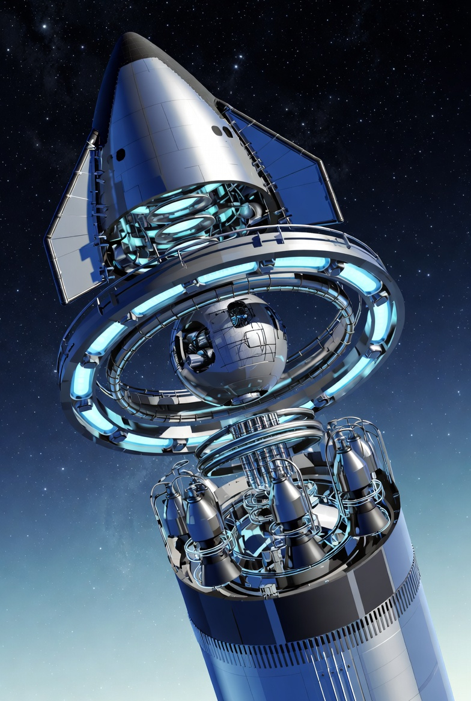

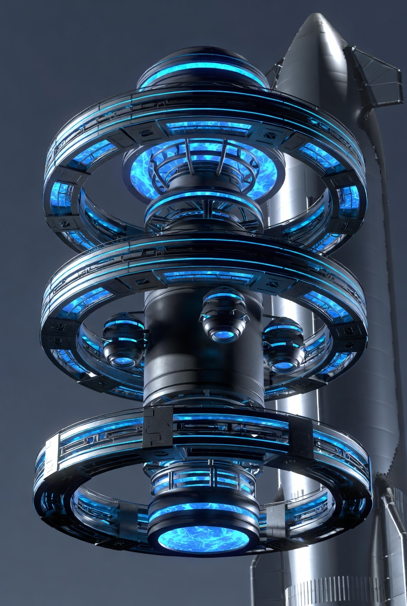

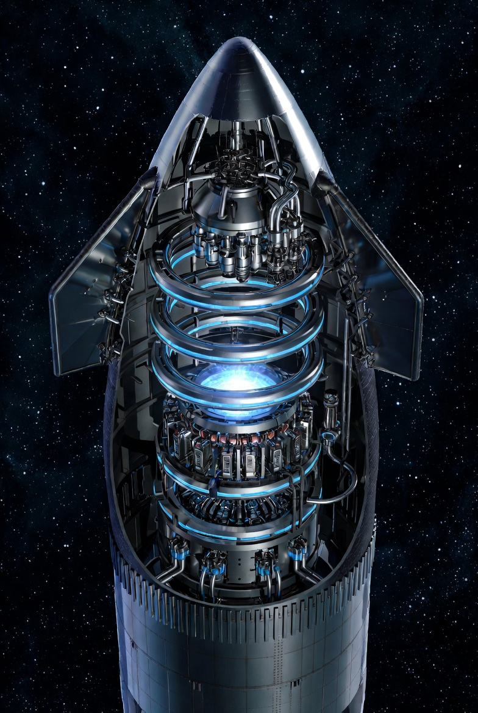

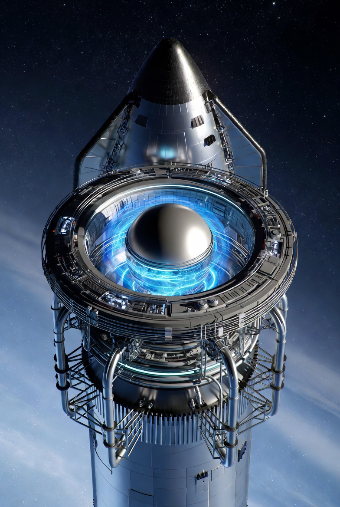

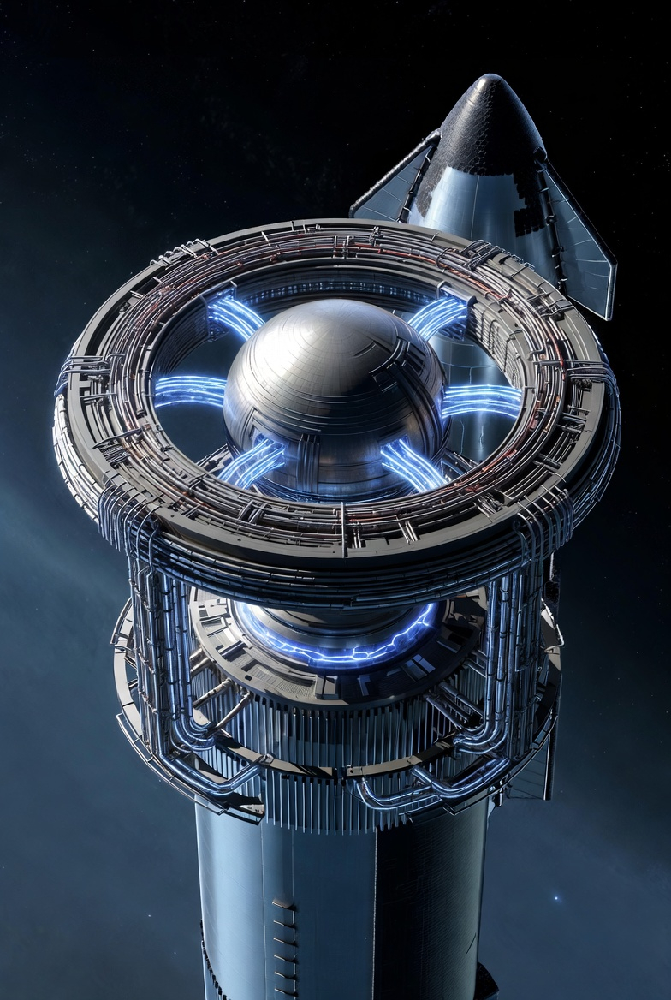

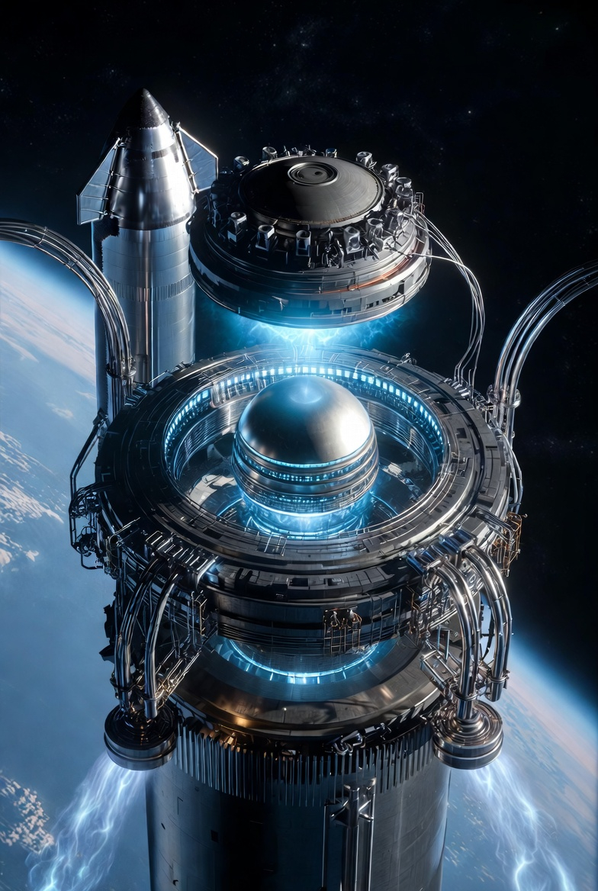

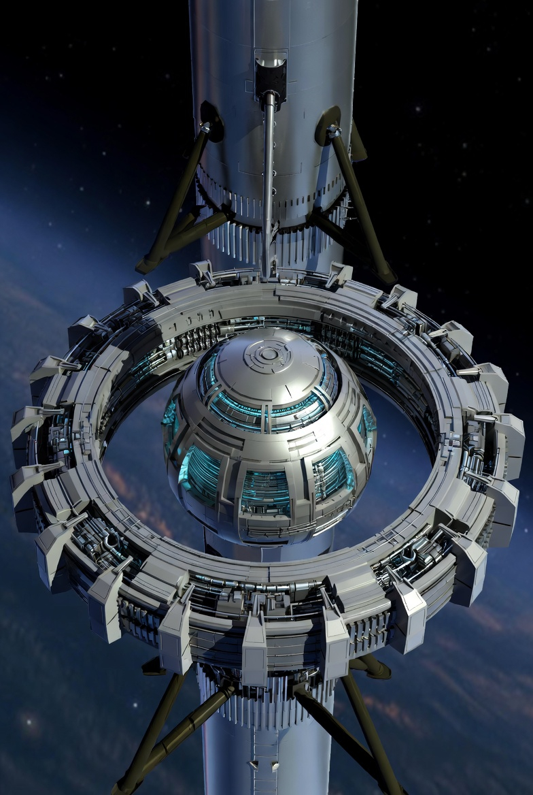

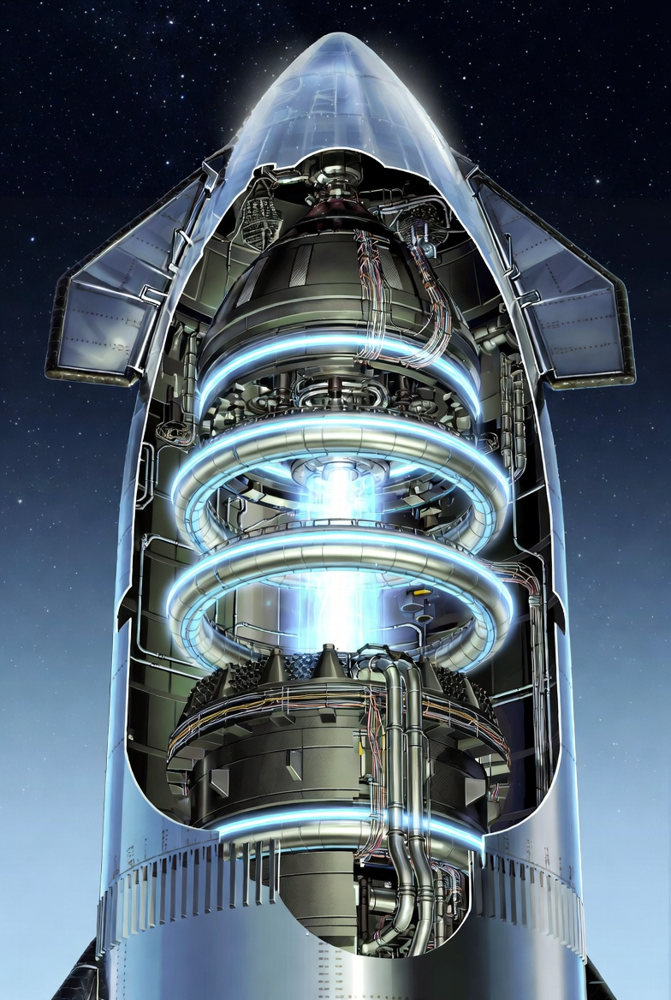

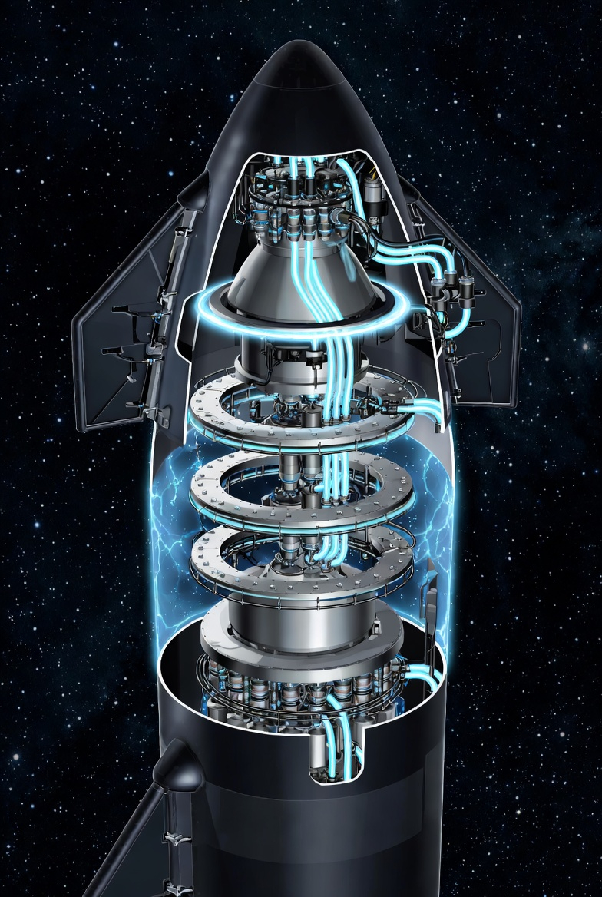

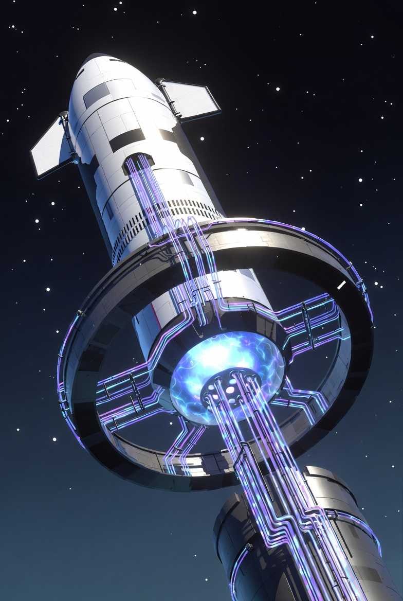

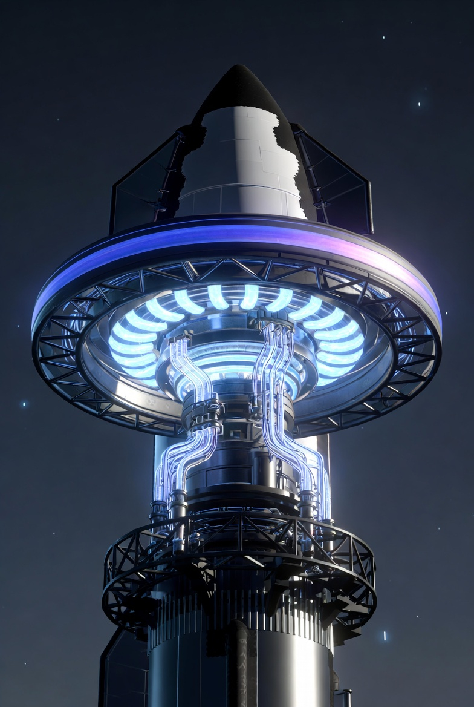