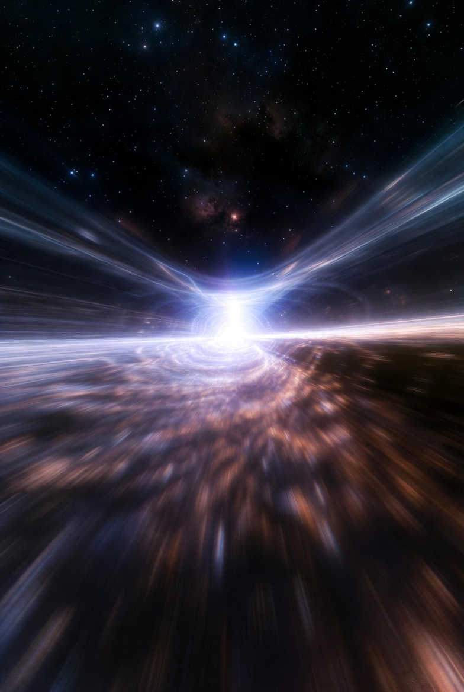
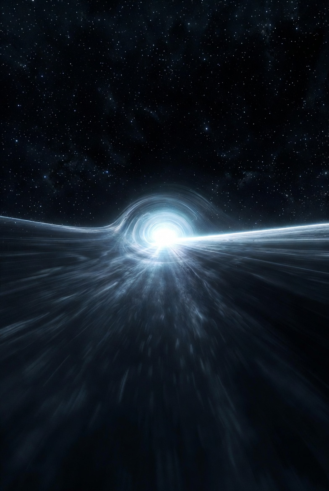

# Time effects during traveling with Warp Drive

Article on X: [Time effects during traveling with Warp Drive](https://x.com/skyisuniverse/status/2028491256943235448)

From [my conversation with Grok on Warp-drived Starship](https://x.com/i/grok/share/cdc1453c68324134beb8e748ef73cd8f)

From [my conversation with Grok on Time effects during traveling with Warp Drive](https://x.com/i/grok/share/cdc1453c68324134beb8e748ef73cd8f)

## Introduction

In the context of a hypothetical Warp Starship using an Alcubierre-inspired drive (or similar positive-energy variants like Lentz's solitons), the key feature is that the interior of the warp bubble maintains flat spacetime, resembling an inertial reference frame. This means the crew does not experience the conventional special relativistic time dilation that occurs in high-speed travel near the speed of light.

## Time for the Starship Crew

- The crew would experience the trip's duration as "normal" proper time, equivalent to the coordinate time of the journey. For example, if the warp drive enables a round trip to Mars in just a few minutes (by contracting spacetime ahead and expanding it behind), the crew's clocks and biological aging would advance by only those few minutes.

- There are no g-forces, acceleration effects, or relativistic slowdowns felt inside the bubble, as the ship isn't accelerating through space—space is moving around it.

- This avoids the "twin paradox" scenario seen in near-light-speed rocket travel, where the traveling twin ages less.

## Time for People on Earth

- Observers on Earth would see the same elapsed time as the crew: the brief duration of the warp traversal (e.g., minutes for the round trip).

- Since the drive warps spacetime globally but keeps the interior flat, clocks remain synchronized between the ship and Earth. No significant discrepancy arises, even for effective superluminal speeds.

- However, for causality reasons in general relativity, setting up the warp field might require pre-arrangements (e.g., energy infrastructure along the path), limited by light-speed signaling. For a short Mars trip (light travel time ~20-40 minutes round trip at max distance), this setup could be minimal, but the actual travel time is what matters here.

In essence, both parties experience identical, short trip durations—revolutionizing interplanetary travel by eliminating time desynchronization. Note that extreme superluminal designs could theoretically risk closed timelike curves (potential backward time travel), but quantum effects like the chronology protection conjecture are thought to prevent practical paradoxes.

