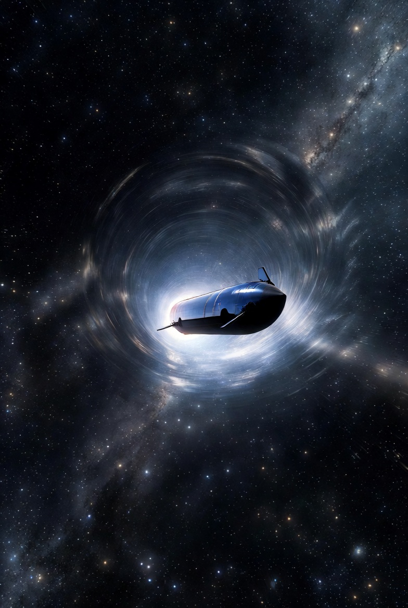
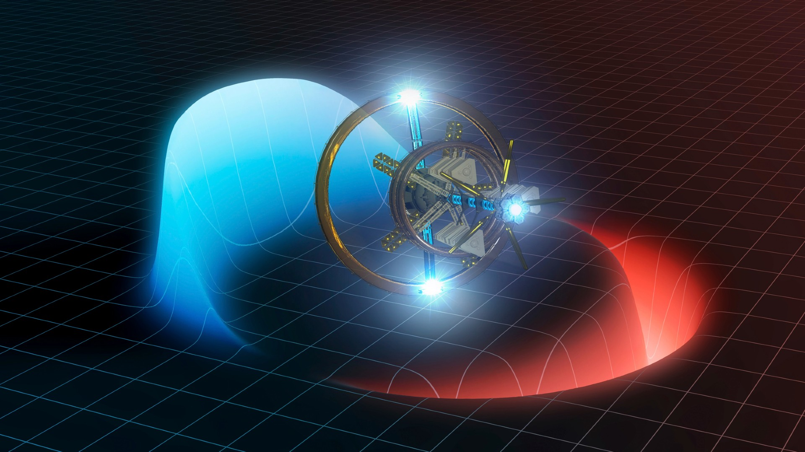
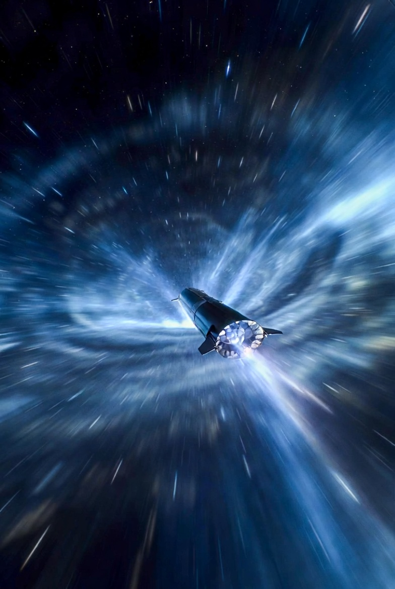
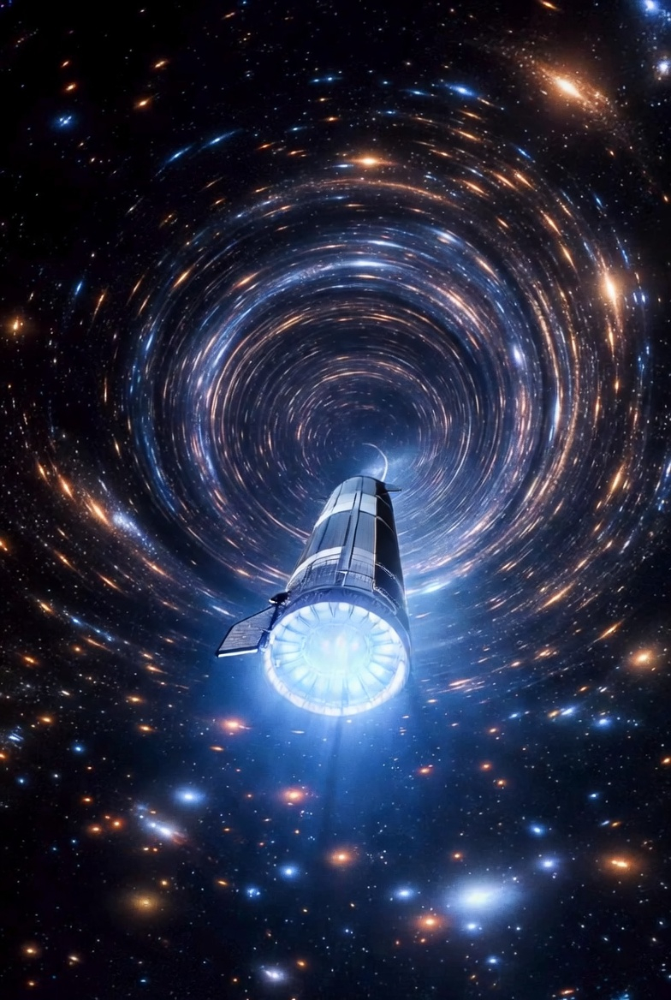
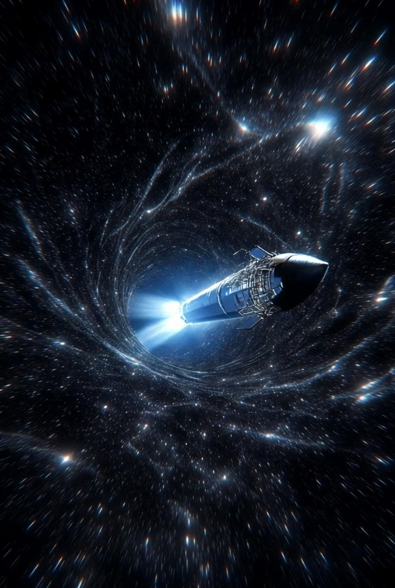
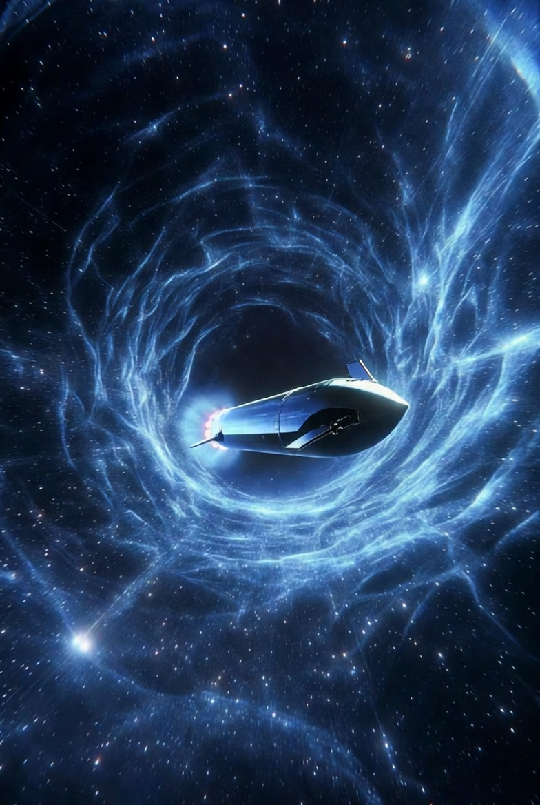
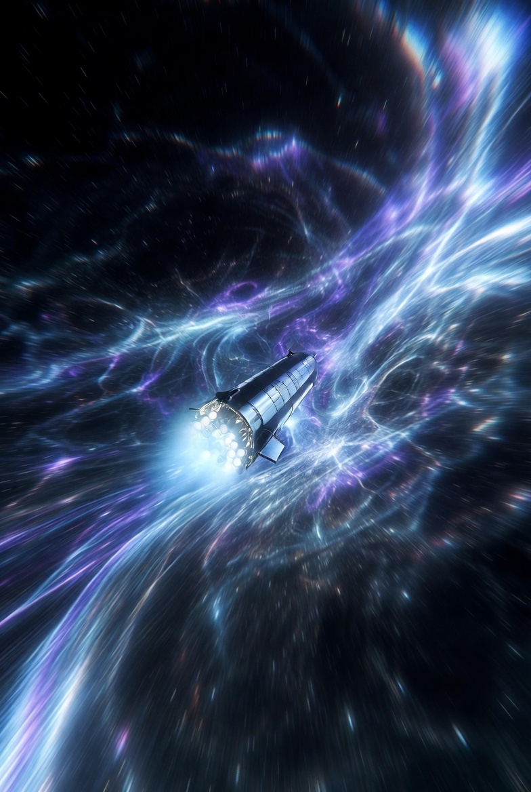
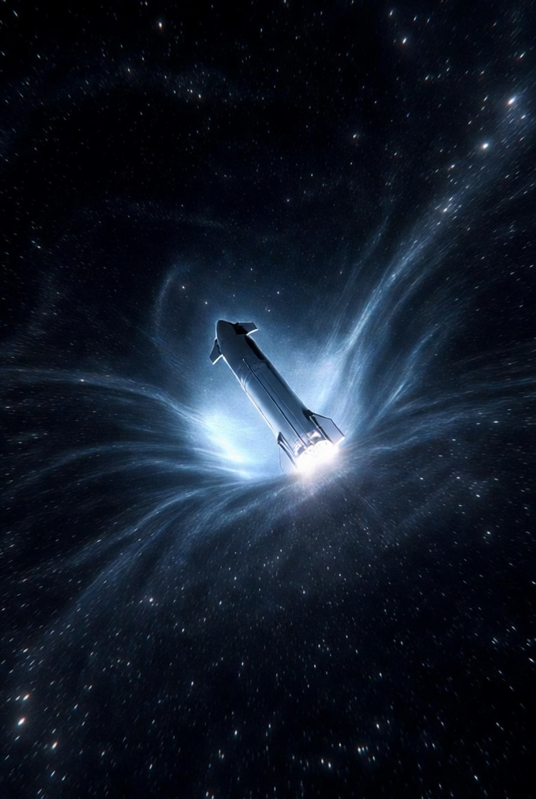
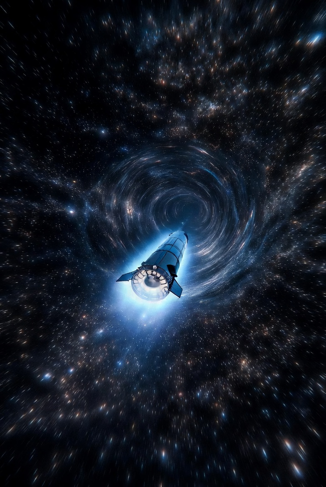

# Warp Drive Without Negative Energy 

Article on X: [Warp Drive Without Negative Energy](https://x.com/skyisuniverse/status/2028487600294564144)

From [my conversation with Grok on Warp-drived Starship](https://x.com/i/grok/share/cdc1453c68324134beb8e748ef73cd8f)

From [my conversation with Grok on Warp Drive Without Negative Energy](https://x.com/i/grok/share/cdc1453c68324134beb8e748ef73cd8f)

## Warp Drive Without Negative Energy: An Overview

The concept of a warp drive, popularized by science fiction like Star Trek, stems from theoretical physics and aims to enable faster-than-light (FTL) or effective high-speed travel by manipulating spacetime rather than accelerating a spacecraft through space. In Einstein's general relativity, spacetime can be curved or "warped" by mass and energy, and a warp drive exploits this by creating a bubble of spacetime around a ship. Space contracts in front of the bubble and expands behind it, allowing the bubble (and ship inside) to move at arbitrary speeds relative to the outside universe without violating local light-speed limits—the ship itself doesn't move faster than light within its local frame.

Traditionally, the 1994 Alcubierre metric required exotic "negative energy" (a hypothetical form of energy with negative density that doesn't exist in known physics) to stabilize the warp bubble. This made it impractical, as negative energy violates energy conditions in general relativity and can't be produced in usable quantities. However, recent advancements as of 2025 have proposed models that eliminate this need, using only positive energy densities compatible with known physics. These "physical warp drives" shift the paradigm from impossible to theoretically feasible, though still far from engineering reality due to enormous energy demands.

## Description of Warp Drives Without Negative Energy

Several key models have emerged:

- **Constant-Velocity Subluminal Warp Drive (Applied Physics Lab, 2021 onward)**: Developed by researchers at the Advanced Propulsion Laboratory (APL), this model uses a stable shell of ordinary matter to create an Alcubierre-like "shift vector" in spacetime. Instead of negative energy, it relies on positive ADM mass (a measure of total energy in spacetime) and floating "bubbles" of spacetime geometry. The bubble envelops the ship, warping space around it without the ship experiencing acceleration. This version is subluminal (below light speed) but could achieve high fractions of c (speed of light), like 0.99c, making travel feel instantaneous from the ship's perspective due to time dilation. It's the first peer-reviewed model fully satisfying all energy conditions in general relativity. A 2025 update refines it for constant velocity, reducing previous negative energy requirements by factors of 100 or more in related designs.

- **Solitonic Positive-Energy Warp (Erik Lentz, 2021)**: This approach uses soliton-like structures—self-sustaining waves in spacetime—sourced entirely by positive energy densities. Solitons are stable, localized energy configurations that propagate without dispersing, allowing the warp bubble to form and move without exotic matter. Unlike subluminal models, this could enable hyper-fast (superluminal effective) travel in principle, as the bubble's motion isn't limited by local causality. Parallel work by researchers like Fell and Heisenberg explores similar positive-energy families.

- **Physical Warp Drives (Bobrick & Martire, 2021)**: This framework expands warp drives into a "design space" where geometries can be tailored using ordinary materials and positive energy for subluminal speeds. It identifies regimes where no negative energy is needed, focusing on reshaping the bubble (e.g., with a narrow "neck" for compression) to minimize issues. A 2025 paper by former NASA scientist Harold "Sonny" White adapts this for starship-like designs, shifting energy to cylindrical "nacelles" for stability during hypothetical FTL journeys.

These models still require immense energy—equivalent to several Jupiter masses converted to energy via E=mc², or harnessed from advanced fusion/antimatter sources. They avoid quantum issues like the Casimir effect's tiny negative energies by sticking to classical positive sources. Visually, imagine a spacecraft encased in a shimmering bubble distorting the stars around it:

## What It Could Enable for Reaching Planets and Outer Space

If realized, these warp drives could revolutionize space exploration by compressing travel times dramatically, without the ship exceeding light speed locally:

- **Solar System Travel**: Trips to Mars (currently 6-9 months) could take minutes to hours at high subluminal speeds. Reaching outer planets like Jupiter or Saturn (years away now) might occur in days, enabling routine mining of asteroids, colonization of moons like Europa, or rapid response to space events. This would make the solar system feel like a neighborhood, boosting scientific missions and human expansion.

- **Interstellar Exploration**: For exoplanets, superluminal-effective models could cut journeys to nearby stars like Alpha Centauri (4.3 light-years away, over 20,000 years with current tech) to weeks or months from Earth's perspective, or even shorter onboard due to relativity. This opens doors to studying habitable worlds in systems like Proxima Centauri, potentially within a human lifetime. Further out, to the galactic center (26,000 light-years) or other galaxies, travel could become conceivable, enabling probes to distant black holes, nebulae, or even SETI searches for alien life.

- **Broader Implications**: Beyond travel, it could facilitate resource gathering from outer space (e.g., helium-3 from gas giants for fusion), real-time communication relays across vast distances (via warp-transported satellites), or escaping existential threats like asteroids by relocating populations. However, challenges like energy sourcing, causality risks (e.g., potential time paradoxes in superluminal cases), and gravitational effects on passengers remain unsolved. While exciting, experts estimate practical warp tech is decades or centuries away.

