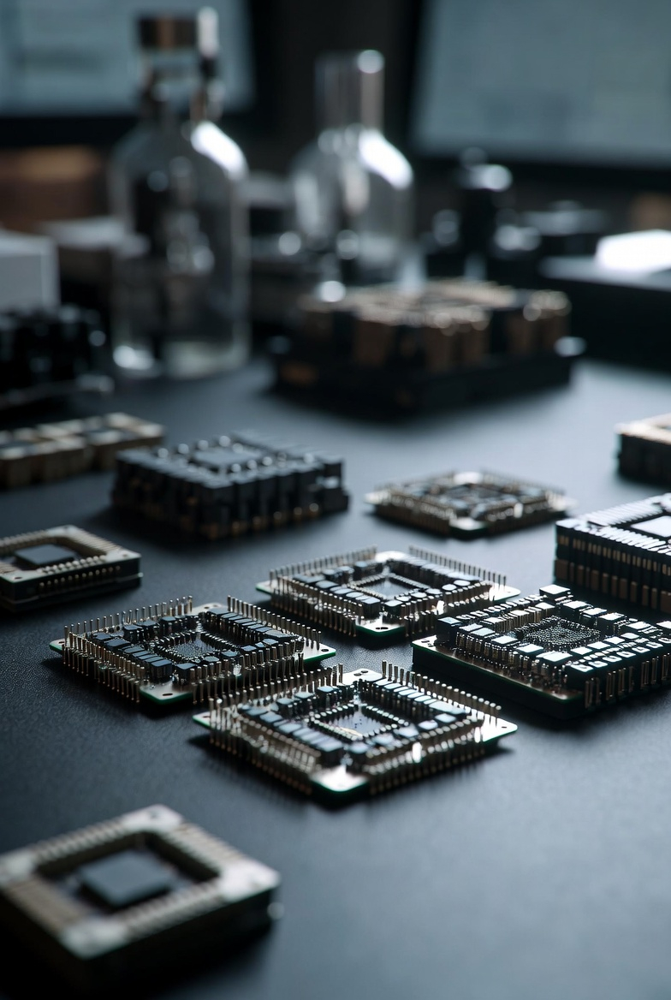

# Alternative hardware for AI training

Article on X: [Alternative hardware for AI training](https://x.com/skyisuniverse/status/2021985672291397814)

From [my conversation with Grok on more efficient hardware for AI training](https://x.com/i/grok/share/fc8d3304e041442f8f1b9e64fca391b2)

## Hardware Innovations

One major area for breakthroughs is in computing hardware that moves beyond traditional silicon-based von Neumann architectures, which separate memory and processing, leading to energy inefficiencies and bottlenecks during AI training.

### **Photonic (Light-Based) Computing**

A key breakthrough could involve chips that use light beams instead of electricity to perform computations. For instance, engineers have developed programmable photonic chips capable of training nonlinear neural networks directly with light. This works by using a semiconductor material where a "pump" beam modulates a "signal" beam's behavior (absorption, transmission, or amplification), enabling real-time reconfiguration and nonlinear functions essential for deep learning. Such chips have demonstrated over 97% accuracy on classification tasks while using far less energy and fewer operations than electronic equivalents—potentially reducing AI data center power consumption by orders of magnitude and speeding up training through parallel optical processing. This could make training easier by eliminating heat management issues and enabling scalable, low-power systems.

### **Neuromorphic Computing**

Brain-inspired hardware, or neuromorphic chips, mimic neural structures with integrated memory and processing (in-memory computing). Recent advances include using memristor arrays for vector-matrix multiplications—a core operation in AI training—while leveraging device randomness for efficient random number generation in probabilistic algorithms. This reduces data movement, cutting latency and power use by factors like 10-100x compared to GPUs. For example, 3D neuromorphic architectures enable conditional computing in large models, scaling to brain-like efficiency with sparse connectivity (e.g., modeling gray and white matter in the brain). Future breakthroughs here could allow AI models to train in real-time on edge devices, making the process faster and more accessible without massive data centers.

### **Analog Computing with Topology Optimization**

Analog systems using resistive memory could revolutionize training by shifting from precise weight tuning to pruning connections in overparameterized networks. In this approach, random weights are generated via stochastic electroforming in memory chips, then optimized by iteratively removing low-importance edges (pruning) and reinstating critical ones. This draws from the "Lottery Ticket Hypothesis," where sparse sub-networks perform as well as dense ones. Results show 87-98% accuracy on benchmarks like Fashion-MNIST and ImageNet, with 99% reductions in programming operations and up to 99.7% energy savings versus GPUs. This simplifies training by embracing hardware noise as a feature, not a flaw, and could enable sustainable, low-cost AI hardware for broader adoption.

### **Quantum Computing**

Quantum systems could accelerate AI training through parallel processing of complex optimizations, such as matrix operations in deep learning. Algorithms like Quantum Approximate Optimization (QAOA) or Variational Quantum Eigensolvers (VQE) might fine-tune models faster than classical methods, potentially handling exponentially larger datasets. Hybrid quantum-AI approaches, where quantum processors pre-process data for classical ML, have shown promise in reducing training data needs and speeding up convergence. While current noisy intermediate-scale quantum (NISQ) devices limit scale, fault-tolerant quantum computers could provide exponential speedups for tasks like gradient descent, making training easier for problems intractable on classical hardware.

## Algorithmic and Methodological Advances

Breakthroughs in software and training paradigms could complement hardware, optimizing how models learn without requiring proportional increases in compute.

- **Probability-Based Training Methods**: A novel approach inspired by natural dynamic systems (e.g., climate or financial models) uses probabilistic targeting of high-impact data points instead of iterative parameter adjustments. This determines model parameters with minimal computations, achieving comparable accuracy to traditional methods but 100x faster and with drastically lower energy use. It focuses on "critical locations" where changes are rapid, reducing redundant iterations. Such methods could simplify training pipelines, making them more accessible for smaller teams or resource-constrained environments.

## Broader Implications and Challenges

These breakthroughs could collectively reduce AI training's environmental footprint (e.g., via energy savings) and democratize access by lowering hardware barriers. However, challenges remain: photonic and neuromorphic systems need better integration with existing software; quantum requires error correction for reliability; and analog methods must scale to massive models. Combined with advances in materials (e.g., new semiconductors) or cooling, they point to a future where training trillion-parameter models becomes routine and efficient.

## Baseline for Grok 5 Training

Grok 5 is a hypothetical next-generation model from xAI, projected to have around 6 trillion parameters with multimodal capabilities, based on industry trends for 2026 frontier models. For a baseline without breakthroughs, we estimate resources using data from similar models like Grok 4 (1.7T params, 310 GWh energy, $490M cost) and scaling up proportionally (assuming ~3.5x param increase leads to ~4-5x compute due to MoE efficiency and scaling laws). Training compute is estimated at ~1e27 FLOPs (6 * params * 20 * params for Chinchilla-optimal tokens, adjusted for MoE active params ~500B).

- **Time**: ~120 days (based on Grok 4's scale-up and typical frontier training runs).
- **Energy**: ~1.5 TWh (scaled from Grok 4's 310 GWh, accounting for larger scale and 1 GW clusters).
- **Hardware**: ~200,000 H100-equivalent GPUs (or next-gen like Blackwell), clustered in a supercomputer setup.
- **Cost**: ~$1B (hardware rental/depreciation ~$600M, energy ~$200M at $0.15/kWh, ops ~$200M).
- **Other**: Water usage ~3B liters; CO2 emissions equivalent to ~250k US households annually.

These are conservative estimates; actuals could vary with optimizations like sparse MoE.

## Resources with Photonic Computing

Photonic chips use light for computations, enabling parallel processing with 100x speedups and 100x energy savings over GPUs for AI tasks (e.g., 12.5 GHz ops at picosecond latencies, 100x faster than Nvidia GPUs for generation). Training would shift to specialized photonic accelerators (e.g., Lightmatter or Tsinghua OFE2 chips), reducing data movement bottlenecks. Assuming integration replaces 80% of GPU compute.

- **Time**: ~1.2 days (100x speedup on core matrix ops and training loops).
- **Energy**: ~15 GWh (100x reduction via optical efficiency, minimal heat).
- **Hardware**: ~2,000 photonic chips (e.g., integrated 3D optics with 50B transistors/chip), far fewer than GPUs due to parallelism.
- **Cost**: ~$100M (lower hardware scale, but custom fab ~$50M premium; energy savings offset).
- **Other**: Enables edge training; challenges in precision scaling to 6T params.

## Resources with Neuromorphic Computing

Neuromorphic hardware mimics brain neurons (e.g., IBM NorthPole, Intel Loihi 2), offering 100-1000x energy efficiency and 5-10x speedups via in-memory computing and spiking networks. For Grok 5, training leverages sparse connectivity and adaptive thresholds, achieving 312x energy gains over GPUs and 847 GOp/s/W.

- **Time**: ~12-24 days (10x speedup from reduced latency/data movement).
- **Energy**: ~1.5-15 GWh (100-1000x savings, e.g., 67% reduction in low-activity phases).
- **Hardware**: ~20,000 neuromorphic chips (e.g., 3D stacked with memristors), optimized for edge but scaled to clusters.
- **Cost**: ~$100-200M (cheaper per chip, but integration costs; 89x savings over CPU baselines).
- **Other**: 2.3 ms inference latency post-training; hybrid with GPUs for non-spiking parts.

## Resources with Analog Computing and Topology Optimization

Analog systems use resistive memory for in-place computations, embracing noise for pruning (e.g., Lottery Ticket Hypothesis). Breakthroughs show 1000x throughput and 100x energy savings, with 99% reductions in operations via stochastic updates.

- **Time**: ~0.12-1.2 days (100-1000x faster matrix inversion/training).
- **Energy**: ~1.5-15 GWh (100-1000x less, e.g., 10,000x for core calcs in hybrid setups).
- **Hardware**: ~2,000-20,000 analog chips (e.g., memristor arrays with 3D topology), minimal data shuttling.
- **Cost**: ~$50-100M (90% inference savings extend to training; custom but low-power).
- **Other**: 87-98% accuracy retention; up to 99.7% energy savings vs. GPUs for benchmarks.

## Resources with Quantum Computing

Quantum systems accelerate optimizations (e.g., QAOA for gradients), offering exponential speedups for intractable parts but limited by NISQ noise. Hybrid quantum-classical training could yield 10-100x gains for RL/post-training, but full quantum training awaits fault-tolerant systems (e.g., 63% faster learning in demos).

- **Time**: ~12 days (10x overall speedup, exponential for optimization phases).
- **Energy**: ~150 GWh (proportional to time, plus quantum cooling ~10% overhead).
- **Hardware**: Hybrid: 200k GPUs + 1,000-qubit quantum processor (e.g., Quantinuum Helios or IBM, ~1M qubits needed for full scale).
- **Cost**: ~$200M (quantum access premium ~$100M, but offsets via faster convergence).
- **Other**: Potential for fewer data needs; current NISQ limits to ~10% quantum portion.

## Resources with Probability-Based Training Methods

This shifts from iterative gradients to probabilistic targeting of critical data points, achieving 100x speedups and comparable accuracy (e.g., TUM method focuses on rapid-change locations).

- **Time**: ~1.2 days (100x faster iterations).
- **Energy**: ~15 GWh (100x reduction in computations).
- **Hardware**: Same as baseline but underutilized (~2,000 GPUs effective).
- **Cost**: ~$100M (fewer resources needed overall).
- **Other**: Minimal data requirements; hybrid with baselines for stability.

These estimates combine reported breakthroughs with scaling assumptions. Real-world integration may require hybrids, and challenges like hardware maturity could adjust figures upward. Breakthroughs could compound (e.g., photonic + analog ~1000x total), potentially enabling desktop-scale training for smaller models.

## Possible scientific breakthroughs to make these options even better

### Enhancing Photonic Computing

Photonic computing could be further improved by integrating parallel optical matrix-matrix multiplication (POMMM), which allows a single light source to handle multiple tensor operations simultaneously, offering exponential speedups in parallel processing for AI workloads. Combining this with all-optical chips like LightGen, capable of running generative AI models with over two orders of magnitude better speed and energy efficiency than electronic counterparts, would enable direct optical training of multimodal models. Additionally, 3D photonic-electronic platforms boost bandwidth density and efficiency, reducing interconnect bottlenecks in large-scale training. The Optical Feature Extraction Engine (OFE2) at 12.5 GHz could preprocess data optically, slashing latency.

- **Updated Time**: ~6-12 hours (exponential parallel ops + GHz speeds).
- **Updated Energy**: ~1-5 GWh (combined efficiencies from POMMM and LightGen).
- **Updated Hardware**: ~500-1,000 integrated photonic chips (3D stacking reduces count).
- **Updated Cost**: ~$50M (efficiency gains offset custom integration).

### Enhancing Neuromorphic Computing

Neuromorphic systems could advance with molecular devices that dynamically switch between memory, logic, and learning roles, enabling adaptive, real-time training within the hardware itself. Chips like Intel's Loihi 3 (8M neurons on 4nm) and BrainChip's Akida 2.0 (1.2M neurons at 500mW) offer 25-500x energy savings for edge AI, scalable to brain-like systems. IBM's NorthPole and NeuRRAM provide in-memory computation for ultra-low power, while Darwin3 integrates 2.35M neurons with on-chip learning. These allow neuromorphic hardware to mimic brain plasticity, improving sparse training for Grok 5. 

- **Updated Time**: ~6-12 days (on-chip learning + 1000x real-time acceleration).
- **Updated Energy**: ~500 MWh-5 GWh (500x savings from Akida/Loihi).
- **Updated Hardware**: ~5,000-10,000 advanced neuromorphic chips (e.g., Loihi 3 clusters).
- **Updated Cost**: ~$50-100M (commercial scalability reduces per-unit costs).

### Enhancing Analog Computing with Topology Optimization

Analog computing could be boosted by Peking University's high-precision analog matrix chips, achieving 1000x speed and 100-200x energy savings for matrix operations and AI tasks like NMF. "Residual Learning" adapts backpropagation to analog, maintaining digital accuracy with 1000x less energy. Ultrahigh-precision via memory-switching geometric ratios enhances topology optimization by stabilizing pruning in noisy environments. AI-assisted analog layout design automates optimization for custom chips.

- **Updated Time**: ~1-6 hours (1000x matrix inversion + automated design).
- **Updated Energy**: ~500 MWh-5 GWh (200x efficiency gains).
- **Updated Hardware**: ~500-2,000 analog chips (geometric scaling reduces needs).
- **Updated Cost**: ~$25-50M (energy savings + faster fab).

### Enhancing Quantum Computing

Quantum for AI could leverage Google's logical qubit prototypes and million-qubit light traps for error-corrected scaling, enabling exponential speedups in optimization phases. Hybrid quantum-classical systems integrate AI for error correction and algorithm discovery, reducing training time for ML models. Room-temperature qubits (e.g., photonic) and NISQ advancements minimize cooling overheads. 

- **Updated Time**: ~6-12 hours (logical qubits + hybrids for full training).
- **Updated Energy**: ~50-100 GWh (AI-optimized error correction).
- **Updated Hardware**: 100k GPUs + 10,000-qubit processor (scalable traps).
- **Updated Cost**: ~$100-150M (reduced infrastructure needs).

### Enhancing Probability-Based Training Methods

Probability-based methods could incorporate AI as a scientific collaborator for probabilistic discovery, focusing on uncertainty-driven data selection to minimize computations. Bayesian-inspired active learning in models like Pangu-Weather accelerates targeting high-impact points, reducing data needs by 10-100x. Post-training refinements with probabilistic constraints enhance convergence, while AI breakthroughs in 2026 enable autonomous hyperparameter optimization.

- **Updated Time**: ~12-24 hours (100x faster with uncertainty targeting).
- **Updated Energy**: ~5-10 GWh (data-efficient methods).
- **Updated Hardware**: ~1,000 GPUs (underutilized but optimized).
- **Updated Cost**: ~$50M (reduced compute scale).

## Costs & timeline based on in-house hardware production

### 1. Photonic Computing (Enhanced with POMMM, LightGen, 3D Platforms)

In-house development involves custom photonic chip design (using AI to cut design time from weeks to hours) and fab setup for optical components, costing $20-85B initially but declining with maturity. Production scales to LSI (500-20,000 actuators/chip) within 6 years, but initial fab build adds 2-3 years.

- **Investments Needed**: $500M-1B for R&D/design (hundreds of engineers over 18 months); $5-10B for specialized fab (silicon photonics using existing semiconductor lines); $100-200M integration/energy setup. Total: $5.6-11.2B, offset by xAI's funding but 50-100x higher than procurement.

- **Timeline (0 to Hero)**: Months 0-18: R&D/design (AI-accelerated). Months 18-36: Fab construction/prototyping (300mm wafers). Months 36-42: Integration/scaling (500-1,000 chips). Months 42-43: Training (~6-12 hours). Hero: 43 months. Delays from yield optimization.

### 2. Neuromorphic Computing (Enhanced with Loihi 3, Akida 2.0, Molecular Devices)

In-house requires custom memristor/PCM integration, with high R&D costs ($100-500M) and complex processes hindering scale. Chips like Hala Point (1.15B neurons) took years; market growth to $14.9B by 2032, but in-house fab/yield optimization adds time.

- **Investments Needed**: $300-600M R&D (neuron/synapse density, on-chip learning); $2-5B fab (4nm nodes, BEOL integration); $100-200M talent/infrastructure. Total: $2.4-5.8B, 20-40x procurement due to yield/validation.

- **Timeline (0 to Hero)**: Months 0-24: R&D/prototyping (analog cores, 1-2M neurons/chip). Months 24-48: Fab build/scaling (5,000-10,000 chips). Months 48-54: Hybrid integration. Months 54-55: Training (6-12 days). Hero: 55 months. Challenges: Manufacturing optimization for low-power.

### 3. Analog Computing with Topology Optimization (Enhanced with Peking Chips, Residual Learning)

Analog chip dev mirrors digital but with added complexity (e.g., PCM arrays); costs per design, plus fab for resistive memory. Market to ... by 2031; in-house reduces long-term costs but initial setup high.

- **Investments Needed**: $200-400M R&D (topology/pruning algorithms, 14nm fabrication); $1-3B fab (hybrid analog-digital); $50-100M automation/energy. Total: $1.25-3.5B, 25-35x procurement from noise/stability R&D.

- **Timeline (0 to Hero)**: Months 0-18: Design (AI-assisted, minutes for structures). Months 18-36: Fab/prototyping (500-2,000 chips). Months 36-40: Optimization. Months 40-41: Training (1-6 hours). Hero: 41 months. Faster design but fab delays.

### 4. Quantum Computing (Enhanced with Logical Qubits, Hybrids)

In-house quantum hardware is extremely costly ($20-100M per chip, tens of millions for systems, billions for full-scale); timelines 8-10 years for fault-tolerant systems. Market to $4.375B by 2028; cryogenic/facility adds $10-50M.

- **Investments Needed**: Investments Needed: $500M-1B R&D (qubit stability, error correction); $5-10B fab/lab (cryogenics, 10K-qubit processors); $200-500M hybrid integration. Total: $5.7-11.5B, 30-50x procurement from NISQ limitations.

- **Timeline (0 to Hero)**: Timeline (0 to Hero): Months 0-36: R&D/prototypes (logical qubits). Months 36-96: Fab/scaling (full systems). Months 96-102: Integration. Months 102-103: Training (6-12 hours). Hero: 103 months (8.5+ years). Longest due to maturity.

### 6. Probability-Based Training Methods (Enhanced with Uncertainty Targeting)

Software dev; costs $20-500K for custom algorithms, timelines 2-12 months.

- **Investments Needed**: $15-40M dev (Bayesian tools, data selection); $5-10M infrastructure. Total: $20-50M, aligned with prior.

- **Timeline (0 to Hero)**: Months 0-3: Adaptation/optimization. Months 3-4: Training (12-24 hours). Hero: 4 months. Unchanged.