# Photonic Chips

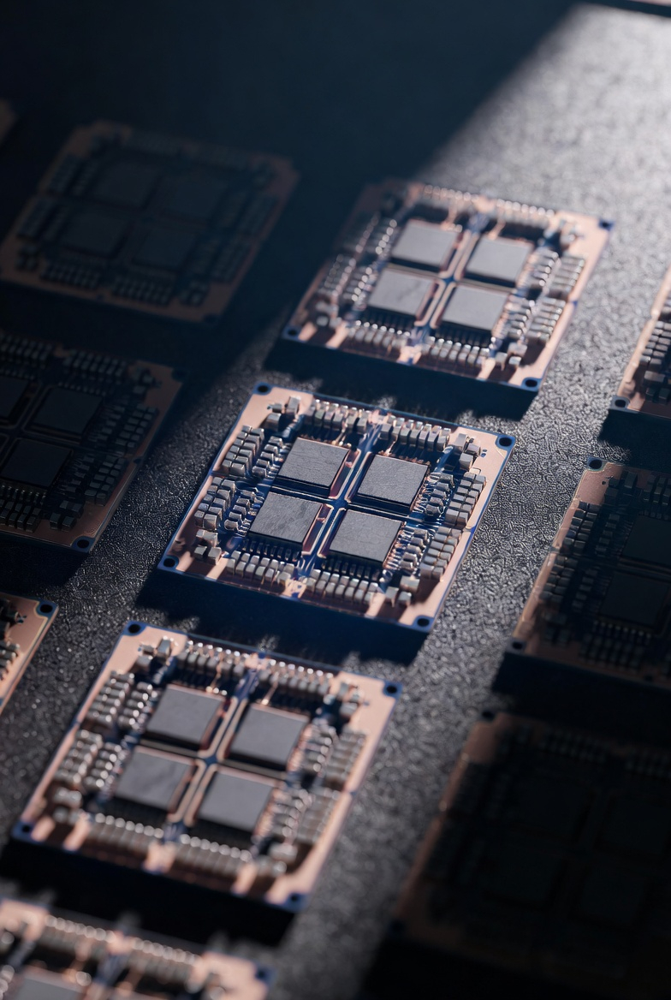

[Alternative hardware for AI training](/xAI/alternative-hardware-for-ai-training) #[Photonic Computing]

> **Photonic (Light-Based) Computing**: A key breakthrough could involve chips that use light beams instead of electricity to perform computations. For instance, engineers have developed programmable **photonic chips** capable of training nonlinear neural networks directly with light. This works by using a semiconductor material where a "pump" beam modulates a "signal" beam's behavior (absorption, transmission, or amplification), enabling real-time reconfiguration and nonlinear functions essential for deep learning. Such chips have demonstrated over 97% accuracy on classification tasks while using far less energy and fewer operations than electronic equivalents—potentially reducing AI data center power consumption by orders of magnitude and speeding up training through parallel optical processing. This could make training easier by eliminating heat management issues and enabling scalable, low-power systems.

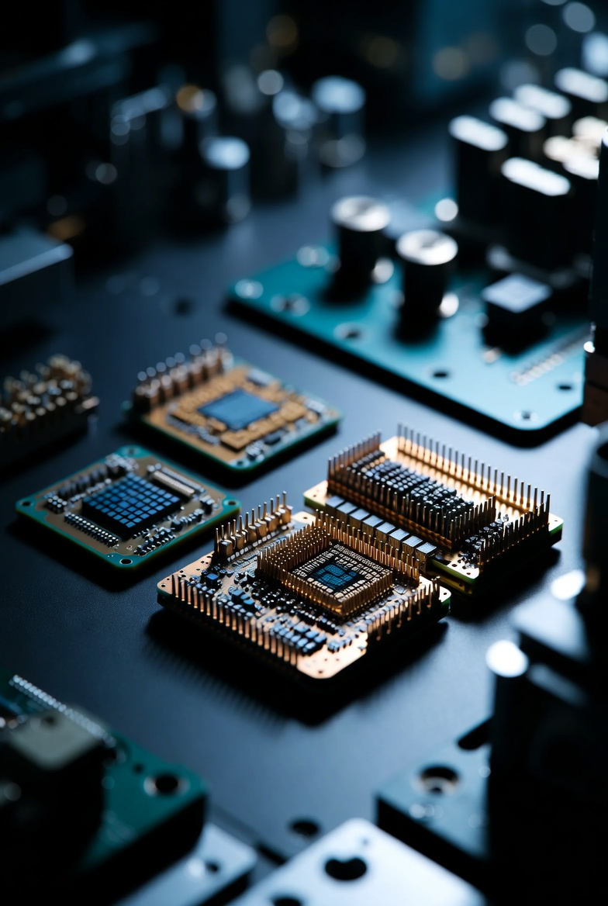

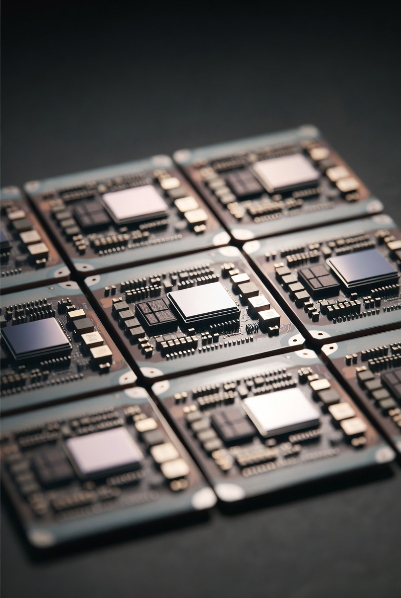

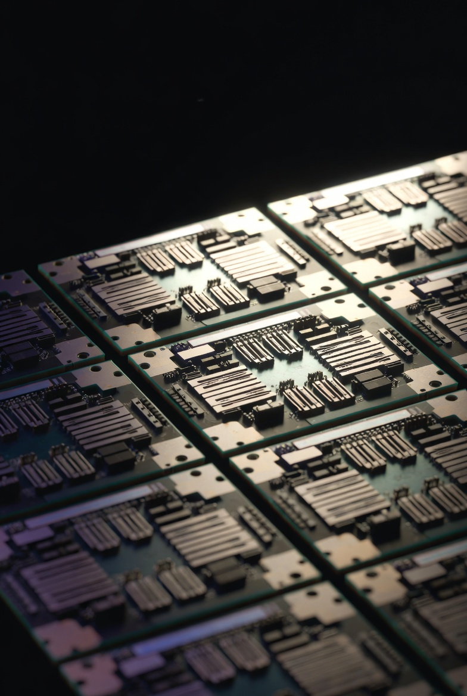

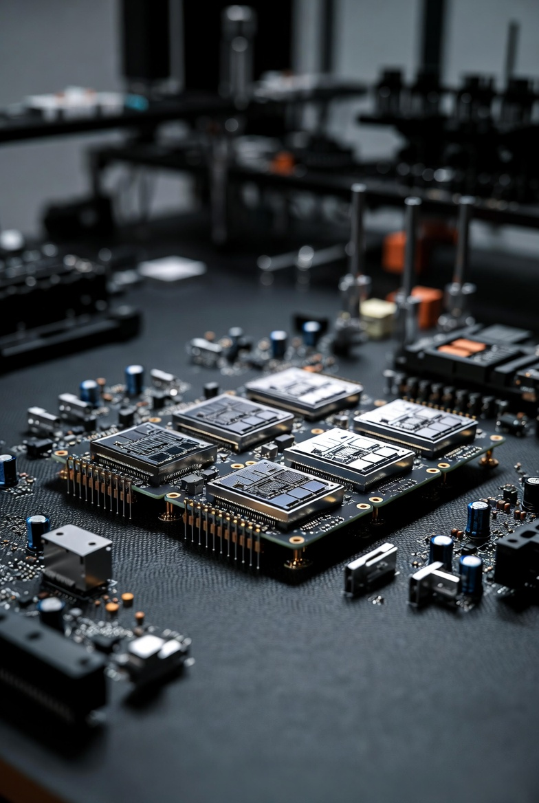

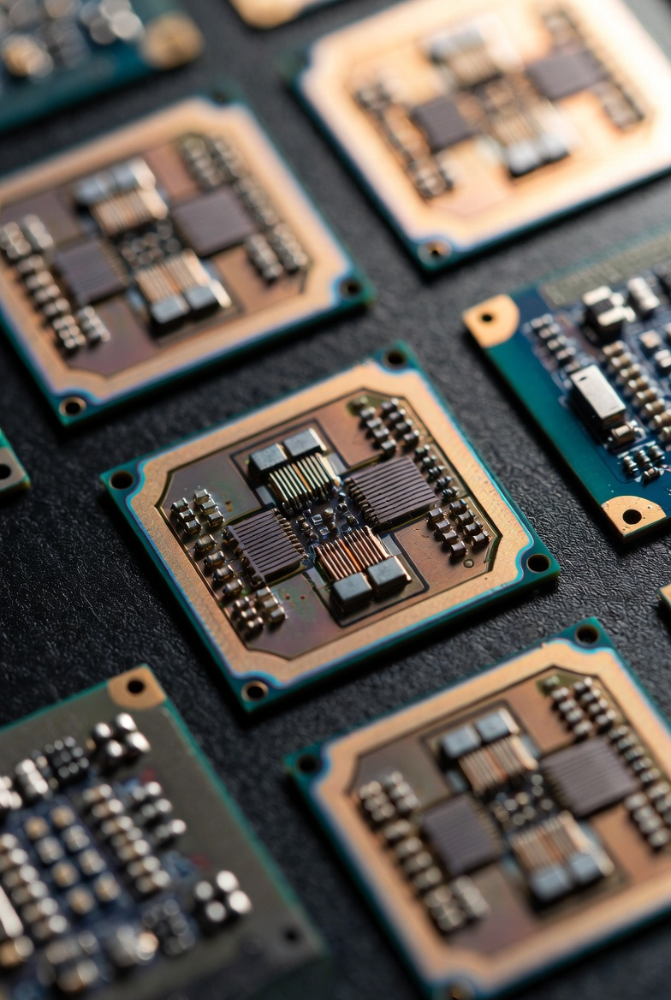

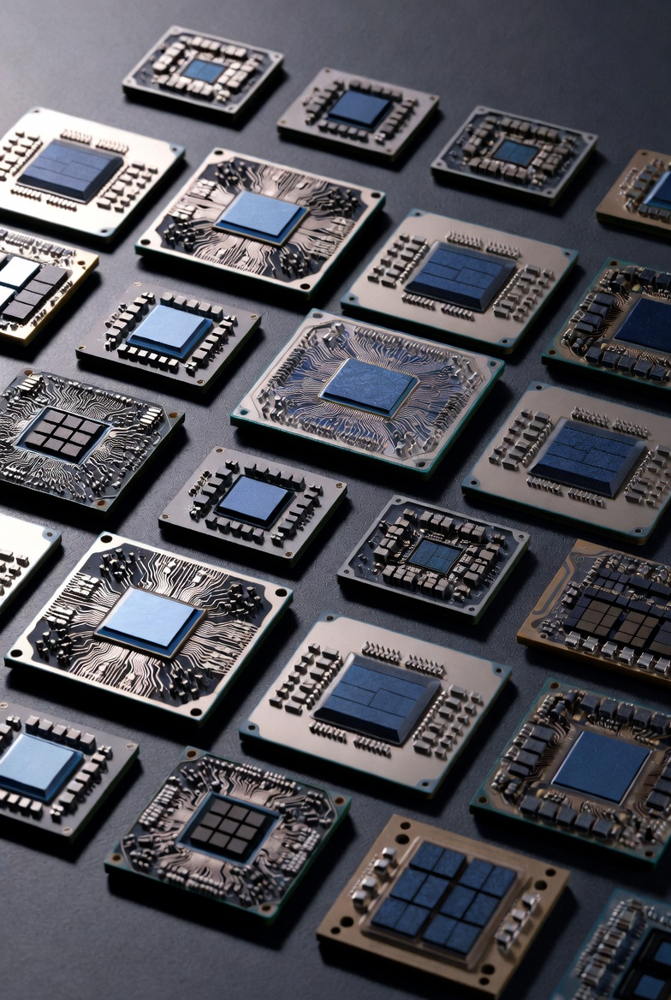

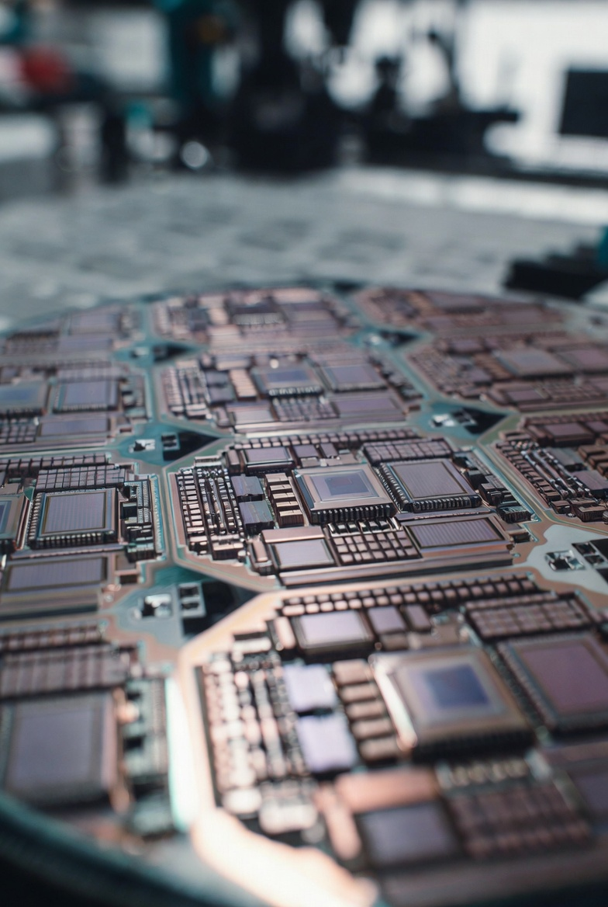

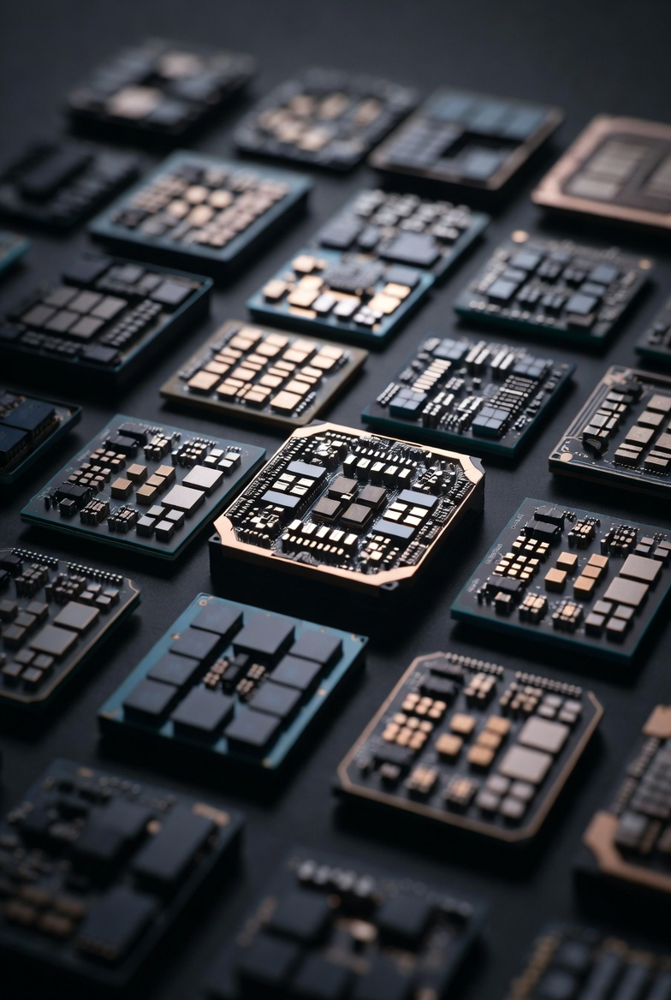

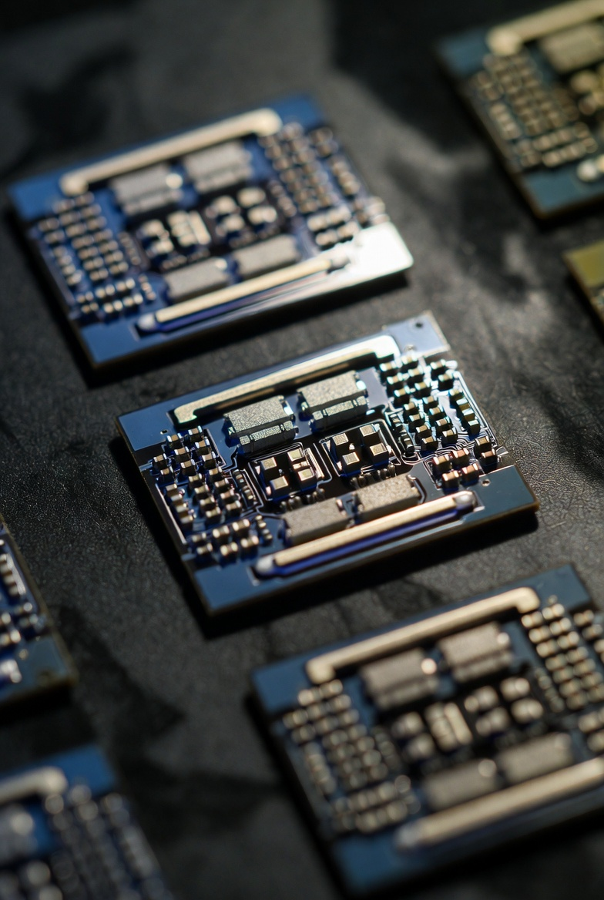

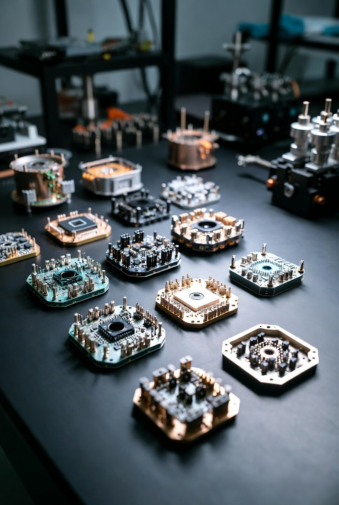

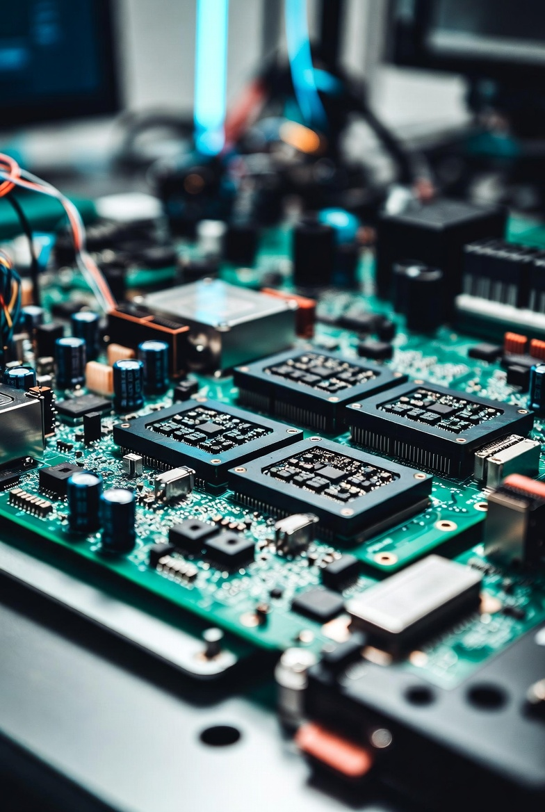

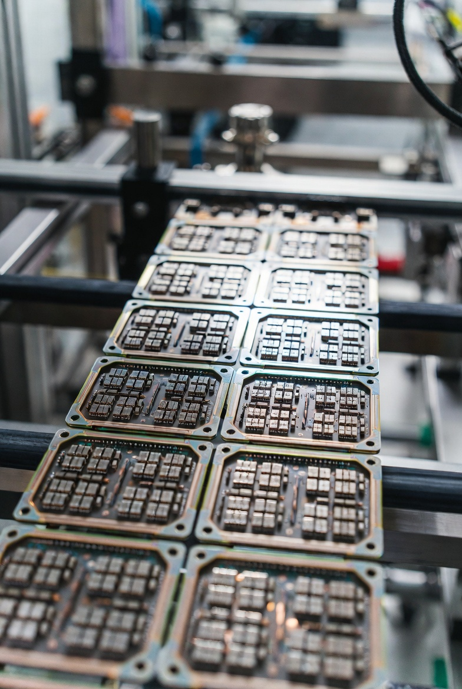

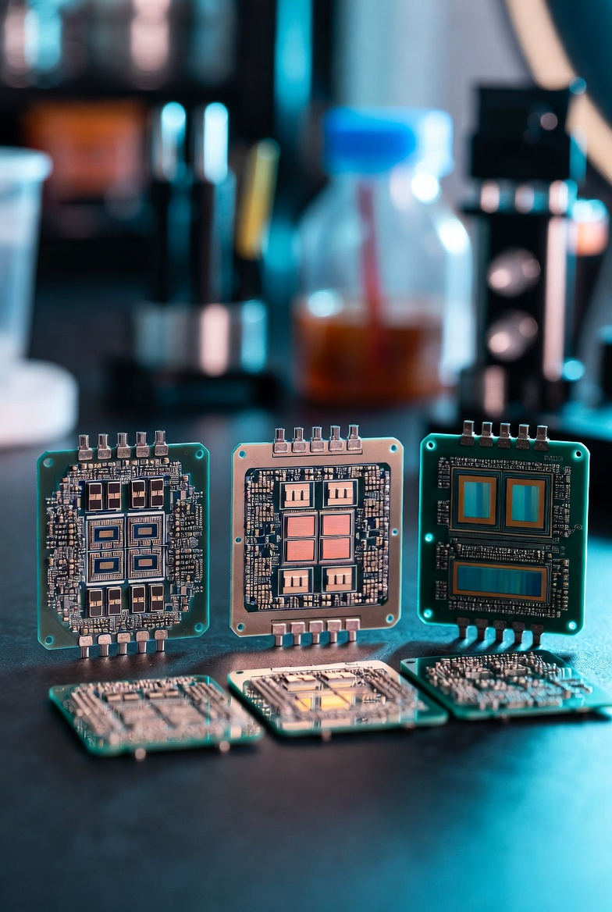

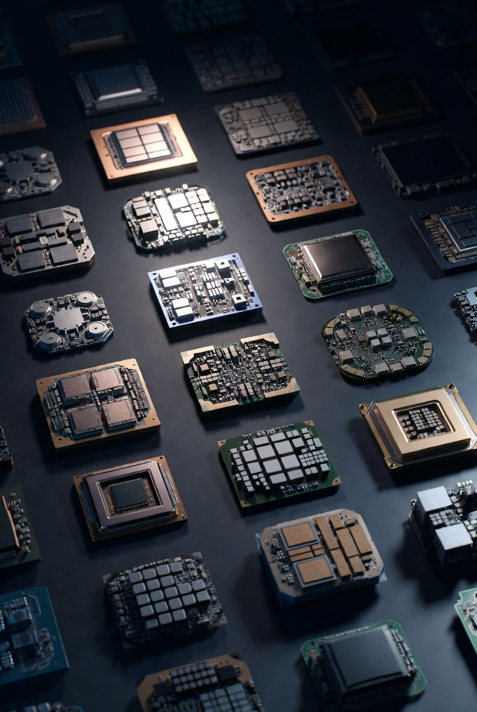