# Quantum Computer

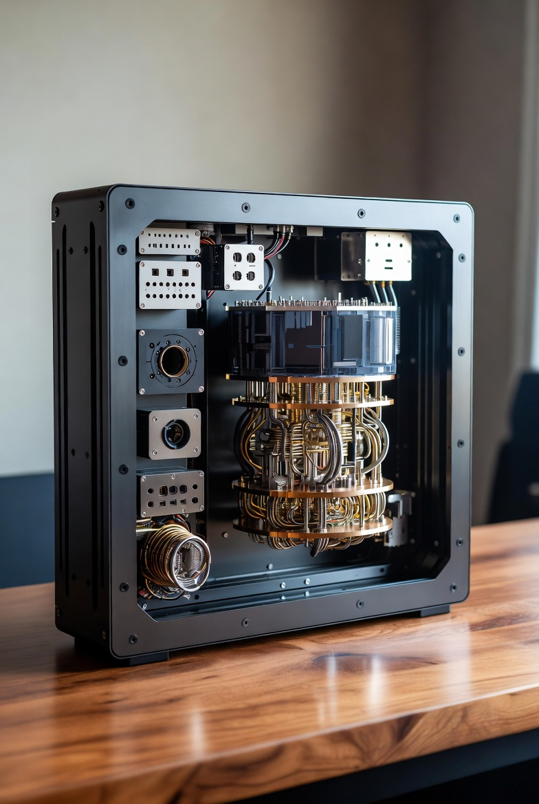

[Alternative hardware for AI training](/xAI/alternative-hardware-for-ai-training) #[Quantum Computing]

> **Quantum Computing**: Quantum systems could accelerate AI training through parallel processing of complex optimizations, such as matrix operations in deep learning. Algorithms like Quantum Approximate Optimization (QAOA) or Variational Quantum Eigensolvers (VQE) might fine-tune models faster than classical methods, potentially handling exponentially larger datasets. Hybrid quantum-AI approaches, where quantum processors pre-process data for classical ML, have shown promise in reducing training data needs and speeding up convergence. While current noisy intermediate-scale quantum (NISQ) devices limit scale, fault-tolerant **quantum computers** could provide exponential speedups for tasks like gradient descent, making training easier for problems intractable on classical hardware.

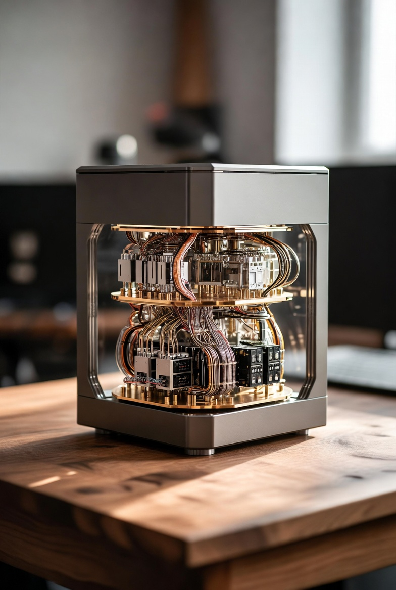

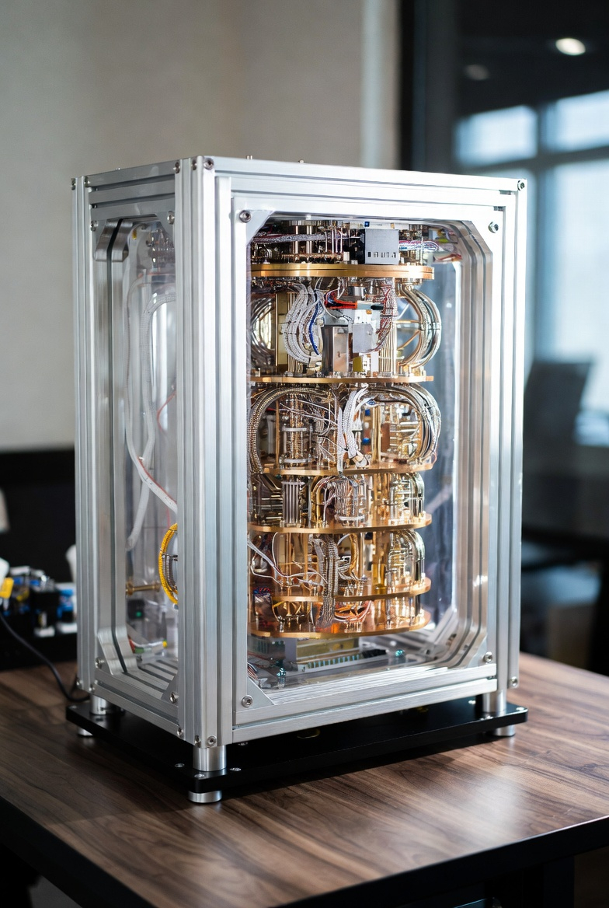

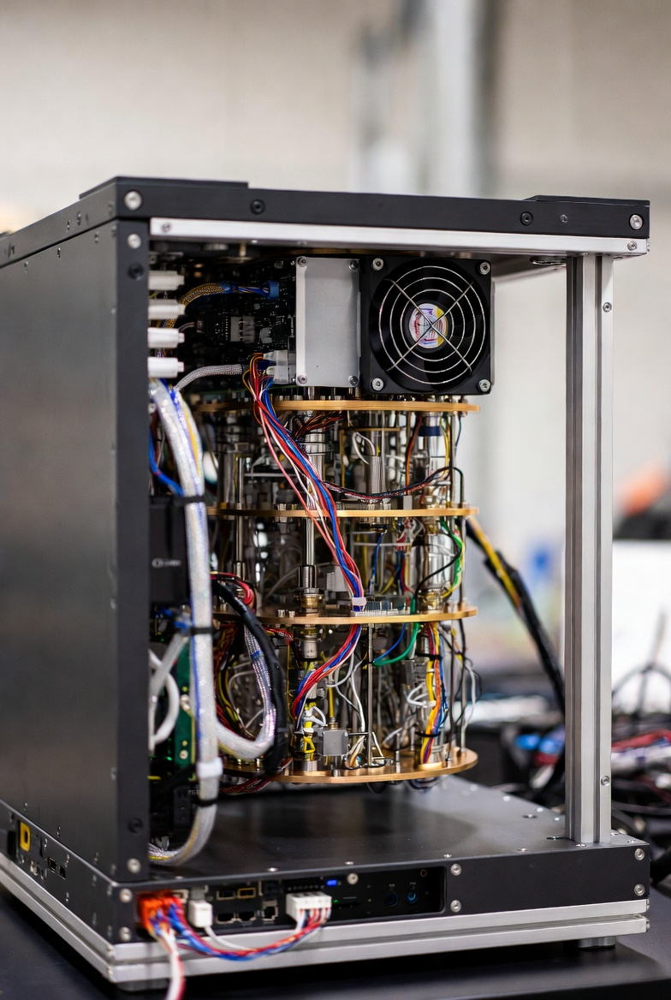

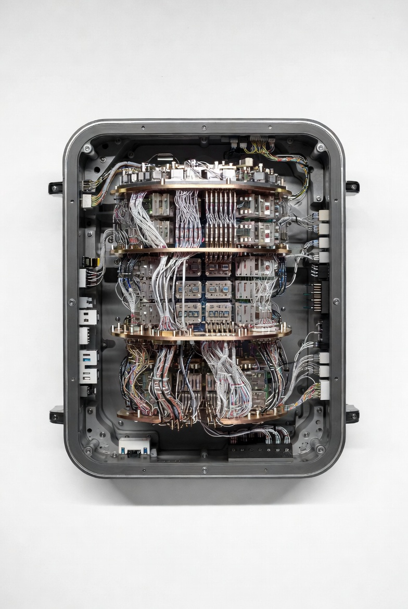

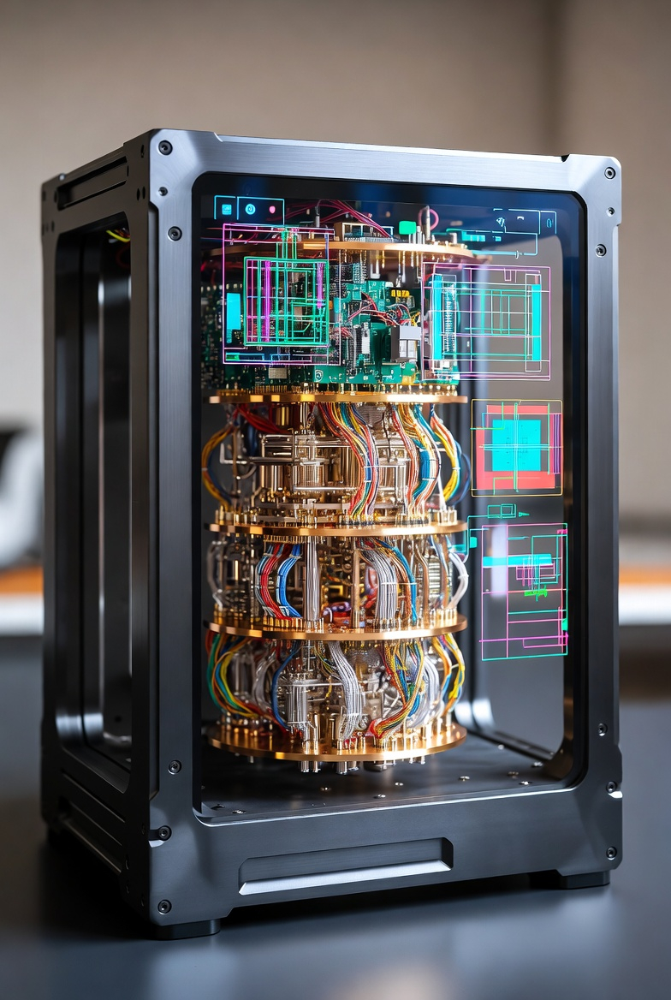

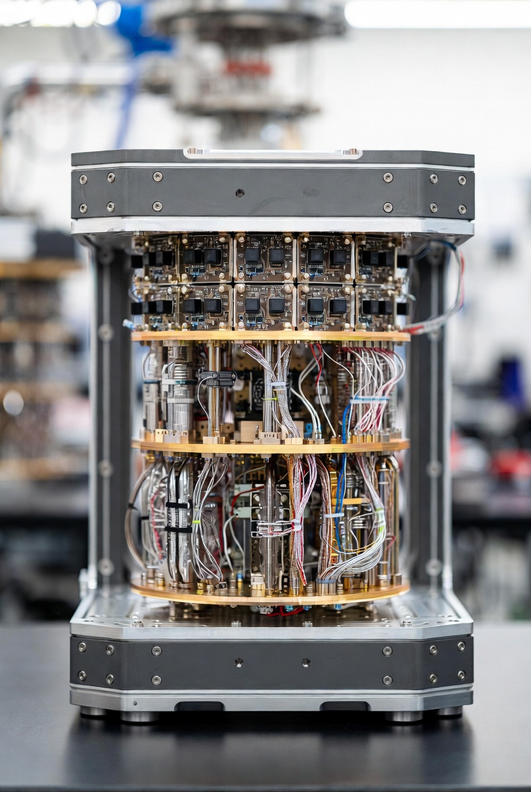

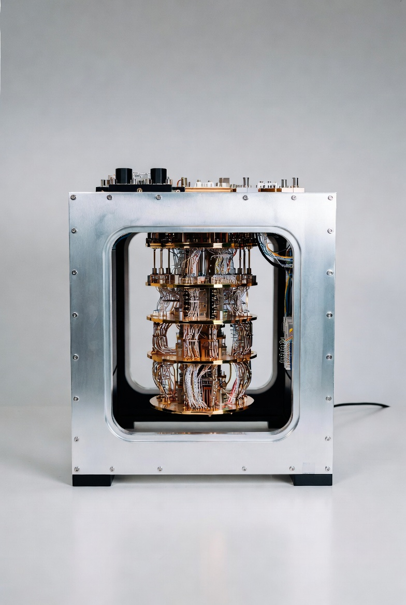

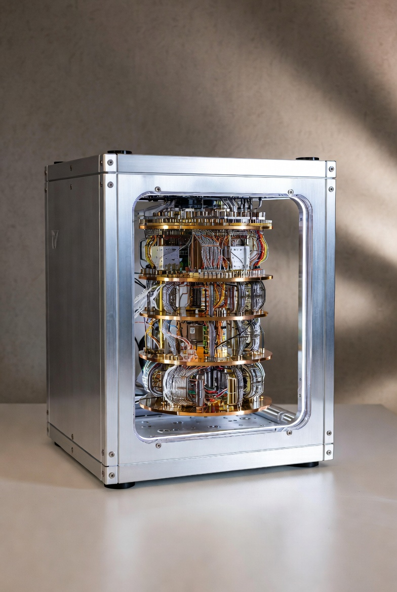

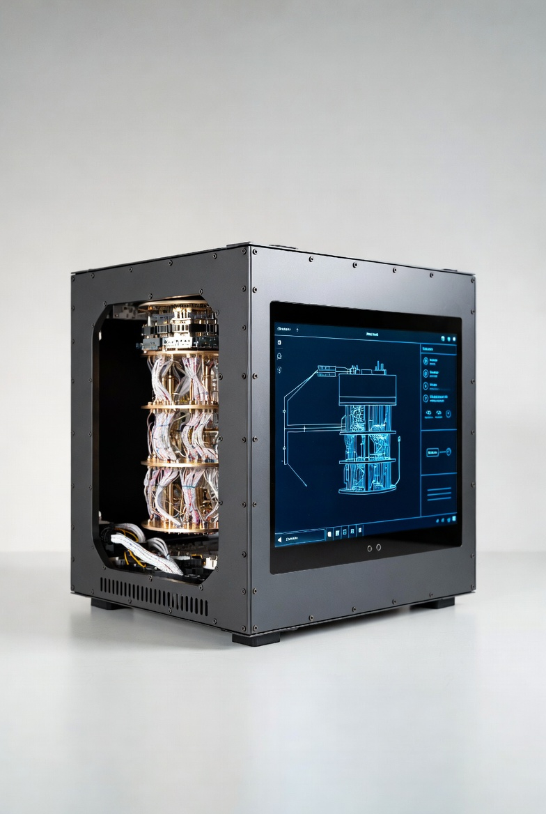

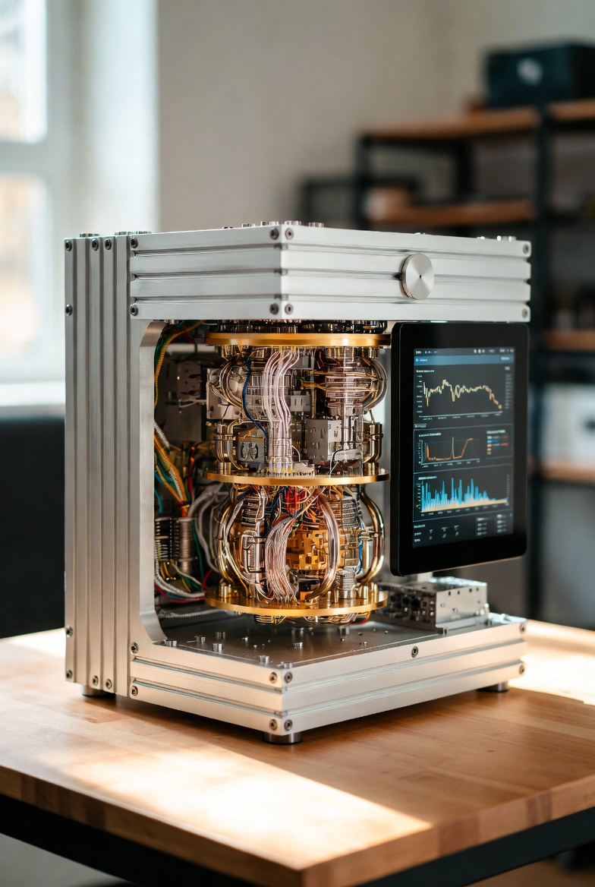

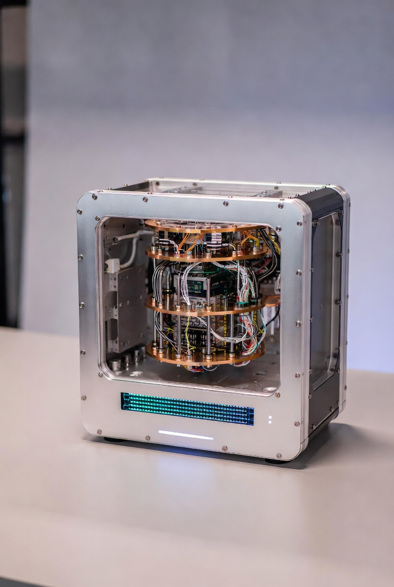

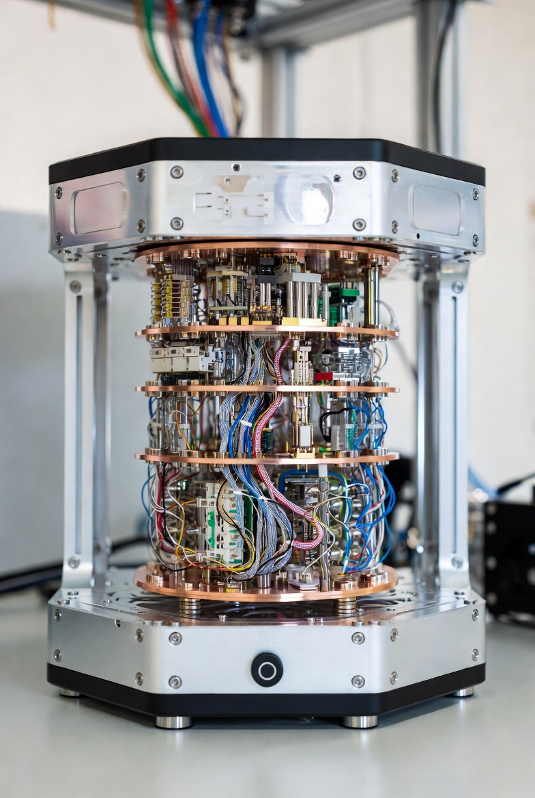

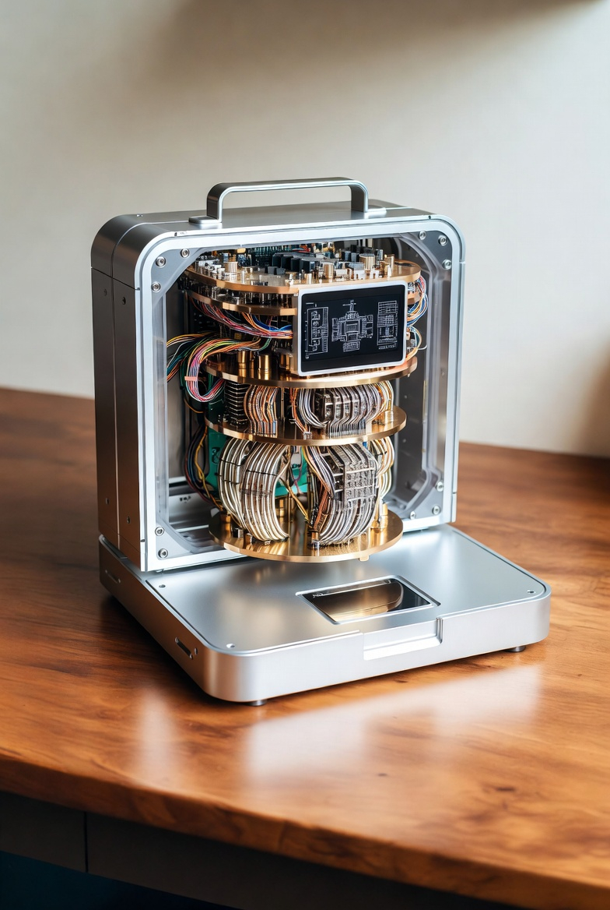