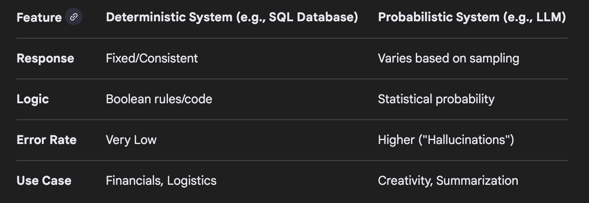

# Deterministic Nature of Language Models

If we manage to define what Human-like understanding and Reasoning is, would it be sufficient to define (ground(?)) features of Deterministic (Precision?) Nature of Language Models based on them?

If not, then what could be sufficient for it?

---

## World Model

### Multi-dimensional data

If we had a device (or a set of those), that would be able to gather & process data from the outer world to build a world model based on different types of data and dimensions (as much as possible), would it suffice?

At least, would it be a better approximation towards such determinism compared to current LLMs?

### Data types & dimensions

- Text
- Visual
    - Images
    - Video
- Chemistry
- Physics
- etc. ?

### Scale

- nm to ? (e.g. with sattellites based data) ?