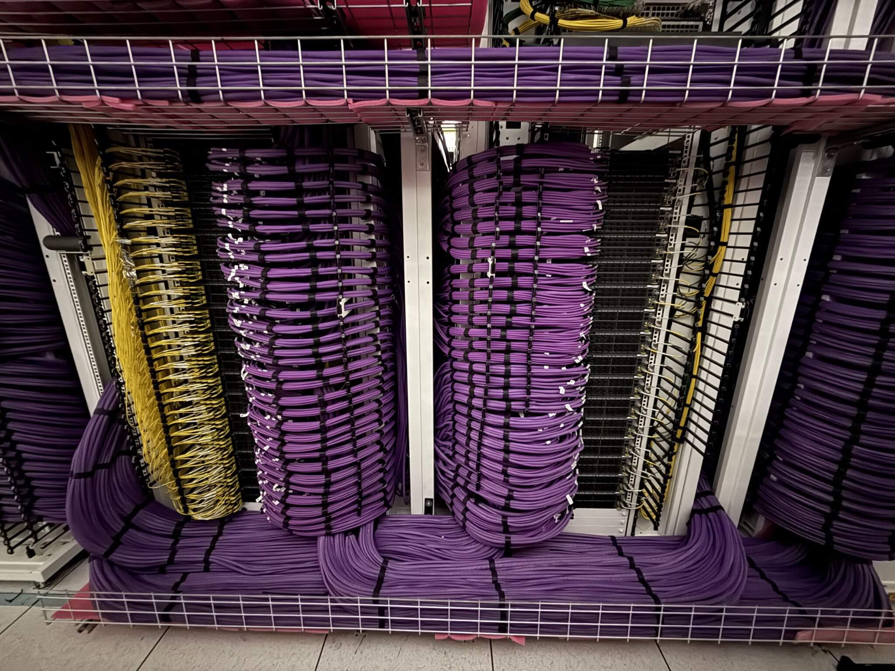

# xAI powered entirely with solar

Article on x.com: [xAI powered entirely with solar](https://x.com/skyisuniverse/status/2020087847546429888)

From [my conversation with Grok on powering xAI's compute entirely with solar energy](https://x.com/i/grok/share/f116aa5ef7ef4199a4bede4b38246002)

As of early 2026, xAI's Colossus supercomputer complex in Memphis, Tennessee (primarily Colossus 1 and Colossus 2, with a third building acquired for further expansion) is one of the world's largest AI training clusters. It currently operates at a scale of roughly **500,000–555,000 NVIDIA GPUs** (a mix of H100/H200, GB200/GB300 Blackwell-series, and similar), with a total power draw in the range of **~1.5–2 GW** (gigawatts) at or near full capacity, based on recent announcements and reports. This makes it gigawatt-scale—the first of its kind for AI training—and plans aim toward 1 million+ GPUs in the near term.

If xAI's entire compute infrastructure were powered **exclusively by solar energy** (utility-scale solar PV farms, with appropriate storage and/or overbuild to handle 24/7 operations), the impacts would span several dimensions.

## Environmental / Climate Impact

This would represent one of the most significant decarbonization steps in the AI sector.

Current US grid carbon intensity averages around **~380–400 g CO₂/kWh** (2024–2025 figures, with slight year-to-year improvements from coal-to-gas and renewables shifts). In Tennessee (SERC Tennessee Valley subregion), it's typically close to or slightly below the national average due to a mix of nuclear, coal, gas, and hydro.

For a **~1.8 GW** average load (a reasonable midpoint estimate for current Colossus scale at high utilization):

- Annual electricity consumption ≈ 1.8 GW × 8760 hours/year ≈ **15.8 TWh/year**.
- Grid-powered CO₂ emissions ≈ 15.8 TWh × 0.39 kg CO₂/kWh (midpoint) ≈ **~6.2 million metric tons CO₂/year**.

Solar PV has near-zero operational emissions (lifecycle emissions ~20–50 g CO₂/kWh, mostly from manufacturing and construction, but often <40 g in recent analyses).

Switching to 100% solar would eliminate **~5.5–6 million metric tons of CO₂/year** from direct operations (equivalent to removing ~1.2–1.4 million typical US passenger cars from the road annually, or roughly the emissions of a mid-sized US city). This would make xAI's compute among the cleanest at frontier scale, especially valuable for an organization focused on understanding the universe and scientific discovery.

## Economic / Cost Impact

Latest tandems push utility-scale LCOE sharply lower through higher efficiency (reducing balance-of-system costs like land, racking, wiring, and inverters by 20–35%) and cheaper manufacturing (solution-processing, roll-to-roll, abundant materials targeting <$0.20–0.30/W module costs in projections).

- Recent utility-scale solar LCOE (mostly silicon) is ~$30–50/MWh globally (IRENA 2024–2025 data shows ~$43/MWh weighted average, lower in China/India at $33–38/MWh). Perovskite tandems at 25–28% module efficiency could drive effective LCOE toward **$20–35/MWh** in sunny regions (even with storage overbuild), per technoeconomic models and scaling trends.

- For ~17.5 TWh/year: Levelized cost at ~$25–35/MWh → **$440–610 million/year** (vs. potentially higher/variable grid + gas turbine costs, which can spike with fuel prices or demand charges).

- **Upfront capex**: Solar + massive storage (e.g., 8–12+ hours lithium/sodium-ion or flow batteries) + transmission might require **$30–60 billion** (at $1–1.5/W installed with tandems' efficiency gains offsetting some BOS). This is substantial but comparable to xAI's GPU/hardware spend ($18B+ reported) and could be financed via long-term PPAs at locked low rates.

- Long-term: Tandems' rapid learning curve (faster than silicon historically) and synergies (e.g., Tesla/xAI ecosystem for storage/integration) make this increasingly cheaper than grid volatility or new nuclear/gas. Payback could accelerate if perovskite commercialization hits gigawatt-scale lines in 2026–2027.

## Comparison to 100% Solar with Latest Perovskite-Silicon Tandem Tech

Using the same prior assumptions (24–28% commercial module efficiencies from breakthroughs like LONGi/Trina records, advanced stability via ionic liquids, passive cooling, scaled roll-to-roll manufacturing; overbuilt 2–3× nameplate + storage for 24/7 baseload in sunny regions):

- Effective LCOE: **$20–35/MWh** (higher efficiency slashes balance-of-system costs 20–35%; locked PPA pricing; falling storage via sodium-ion/lithium advancements).
- Annual costs:
    - a) Current scale (8.76 TWh/year): **~$175–310 million/year** (**savings of ~$300–700 million/year** vs. current blended $70–100/MWh (50–80% reduction potential; even larger if gas/turbine costs push blended higher or TVA imposes data-center premiums).).
    - b) Full scale (17.5 TWh/year): **$350–610 million/year** (**savings of ~$850 million – 1.1+ billion/year** vs. current mix at $70–100/MWh; even larger if gas reliance pushes blended higher).

## Economic summary

- **Short-term (at ~400 MW scale)**: Solar would be **significantly cheaper** (potentially **50–70% lower annual cost**) once deployed, hedging against gas volatility, potential TVA data-center surcharges, and demand charges. Upfront capex for solar + storage (~$5–10B scaled down) is high but recoupable in 5–10 years via savings + sustainability premiums/financing.
- **Short-to-medium term (at 1 GW scale)**: Latest-gen solar would be **substantially cheaper** once deployed (**potentially halving or better the annual energy bill**), providing strong hedging against fuel volatility, demand charges, and regulatory rate risks. Upfront capex for a 1 GW solar + storage system (with overbuild) estimated at **$10–20 billion** (efficiency gains reduce land/BOS needs), but recoupable in **3–8 years** via massive savings, IRA tax credits (clean energy/storage incentives), financing, and potential sustainability-linked premiums.
- **At full 2 GW scale**: **Savings** amplify dramatically (**billions/year**), making solar the clear lower-cost path long-term (20–25 year plant life, fixed low costs vs. fuel/grid exposure). Solar avoids turbine maintenance/fines and grid upgrade fees xAI currently bears.
- **Long-term**: Locked pricing (fixed low costs) over 20–25 year plant life make solar overwhelmingly superior to and shield from current exposure (inflation/fuel/gas spikes, grid fees, turbine issues). Potential tax credits. Synergies with Tesla (batteries, deployment) accelerate viability.

## Non-economic impacts (scaled to 1 GW):

- **CO₂ avoidance**: Grid-powered emissions (380–400 g CO₂/kWh US/Tennessee average) ≈ 3.3–3.5 million metric tons/year. Solar (lifecycle ~20–40 g/kWh) eliminates nearly all → **3–3.3 million tons avoided annually** (equivalent to removing ~700,000–800,000 US cars yearly).
- **Local benefits**: Zero turbine emissions → improved air quality, fewer health impacts, and eased regulatory/community tensions in Memphis area.
- **Land use**: Tandems' efficiency means ~4,000–8,000 acres needed (with overbuild/storage) vs. more for standard silicon—feasible but still significant.
- **Reliability/strategic**: Storage/overbuild enables consistent 24/7 uptime; dedicated solar bypasses grid bottlenecks for faster scaling; positions xAI as sustainability leader in AI (PR/regulatory edge).

## Conclusion

In short, switching to 100% latest-gen solar (latest perovskite-silicon tandem) would:

- represent a **major cost reduction** over xAI's current hybrid (grid + expensive/controversial gas), especially as the cluster scales toward GW levels—turning a potential multi-billion-dollar annual energy bill into one that's far lower, cleaner, and more predictable.
- deliver **hundreds of millions in annual savings**, eliminate major pollution sources, and enable more predictable/clean scaling—making it a highly attractive path despite high initial investment and deployment timelines (2–4 years for full buildout). This bridges the gap toward the even larger savings at 2 GW full scale, turning energy from a major cost/risk into a competitive advantage.