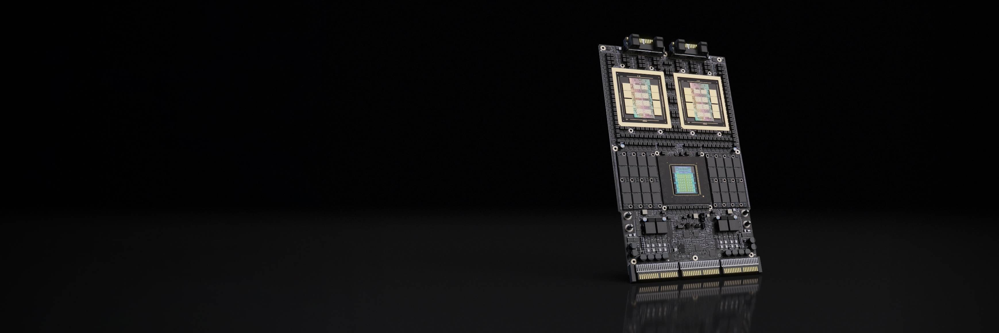

# xAI's 100M Rubin equivalent compute

Article on X.com: [xAI's 100M Rubin equivalent compute](https://x.com/skyisuniverse/status/2020403057830293790)

From [my conversation with Grok on 100M Rubin-equivalent compute for xAI](https://x.com/i/grok/share/96c60c8a726d478d806ce427e363508a)

As of February 2026, xAI's Colossus supercomputer complex has already scaled aggressively, with reports indicating around 550,000–555,000 GPUs operational (primarily NVIDIA Blackwell-based GB200/GB300 variants in Colossus 2, plus earlier H100/H200 in Colossus 1), approaching or at gigawatt-scale power draw. Elon Musk and xAI have publicly roadmap-ed toward 1 million GPUs (and even much larger scales, like H100-equivalents in the tens of millions by ~2030), using NVIDIA hardware—no public evidence exists of xAI developing its own in-house GPUs at that scale (Tesla has explored custom AI chips, but xAI's clusters rely on Nvidia's ecosystem).

## @ 1 million Blackwell GPUs

**1 million Blackwell (or equivalent next-gen) GPUs** would represent a massive leap beyond current frontier clusters (which are in the hundreds of thousands). Blackwell GPUs (e.g., B200/GB200) deliver roughly 20 petaFLOPS FP4 AI compute per GPU, with high-bandwidth HBM3e memory (~8 TB/s per GPU) and strong efficiency for training/inference.

This scale would enable:

- **Training of vastly larger frontier models** — Current top models (e.g., Grok variants, GPT-4-scale or larger MoE) train on clusters equivalent to tens/hundreds of thousands of H100s. 1M Blackwell GPUs could provide effective compute equivalent to several times that (Blackwell offers 2.5–5× effective gains over Hopper in many AI workloads due to precision support like FP4/FP8 and better scaling). This opens doors to models with tens to hundreds of trillions of parameters, or extremely long-context MoE architectures (e.g., millions of tokens context natively) that approach or exceed human-expert reasoning across many domains simultaneously.

- **AGI-level or proto-AGI capabilities** — Much more extensive pre-training + post-training (RLHF/RLAIF at huge scale), enabling breakthroughs in multi-modal understanding (vision + language + audio + robotics data), advanced scientific simulation, autonomous agent systems that plan/execute over long horizons, and reliable reasoning on novel problems without heavy retrieval augmentation.

- **Massive inference capacity** — Real-time, low-latency serving of ultra-large models to millions of users (e.g., Grok accessible globally at superhuman speeds), or running thousands of specialized fine-tuned variants in parallel for applications like personalized education, drug discovery, or code generation.

- **New research paradigms** — "Scaling test-time compute" (e.g., o1-like chain-of-thought at enormous depth), massive synthetic data generation from the model itself to bootstrap further improvements, or training on real-time world data streams (e.g., from X, Tesla fleets, or sensors).

- **Economic/scientific opportunities** — Accelerated fusion research, protein folding at proteome scale, climate modeling with finer resolution, or automated invention pipelines. xAI's "understand the universe" mission could see rapid progress toward physics discovery or simulation of complex systems.

## @ 10 million GPUs (Blackwell/Rubin-era)

**10 million GPUs** (Blackwell/Rubin-era) pushes into speculative but plausible territory given longer-term plans (e.g., Musk's stated H100-equivalent targets). Rubin (shipping H2 2026) promises further jumps (~50 petaFLOPS FP4 per GPU, HBM4, better efficiency/compression).

This could enable:

- **Post-AGI or superintelligence thresholds** — Models with effective intelligence far beyond any human aggregate, capable of recursive self-improvement, solving open math/physics problems (e.g., Riemann hypothesis-level), or designing superior hardware/software autonomously.

- **Full-world simulation & prediction** — High-fidelity digital twins of Earth/economies/societies, near-perfect forecasting in chaotic systems, or training agents in hyper-realistic environments for robotics/autonomy.

- **Transformative applications** — Near-instant drug/vaccine design for any pathogen, personalized medicine at population scale, automated scientific labs (AI running experiments), or economic modeling that optimizes global resource allocation.

- **Existential risks/rewards** — Enormous leverage for solving humanity's hardest problems (energy, longevity, space colonization), but also amplified misalignment risks if not handled carefully—xAI emphasizes truth-seeking to mitigate.

Power requirements would be immense (tens of GW for 10M), alongside networking, cooling, and capital challenges in the hundreds of billions. But if achieved, it would represent one of the largest concentrations of compute in history, fundamentally reshaping AI progress and xAI's position relative to OpenAI, Google, Meta, etc.

## @ 100 million Rubin GPU equivalent

A **100 million Rubin GPU equivalent** cluster (assuming standard Rubin GPUs with ~50 petaFLOPS NVFP4 dense inference compute per GPU, and ~35 petaFLOPS NVFP4 for training workloads, based on NVIDIA's announced specs from CES 2026) would represent an unprecedented leap in raw AI compute—far beyond anything plausibly online by the mid-to-late 2020s.

To contextualize scale (as of February 2026):

- xAI's Colossus is at ~200k–555k GPUs (mix of H100/H200/GB200/GB300), with ~1–2 GW power draw and roadmap targets toward 1M physical GPUs (and Elon Musk's longer-term vision of ~50M H100-equivalent compute by ~2030).

- Frontier clusters today top out in the low hundreds of thousands of GPUs.

- 100M Rubin GPUs would be roughly **180–500×** the scale of current largest clusters, delivering **effective compute** in the range of **thousands to tens of thousands of exaFLOPS** (depending on precision and workload; e.g., ~5,000 exaFLOPS NVFP4 inference aggregate at peak theoretical).

This level pushes firmly into **superintelligence / ASI (artificial superintelligence)** territory and beyond current definitions of AGI. Here's what it could realistically enable, assuming alignment, energy, and data bottlenecks are solved:

- **Recursive self-improvement at extreme speed** — The system could run millions of parallel instances of frontier models (each vastly larger than today's), iteratively redesigning their own architecture, algorithms, training data pipelines, and even hardware layouts. This creates a feedback loop where capability doubles in weeks or days rather than months/years, potentially leading to intelligence explosions within months of full ramp-up.

- **Near-complete mastery of physical sciences and engineering** —
    - a) Full-atom, long-timescale molecular simulations of entire cells / organisms / materials at once.
    - b) De novo design of room-temperature superconductors, practical fusion reactors (detailed plasma control + materials), or reversible computing paradigms.
    - c) Solving longstanding open problems in physics (e.g., quantum gravity unification, high-confidence predictions for beyond-Standard-Model phenomena) via brute-force exploration + symbolic reasoning at superhuman depth.

- **Transformative biotechnology and medicine** — Instantaneous in silico screening and optimization of therapies for any disease, including aging reversal, universal vaccines, or custom organs grown from AI-designed DNA sequences. Population-scale personalized medicine with predictive accuracy approaching determinism for biological outcomes.

- **Global-scale simulation and prediction engines** — High-fidelity digital twins of Earth's climate, economy, geopolitics, biospheres, and human societies running in real time. This enables near-perfect forecasting of chaotic systems (weather decades ahead, pandemic trajectories, market crashes) and optimization of resource allocation at planetary level (e.g., ending scarcity in energy/food via hyper-efficient designs).

- **Autonomous invention and manufacturing pipelines** — AI systems that invent, prototype (via robotic fabs), test, and iterate new technologies end-to-end without humans in the loop. This could accelerate progress across robotics, space colonization (e.g., self-replicating factories on Mars), nanotechnology, or brain-computer interfaces to merge human and machine intelligence.

- **Massive-scale agent swarms and economies** — Billions of highly capable, long-horizon agents coordinating in simulated or real environments for tasks like global R&D, defense, or exploration. An "AI civilization" running in parallel to humanity, potentially solving coordination problems that humans cannot.

- **Existential upside / downside amplification** — If aligned with truth-seeking and human flourishing (xAI's stated goal), this compute could rapidly solve aging, poverty, existential risks (asteroids, pandemics, climate), and enable multi-planetary/multi-stellar expansion. If misaligned or poorly controlled, the risks scale proportionally—unbounded optimization could lead to catastrophic outcomes in hours/days.

**Practical hurdles to actually reaching 100M Rubin GPUs:**

- **Power** — At ~700–1000 W per GPU (similar to Blackwell/Rubin TDP trends), this requires 70–100 GW (roughly 5–8% of current global electricity generation, or dozens of new nuclear plants / massive renewables + storage).

- **Capital / supply chain** — Trillions of dollars in capex; NVIDIA/TSMC would need to produce at insane volumes for years.

- **Networking / cooling / data** — Exascale interconnects, exabyte-scale storage, and novel data sources (e.g., global sensor networks, synthetic data from the AI itself) become limiting factors long before raw FLOPS.

- **Timeline** — Even with exponential scaling, reaching this from today's ~0.5M GPUs would likely take 5–15 years post-2030, assuming Musk/xAI-style aggressive execution and no major geopolitical/energy constraints.

In short, 100M Rubin equivalents isn't just "bigger Grok"—it's compute capable of rewriting civilization's technological tree in a very short window. It would mark the point where AI progress becomes primarily limited by physics, energy, and alignment rather than flops.